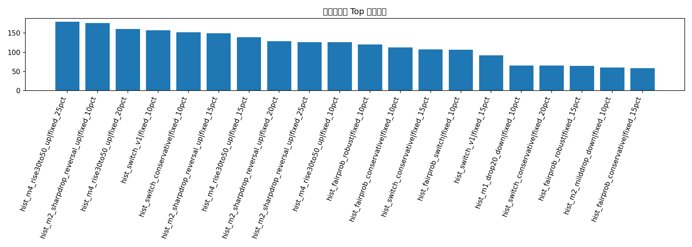
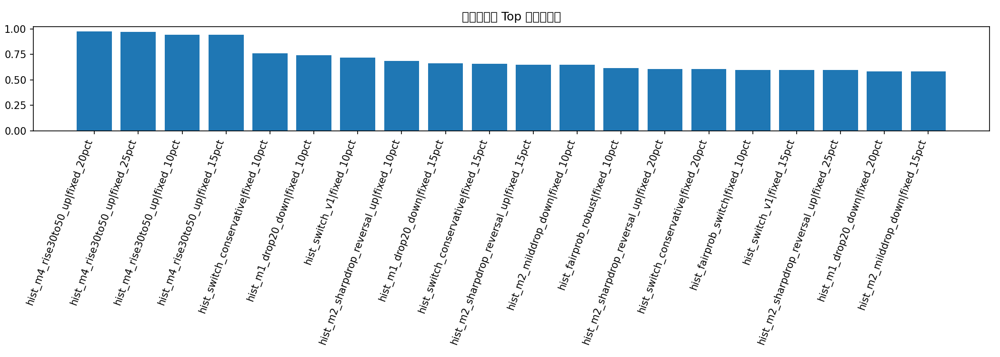

# monthly_runs 全历史 5分钟 BTC 事件：系统性策略研究

这份报告会把 `data/monthly_runs/*` 下所有找到的 5 分钟 BTC 数据统一汇总，重新找历史上更稳、更强的交易策略。

## 数据覆盖

| run_name             |   file_count |   raw_row_count |   markets |
|:---------------------|-------------:|----------------:|----------:|
| 24949259015_attempt1 |           48 |           39535 |       248 |
| 24952032748_attempt1 |           48 |           36019 |       229 |
| 24986940107_attempt1 |           10 |            8923 |        54 |

## 候选策略说明

- `hist_m1_drop20_down`：第1分钟跌超20，买Down
- `hist_m2_drop10_down`：第2分钟跌超10，买Down
- `hist_m2_sharpdrop_reversal_up`：第2分钟跌在(-50,-30]，买Up
- `hist_m2_milddrop_down`：第2分钟跌在(-30,-10]，买Down
- `hist_m2_extremeup_fade_down`：第2分钟涨超50，买Down
- `hist_m4_rise30to50_up`：第4分钟涨在(30,50]，买Up
- `hist_switch_v1 / v2 / conservative`：分钟感知组合策略
- `hist_fairprob_switch / conservative / robust`：先估 fair probability，再与市场价格比较，只有 edge 足够大才交易

## 收益最高 Top 20

| source_layer        | strategy                      | sizing      |   trades |   ending_bankroll |   total_return |   avg_trade_return_on_cost |   median_trade_return_on_cost |   win_rate |   profit_factor |   max_drawdown |   max_consecutive_losses |   avg_entry_minute |   avg_edge |   p10_trade_return_on_cost |   score_end |   score_win |   score_pf |   score_dd |   score_streak |   score_tail |   robustness_score |
|:--------------------|:------------------------------|:------------|---------:|------------------:|---------------:|---------------------------:|------------------------------:|-----------:|----------------:|---------------:|-------------------------:|-------------------:|-----------:|---------------------------:|------------:|------------:|-----------:|-----------:|---------------:|-------------:|-------------------:|
| all_monthly_history | hist_m4_rise30to50_up         | fixed_25pct |       50 |          179.22   |         0.7922 |                     0.0636 |                        0.1    |     0.9    |          1.4439 |         0.4752 |                        2 |             4      |   nan      |                    -0.0919 |      1      |      0.9688 |     0.9792 |     0.9375 |         0.9688 |       0.9479 |             0.9688 |
| all_monthly_history | hist_m2_sharpdrop_reversal_up | fixed_10pct |       51 |          176.208  |         0.7621 |                     0.4439 |                       -1.0345 |     0.3137 |          1.1241 |         0.5534 |                        9 |             2      |   nan      |                    -1.0667 |      0.9792 |      0.1354 |     0.9167 |     0.8958 |         0.4271 |       0.5833 |             0.6865 |
| all_monthly_history | hist_m4_rise30to50_up         | fixed_20pct |       50 |          160.449  |         0.6045 |                     0.0636 |                        0.1    |     0.9    |          1.4449 |         0.3825 |                        2 |             4      |   nan      |                    -0.0919 |      0.9583 |      0.9688 |     1      |     0.9583 |         0.9688 |       0.9896 |             0.9729 |
| all_monthly_history | hist_switch_v1                | fixed_10pct |      242 |          157.38   |         0.5738 |                     0.1238 |                        0.2148 |     0.5992 |          1.0271 |         0.7426 |                        5 |             1.7273 |   nan      |                    -1.0769 |      0.9375 |      0.6354 |     0.8542 |     0.6875 |         0.6354 |       0.3125 |             0.7177 |
| all_monthly_history | hist_switch_conservative      | fixed_10pct |      133 |          151.872  |         0.5187 |                     0.1798 |                        0.2857 |     0.5789 |          1.051  |         0.6013 |                        7 |             1.6165 |   nan      |                    -1.0521 |      0.9167 |      0.5521 |     0.875  |     0.875  |         0.5521 |       0.6354 |             0.7625 |
| all_monthly_history | hist_m2_sharpdrop_reversal_up | fixed_15pct |       51 |          149.734  |         0.4973 |                     0.4439 |                       -1.0345 |     0.3137 |          1.0554 |         0.6724 |                        9 |             2      |   nan      |                    -1.0667 |      0.8958 |      0.1354 |     0.8958 |     0.8333 |         0.4271 |       0.5417 |             0.649  |
| all_monthly_history | hist_m4_rise30to50_up         | fixed_15pct |       50 |          138.783  |         0.3878 |                     0.0636 |                        0.1    |     0.9    |          1.3856 |         0.2889 |                        2 |             4      |   nan      |                    -0.0919 |      0.875  |      0.9688 |     0.9375 |     0.9792 |         0.9688 |       0.9479 |             0.9438 |
| all_monthly_history | hist_m2_sharpdrop_reversal_up | fixed_20pct |       51 |          128.438  |         0.2844 |                     0.4439 |                       -1.0345 |     0.3137 |          1.0263 |         0.7306 |                        9 |             2      |   nan      |                    -1.0667 |      0.8542 |      0.1354 |     0.8333 |     0.7292 |         0.4271 |       0.5417 |             0.6073 |
| all_monthly_history | hist_m2_sharpdrop_reversal_up | fixed_25pct |       51 |          126.177  |         0.2618 |                     0.4439 |                       -1.0345 |     0.3137 |          1.0223 |         0.7405 |                        9 |             2      |   nan      |                    -1.0667 |      0.8333 |      0.1354 |     0.8125 |     0.7083 |         0.4271 |       0.5417 |             0.5948 |
| all_monthly_history | hist_m4_rise30to50_up         | fixed_10pct |       50 |          126.136  |         0.2614 |                     0.0636 |                        0.1    |     0.9    |          1.4136 |         0.1933 |                        2 |             4      |   nan      |                    -0.0919 |      0.8125 |      0.9688 |     0.9583 |     1      |         0.9688 |       0.9896 |             0.9438 |
| all_monthly_history | hist_fairprob_robust          | fixed_10pct |      173 |          120.445  |         0.2044 |                     0.1395 |                        0.1928 |     0.5607 |          1.0207 |         0.6942 |                       10 |             1.9422 |     0.1832 |                    -1.0714 |      0.7917 |      0.3854 |     0.7917 |     0.7604 |         0.2188 |       0.4583 |             0.6135 |
| all_monthly_history | hist_fairprob_conservative    | fixed_10pct |      170 |          112.353  |         0.1235 |                     0.1357 |                        0.1928 |     0.5529 |          1.0129 |         0.6942 |                       10 |             1.9529 |     0.1855 |                    -1.072  |      0.7708 |      0.3021 |     0.7708 |     0.7604 |         0.2188 |       0.375  |             0.5802 |
| all_monthly_history | hist_switch_conservative      | fixed_15pct |      133 |          107.24   |         0.0724 |                     0.1798 |                        0.2857 |     0.5789 |          1.0051 |         0.7456 |                        7 |             1.6165 |   nan      |                    -1.0521 |      0.75   |      0.5521 |     0.7292 |     0.6667 |         0.5521 |       0.6354 |             0.6583 |
| all_monthly_history | hist_fairprob_switch          | fixed_10pct |      186 |          106.71   |         0.0671 |                     0.1261 |                        0.2222 |     0.5699 |          1.0065 |         0.6838 |                       10 |             1.914  |     0.1732 |                    -1.0769 |      0.7292 |      0.4688 |     0.75   |     0.8125 |         0.2188 |       0.2292 |             0.5969 |
| all_monthly_history | hist_switch_v1                | fixed_15pct |      242 |           91.8552 |        -0.0814 |                     0.1238 |                        0.2148 |     0.5992 |          0.9969 |         0.8661 |                        5 |             1.7273 |   nan      |                    -1.0769 |      0.7083 |      0.6354 |     0.7083 |     0.5    |         0.6354 |       0.2292 |             0.5969 |
| all_monthly_history | hist_m1_drop20_down           | fixed_10pct |      115 |           65.6129 |        -0.3439 |                    -0.0051 |                        0.2692 |     0.7391 |          0.8825 |         0.6141 |                        3 |             1      |   nan      |                    -1.0147 |      0.6875 |      0.8854 |     0.4167 |     0.8542 |         0.8438 |       0.9062 |             0.7438 |
| all_monthly_history | hist_switch_conservative      | fixed_20pct |      133 |           64.9147 |        -0.3509 |                     0.1798 |                        0.2857 |     0.5789 |          0.9782 |         0.8403 |                        7 |             1.6165 |   nan      |                    -1.0521 |      0.6667 |      0.5521 |     0.6875 |     0.5208 |         0.5521 |       0.6354 |             0.6042 |
| all_monthly_history | hist_fairprob_robust          | fixed_15pct |      173 |           64.7142 |        -0.3529 |                     0.1395 |                        0.1928 |     0.5607 |          0.9679 |         0.8343 |                       10 |             1.9422 |     0.1832 |                    -1.0714 |      0.6458 |      0.3854 |     0.6458 |     0.5521 |         0.2188 |       0.4583 |             0.5135 |
| all_monthly_history | hist_m2_milddrop_down         | fixed_10pct |       83 |           59.8005 |        -0.402  |                    -0.0262 |                        0.2857 |     0.6506 |          0.8253 |         0.4941 |                        4 |             2      |   nan      |                    -1.0167 |      0.625  |      0.7188 |     0.25   |     0.9167 |         0.7188 |       0.7396 |             0.6479 |
| all_monthly_history | hist_fairprob_conservative    | fixed_15pct |      170 |           58.6541 |        -0.4135 |                     0.1357 |                        0.1928 |     0.5529 |          0.961  |         0.8343 |                       10 |             1.9529 |     0.1855 |                    -1.072  |      0.6042 |      0.3021 |     0.6042 |     0.5521 |         0.2188 |       0.375  |             0.4719 |

## 稳定性最好 Top 20

| source_layer        | strategy                      | sizing      |   trades |   ending_bankroll |   total_return |   avg_trade_return_on_cost |   median_trade_return_on_cost |   win_rate |   profit_factor |   max_drawdown |   max_consecutive_losses |   avg_entry_minute |   avg_edge |   p10_trade_return_on_cost |   score_end |   score_win |   score_pf |   score_dd |   score_streak |   score_tail |   robustness_score |
|:--------------------|:------------------------------|:------------|---------:|------------------:|---------------:|---------------------------:|------------------------------:|-----------:|----------------:|---------------:|-------------------------:|-------------------:|-----------:|---------------------------:|------------:|------------:|-----------:|-----------:|---------------:|-------------:|-------------------:|
| all_monthly_history | hist_m4_rise30to50_up         | fixed_20pct |       50 |          160.449  |         0.6045 |                     0.0636 |                        0.1    |     0.9    |          1.4449 |         0.3825 |                        2 |             4      |   nan      |                    -0.0919 |      0.9583 |      0.9688 |     1      |     0.9583 |         0.9688 |       0.9896 |             0.9729 |
| all_monthly_history | hist_m4_rise30to50_up         | fixed_25pct |       50 |          179.22   |         0.7922 |                     0.0636 |                        0.1    |     0.9    |          1.4439 |         0.4752 |                        2 |             4      |   nan      |                    -0.0919 |      1      |      0.9688 |     0.9792 |     0.9375 |         0.9688 |       0.9479 |             0.9688 |
| all_monthly_history | hist_m4_rise30to50_up         | fixed_10pct |       50 |          126.136  |         0.2614 |                     0.0636 |                        0.1    |     0.9    |          1.4136 |         0.1933 |                        2 |             4      |   nan      |                    -0.0919 |      0.8125 |      0.9688 |     0.9583 |     1      |         0.9688 |       0.9896 |             0.9438 |
| all_monthly_history | hist_m4_rise30to50_up         | fixed_15pct |       50 |          138.783  |         0.3878 |                     0.0636 |                        0.1    |     0.9    |          1.3856 |         0.2889 |                        2 |             4      |   nan      |                    -0.0919 |      0.875  |      0.9688 |     0.9375 |     0.9792 |         0.9688 |       0.9479 |             0.9438 |
| all_monthly_history | hist_switch_conservative      | fixed_10pct |      133 |          151.872  |         0.5187 |                     0.1798 |                        0.2857 |     0.5789 |          1.051  |         0.6013 |                        7 |             1.6165 |   nan      |                    -1.0521 |      0.9167 |      0.5521 |     0.875  |     0.875  |         0.5521 |       0.6354 |             0.7625 |
| all_monthly_history | hist_m1_drop20_down           | fixed_10pct |      115 |           65.6129 |        -0.3439 |                    -0.0051 |                        0.2692 |     0.7391 |          0.8825 |         0.6141 |                        3 |             1      |   nan      |                    -1.0147 |      0.6875 |      0.8854 |     0.4167 |     0.8542 |         0.8438 |       0.9062 |             0.7438 |
| all_monthly_history | hist_switch_v1                | fixed_10pct |      242 |          157.38   |         0.5738 |                     0.1238 |                        0.2148 |     0.5992 |          1.0271 |         0.7426 |                        5 |             1.7273 |   nan      |                    -1.0769 |      0.9375 |      0.6354 |     0.8542 |     0.6875 |         0.6354 |       0.3125 |             0.7177 |
| all_monthly_history | hist_m2_sharpdrop_reversal_up | fixed_10pct |       51 |          176.208  |         0.7621 |                     0.4439 |                       -1.0345 |     0.3137 |          1.1241 |         0.5534 |                        9 |             2      |   nan      |                    -1.0667 |      0.9792 |      0.1354 |     0.9167 |     0.8958 |         0.4271 |       0.5833 |             0.6865 |
| all_monthly_history | hist_m1_drop20_down           | fixed_15pct |      115 |           44.709  |        -0.5529 |                    -0.0051 |                        0.2692 |     0.7391 |          0.8589 |         0.7723 |                        3 |             1      |   nan      |                    -1.0147 |      0.5625 |      0.8854 |     0.3542 |     0.6458 |         0.8438 |       0.8646 |             0.6604 |
| all_monthly_history | hist_switch_conservative      | fixed_15pct |      133 |          107.24   |         0.0724 |                     0.1798 |                        0.2857 |     0.5789 |          1.0051 |         0.7456 |                        7 |             1.6165 |   nan      |                    -1.0521 |      0.75   |      0.5521 |     0.7292 |     0.6667 |         0.5521 |       0.6354 |             0.6583 |
| all_monthly_history | hist_m2_sharpdrop_reversal_up | fixed_15pct |       51 |          149.734  |         0.4973 |                     0.4439 |                       -1.0345 |     0.3137 |          1.0554 |         0.6724 |                        9 |             2      |   nan      |                    -1.0667 |      0.8958 |      0.1354 |     0.8958 |     0.8333 |         0.4271 |       0.5417 |             0.649  |
| all_monthly_history | hist_m2_milddrop_down         | fixed_10pct |       83 |           59.8005 |        -0.402  |                    -0.0262 |                        0.2857 |     0.6506 |          0.8253 |         0.4941 |                        4 |             2      |   nan      |                    -1.0167 |      0.625  |      0.7188 |     0.25   |     0.9167 |         0.7188 |       0.7396 |             0.6479 |
| all_monthly_history | hist_fairprob_robust          | fixed_10pct |      173 |          120.445  |         0.2044 |                     0.1395 |                        0.1928 |     0.5607 |          1.0207 |         0.6942 |                       10 |             1.9422 |     0.1832 |                    -1.0714 |      0.7917 |      0.3854 |     0.7917 |     0.7604 |         0.2188 |       0.4583 |             0.6135 |
| all_monthly_history | hist_m2_sharpdrop_reversal_up | fixed_20pct |       51 |          128.438  |         0.2844 |                     0.4439 |                       -1.0345 |     0.3137 |          1.0263 |         0.7306 |                        9 |             2      |   nan      |                    -1.0667 |      0.8542 |      0.1354 |     0.8333 |     0.7292 |         0.4271 |       0.5417 |             0.6073 |
| all_monthly_history | hist_switch_conservative      | fixed_20pct |      133 |           64.9147 |        -0.3509 |                     0.1798 |                        0.2857 |     0.5789 |          0.9782 |         0.8403 |                        7 |             1.6165 |   nan      |                    -1.0521 |      0.6667 |      0.5521 |     0.6875 |     0.5208 |         0.5521 |       0.6354 |             0.6042 |
| all_monthly_history | hist_fairprob_switch          | fixed_10pct |      186 |          106.71   |         0.0671 |                     0.1261 |                        0.2222 |     0.5699 |          1.0065 |         0.6838 |                       10 |             1.914  |     0.1732 |                    -1.0769 |      0.7292 |      0.4688 |     0.75   |     0.8125 |         0.2188 |       0.2292 |             0.5969 |
| all_monthly_history | hist_switch_v1                | fixed_15pct |      242 |           91.8552 |        -0.0814 |                     0.1238 |                        0.2148 |     0.5992 |          0.9969 |         0.8661 |                        5 |             1.7273 |   nan      |                    -1.0769 |      0.7083 |      0.6354 |     0.7083 |     0.5    |         0.6354 |       0.2292 |             0.5969 |
| all_monthly_history | hist_m2_sharpdrop_reversal_up | fixed_25pct |       51 |          126.177  |         0.2618 |                     0.4439 |                       -1.0345 |     0.3137 |          1.0223 |         0.7405 |                        9 |             2      |   nan      |                    -1.0667 |      0.8333 |      0.1354 |     0.8125 |     0.7083 |         0.4271 |       0.5417 |             0.5948 |
| all_monthly_history | hist_m1_drop20_down           | fixed_20pct |      115 |           25.4585 |        -0.7454 |                    -0.0051 |                        0.2692 |     0.7391 |          0.8292 |         0.8747 |                        3 |             1      |   nan      |                    -1.0147 |      0.3958 |      0.8854 |     0.2917 |     0.4583 |         0.8438 |       0.9062 |             0.5812 |
| all_monthly_history | hist_m2_milddrop_down         | fixed_15pct |       83 |           40.1856 |        -0.5981 |                    -0.0262 |                        0.2857 |     0.6506 |          0.7927 |         0.6856 |                        4 |             2      |   nan      |                    -1.0167 |      0.5417 |      0.7188 |     0.1458 |     0.7917 |         0.7188 |       0.6979 |             0.5812 |

## 两种“最佳”

- 收益最高：**hist_m4_rise30to50_up | fixed_25pct**，期末本金 **179.22 USD**，最大回撤 **47.52%**。
- 稳定性最好：**hist_m4_rise30to50_up | fixed_20pct**，稳健得分 **0.9729**，期末本金 **160.45 USD**，最大回撤 **38.25%**。

## finalist 按 run 的表现

| strategy                      | sizing      | run_name             |   trades |   avg_pnl_usd |   total_pnl_usd |   avg_edge |   win_rate |
|:------------------------------|:------------|:---------------------|---------:|--------------:|----------------:|-----------:|-----------:|
| hist_m1_drop20_down           | fixed_10pct | 24949259015_attempt1 |       48 |        0.5667 |         27.2034 |        nan |     0.7917 |
| hist_m1_drop20_down           | fixed_10pct | 24952032748_attempt1 |       50 |       -1.3328 |        -66.6393 |        nan |     0.68   |
| hist_m1_drop20_down           | fixed_10pct | 24986940107_attempt1 |       17 |        0.297  |          5.0487 |        nan |     0.7647 |
| hist_m1_drop20_down           | fixed_15pct | 24949259015_attempt1 |       48 |        0.6275 |         30.1187 |        nan |     0.7917 |
| hist_m1_drop20_down           | fixed_15pct | 24952032748_attempt1 |       50 |       -1.7875 |        -89.3738 |        nan |     0.68   |
| hist_m1_drop20_down           | fixed_15pct | 24986940107_attempt1 |       17 |        0.2332 |          3.9641 |        nan |     0.7647 |
| hist_m2_sharpdrop_reversal_up | fixed_10pct | 24949259015_attempt1 |       19 |        2.2767 |         43.2571 |        nan |     0.3684 |
| hist_m2_sharpdrop_reversal_up | fixed_10pct | 24952032748_attempt1 |       23 |        7.5276 |        173.134  |        nan |     0.3478 |
| hist_m2_sharpdrop_reversal_up | fixed_10pct | 24986940107_attempt1 |        9 |      -15.5759 |       -140.183  |        nan |     0.1111 |
| hist_m2_sharpdrop_reversal_up | fixed_15pct | 24949259015_attempt1 |       19 |        2.1883 |         41.5781 |        nan |     0.3684 |
| hist_m2_sharpdrop_reversal_up | fixed_15pct | 24952032748_attempt1 |       23 |        9.7649 |        224.592  |        nan |     0.3478 |
| hist_m2_sharpdrop_reversal_up | fixed_15pct | 24986940107_attempt1 |        9 |      -24.0485 |       -216.436  |        nan |     0.1111 |
| hist_m2_sharpdrop_reversal_up | fixed_20pct | 24949259015_attempt1 |       19 |        1.5081 |         28.6539 |        nan |     0.3684 |
| hist_m2_sharpdrop_reversal_up | fixed_20pct | 24952032748_attempt1 |       23 |       11.1852 |        257.26   |        nan |     0.3478 |
| hist_m2_sharpdrop_reversal_up | fixed_20pct | 24986940107_attempt1 |        9 |      -28.6084 |       -257.476  |        nan |     0.1111 |
| hist_m2_sharpdrop_reversal_up | fixed_25pct | 24949259015_attempt1 |       19 |        0.8392 |         15.9439 |        nan |     0.3684 |
| hist_m2_sharpdrop_reversal_up | fixed_25pct | 24952032748_attempt1 |       23 |       12.1483 |        279.411  |        nan |     0.3478 |
| hist_m2_sharpdrop_reversal_up | fixed_25pct | 24986940107_attempt1 |        9 |      -29.9087 |       -269.178  |        nan |     0.1111 |
| hist_m4_rise30to50_up         | fixed_10pct | 24949259015_attempt1 |       20 |        1.2272 |         24.5437 |        nan |     0.95   |
| hist_m4_rise30to50_up         | fixed_10pct | 24952032748_attempt1 |       23 |       -0.1594 |         -3.6658 |        nan |     0.8261 |
| hist_m4_rise30to50_up         | fixed_10pct | 24986940107_attempt1 |        7 |        0.7511 |          5.2578 |        nan |     1      |
| hist_m4_rise30to50_up         | fixed_15pct | 24949259015_attempt1 |       20 |        2.1273 |         42.5457 |        nan |     0.95   |
| hist_m4_rise30to50_up         | fixed_15pct | 24952032748_attempt1 |       23 |       -0.4904 |        -11.2793 |        nan |     0.8261 |
| hist_m4_rise30to50_up         | fixed_15pct | 24986940107_attempt1 |        7 |        1.0738 |          7.5166 |        nan |     1      |
| hist_m4_rise30to50_up         | fixed_20pct | 24949259015_attempt1 |       20 |        3.3035 |         66.0709 |        nan |     0.95   |
| hist_m4_rise30to50_up         | fixed_20pct | 24952032748_attempt1 |       23 |       -0.7051 |        -16.2165 |        nan |     0.8261 |
| hist_m4_rise30to50_up         | fixed_20pct | 24986940107_attempt1 |        7 |        1.5135 |         10.5944 |        nan |     1      |
| hist_m4_rise30to50_up         | fixed_25pct | 24949259015_attempt1 |       20 |        4.6333 |         92.6655 |        nan |     0.95   |
| hist_m4_rise30to50_up         | fixed_25pct | 24952032748_attempt1 |       23 |       -1.1941 |        -27.4644 |        nan |     0.8261 |
| hist_m4_rise30to50_up         | fixed_25pct | 24986940107_attempt1 |        7 |        2.0028 |         14.0194 |        nan |     1      |
| hist_switch_conservative      | fixed_10pct | 24949259015_attempt1 |       52 |        0.9462 |         49.1999 |        nan |     0.6538 |
| hist_switch_conservative      | fixed_10pct | 24952032748_attempt1 |       60 |        1.969  |        118.139  |        nan |     0.55   |
| hist_switch_conservative      | fixed_10pct | 24986940107_attempt1 |       21 |       -5.4984 |       -115.466  |        nan |     0.4762 |
| hist_switch_conservative      | fixed_15pct | 24949259015_attempt1 |       52 |        0.862  |         44.8223 |        nan |     0.6538 |
| hist_switch_conservative      | fixed_15pct | 24952032748_attempt1 |       60 |        1.9396 |        116.375  |        nan |     0.55   |
| hist_switch_conservative      | fixed_15pct | 24986940107_attempt1 |       21 |       -7.3313 |       -153.957  |        nan |     0.4762 |
| hist_switch_v1                | fixed_10pct | 24949259015_attempt1 |       95 |        3.0165 |        286.566  |        nan |     0.6632 |
| hist_switch_v1                | fixed_10pct | 24952032748_attempt1 |      113 |        0.0181 |          2.0495 |        nan |     0.5752 |
| hist_switch_v1                | fixed_10pct | 24986940107_attempt1 |       34 |       -6.801  |       -231.235  |        nan |     0.5    |

## 查缺补漏

这版已经把现有 repo 数据里能做的都往 fair probability / regime / 微观结构近似 方向推进了。
但这几个关键变量，当前数据里仍然没有，所以下一步最值得补：

- Chainlink 对齐标签与历史 report
- Polymarket 自己更细的 orderbook / trade stream
- Binance perp OI / taker flow / liquidation
- Deribit IV / basis / OI
- 宏观事件日历

## 图表

