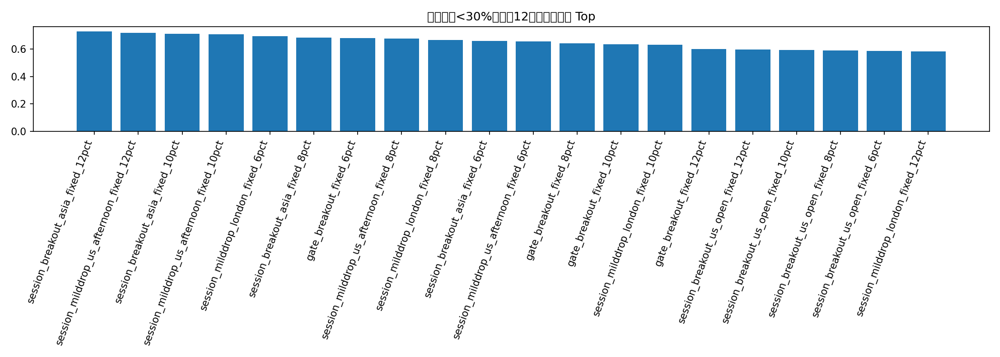
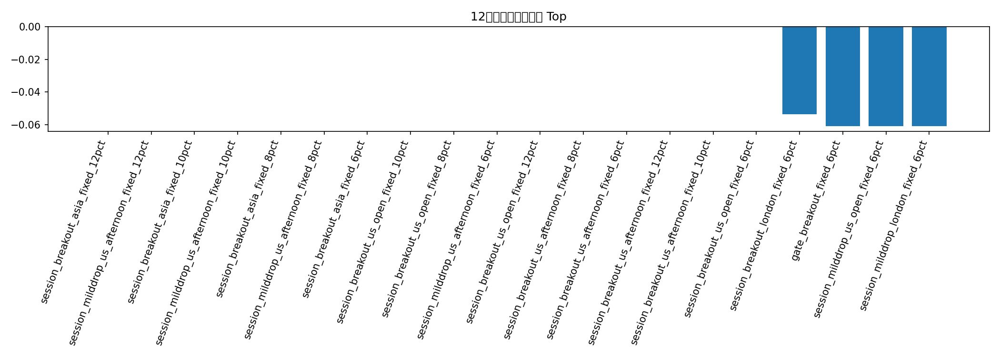

# 全历史 CLOB 策略库扩展：session / 12小时窗口 / adaptive sizing / triple gate

这份报告专门回测四个方向：

1. 时间分段版策略（按 ET session 切分）
2. 12 小时滚动窗口最差收益约束
3. 仓位自适应 / 降杠杆组合策略
4. spread / liquidity / overround 三重过滤

## 满足回撤 < 30% 的候选

| strategy                                  |   trades |   ending_bankroll |   total_return |   avg_trade_return_on_cost |   median_trade_return_on_cost |   win_rate |   profit_factor |   max_drawdown |   max_consecutive_losses |   avg_entry_minute |   avg_fraction |   worst_48_window_return |   median_48_window_return |   pct_positive_48_windows |   pct_nonnegative_48_windows |   num_48_windows |   score_end |   score_dd |   score_12h |   score_12h_pos |   score_pf |   score_win |   robustness_12h_score | meets_dd_lt_30   | meets_12h_positive_all   |
|:------------------------------------------|---------:|------------------:|---------------:|---------------------------:|------------------------------:|-----------:|----------------:|---------------:|-------------------------:|-------------------:|---------------:|-------------------------:|--------------------------:|--------------------------:|-----------------------------:|-----------------:|------------:|-----------:|------------:|----------------:|-----------:|------------:|-----------------------:|:-----------------|:-------------------------|
| session_breakout_asia_fixed_12pct         |       11 |           138.831 |         0.3883 |                     0.2539 |                        0.1786 |     1      |        nan      |         0      |                        0 |                  4 |           0.12 |                   0      |                         0 |                    0.2823 |                       1      |              804 |        0.88 |       0.85 |        0.85 |            0.53 |       0.17 |        0.89 |                 0.7265 | True             | False                    |
| session_milddrop_us_afternoon_fixed_12pct |        6 |           146.359 |         0.4636 |                     0.5476 |                        0.5972 |     1      |        nan      |         0      |                        0 |                  2 |           0.12 |                   0      |                         0 |                    0.1953 |                       1      |              804 |        0.92 |       0.85 |        0.85 |            0.45 |       0.17 |        0.89 |                 0.7165 | True             | False                    |
| session_breakout_asia_fixed_10pct         |       11 |           131.568 |         0.3157 |                     0.2539 |                        0.1786 |     1      |        nan      |         0      |                        0 |                  4 |           0.1  |                   0      |                         0 |                    0.2823 |                       1      |              804 |        0.78 |       0.85 |        0.85 |            0.53 |       0.17 |        0.89 |                 0.7115 | True             | False                    |
| session_milddrop_us_afternoon_fixed_10pct |        6 |           137.601 |         0.376  |                     0.5476 |                        0.5972 |     1      |        nan      |         0      |                        0 |                  2 |           0.1  |                   0      |                         0 |                    0.1953 |                       1      |              804 |        0.86 |       0.85 |        0.85 |            0.45 |       0.17 |        0.89 |                 0.7075 | True             | False                    |
| session_milddrop_london_fixed_6pct        |       26 |           146.629 |         0.4663 |                     0.2574 |                        0.4143 |     0.8462 |          2.8159 |         0.0825 |                        1 |                  2 |           0.06 |                  -0.061  |                         0 |                    0.3234 |                       0.9005 |              804 |        0.94 |       0.58 |        0.62 |            0.61 |       0.94 |        0.65 |                 0.693  | True             | False                    |
| session_breakout_asia_fixed_8pct          |       11 |           124.639 |         0.2464 |                     0.2539 |                        0.1786 |     1      |        nan      |         0      |                        0 |                  4 |           0.08 |                   0      |                         0 |                    0.2823 |                       1      |              804 |        0.6  |       0.85 |        0.85 |            0.53 |       0.17 |        0.89 |                 0.6845 | True             | False                    |
| gate_breakout_fixed_6pct                  |       22 |           120.125 |         0.2013 |                     0.145  |                        0.1579 |     0.9091 |          2.39   |         0.0812 |                        1 |                  4 |           0.06 |                  -0.0608 |                         0 |                    0.4876 |                       0.9055 |              804 |        0.5  |       0.62 |        0.66 |            0.76 |       0.92 |        0.73 |                 0.681  | True             | False                    |
| session_milddrop_us_afternoon_fixed_8pct  |        6 |           129.279 |         0.2928 |                     0.5476 |                        0.5972 |     1      |        nan      |         0      |                        0 |                  2 |           0.08 |                   0      |                         0 |                    0.1953 |                       1      |              804 |        0.66 |       0.85 |        0.85 |            0.45 |       0.17 |        0.89 |                 0.6775 | True             | False                    |
| session_milddrop_london_fixed_8pct        |       26 |           164.233 |         0.6423 |                     0.2574 |                        0.4143 |     0.8462 |          2.8454 |         0.1102 |                        1 |                  2 |           0.08 |                  -0.0813 |                         0 |                    0.3234 |                       0.9005 |              804 |        0.96 |       0.5  |        0.54 |            0.61 |       1    |        0.65 |                 0.666  | True             | False                    |
| session_breakout_asia_fixed_6pct          |       11 |           118.03  |         0.1803 |                     0.2539 |                        0.1786 |     1      |        nan      |         0      |                        0 |                  4 |           0.06 |                   0      |                         0 |                    0.2823 |                       1      |              804 |        0.42 |       0.85 |        0.85 |            0.53 |       0.17 |        0.89 |                 0.6575 | True             | False                    |
| session_milddrop_us_afternoon_fixed_6pct  |        6 |           121.374 |         0.2137 |                     0.5476 |                        0.5972 |     1      |        nan      |         0      |                        0 |                  2 |           0.06 |                   0      |                         0 |                    0.1953 |                       1      |              804 |        0.52 |       0.85 |        0.85 |            0.45 |       0.17 |        0.89 |                 0.6565 | True             | False                    |
| gate_breakout_fixed_8pct                  |       22 |           127.238 |         0.2724 |                     0.145  |                        0.1579 |     0.9091 |          2.333  |         0.1085 |                        1 |                  4 |           0.08 |                  -0.0811 |                         0 |                    0.4627 |                       0.8806 |              804 |        0.62 |       0.52 |        0.58 |            0.68 |       0.9  |        0.73 |                 0.641  | True             | False                    |
| gate_breakout_fixed_10pct                 |       22 |           134.527 |         0.3453 |                     0.145  |                        0.1579 |     0.9091 |          2.2781 |         0.1359 |                        1 |                  4 |           0.1  |                  -0.1014 |                         0 |                    0.4627 |                       0.8806 |              804 |        0.84 |       0.44 |        0.5  |            0.68 |       0.88 |        0.73 |                 0.636  | True             | False                    |
| session_milddrop_london_fixed_10pct       |       26 |           180.709 |         0.8071 |                     0.2574 |                        0.4143 |     0.8462 |          2.8263 |         0.138  |                        1 |                  2 |           0.1  |                  -0.1016 |                         0 |                    0.3234 |                       0.9005 |              804 |        0.98 |       0.42 |        0.46 |            0.61 |       0.98 |        0.65 |                 0.631  | True             | False                    |
| gate_breakout_fixed_12pct                 |       22 |           141.97  |         0.4197 |                     0.145  |                        0.1579 |     0.9091 |          2.2251 |         0.1634 |                        1 |                  4 |           0.12 |                  -0.1216 |                         0 |                    0.4627 |                       0.8806 |              804 |        0.9  |       0.4  |        0.36 |            0.68 |       0.86 |        0.73 |                 0.6    | True             | False                    |
| session_breakout_us_open_fixed_12pct      |        2 |           103.826 |         0.0383 |                     0.1579 |                        0.1579 |     1      |        nan      |         0      |                        0 |                  4 |           0.12 |                   0      |                         0 |                    0.1194 |                       1      |              804 |        0.34 |       0.85 |        0.85 |            0.29 |       0.17 |        0.89 |                 0.5975 | True             | False                    |
| session_breakout_us_open_fixed_10pct      |        2 |           103.184 |         0.0318 |                     0.1579 |                        0.1579 |     1      |        nan      |         0      |                        0 |                  4 |           0.1  |                   0      |                         0 |                    0.1194 |                       1      |              804 |        0.3  |       0.85 |        0.85 |            0.29 |       0.17 |        0.89 |                 0.5915 | True             | False                    |
| session_breakout_us_open_fixed_8pct       |        2 |           102.543 |         0.0254 |                     0.1579 |                        0.1579 |     1      |        nan      |         0      |                        0 |                  4 |           0.08 |                   0      |                         0 |                    0.1194 |                       1      |              804 |        0.28 |       0.85 |        0.85 |            0.29 |       0.17 |        0.89 |                 0.5885 | True             | False                    |
| session_breakout_us_open_fixed_6pct       |        2 |           101.904 |         0.019  |                     0.1579 |                        0.1579 |     1      |        nan      |         0      |                        0 |                  4 |           0.06 |                   0      |                         0 |                    0.1194 |                       1      |              804 |        0.26 |       0.85 |        0.85 |            0.29 |       0.17 |        0.89 |                 0.5855 | True             | False                    |
| session_milddrop_london_fixed_12pct       |       26 |           198.161 |         0.9816 |                     0.2574 |                        0.4143 |     0.8462 |          2.824  |         0.1659 |                        1 |                  2 |           0.12 |                  -0.1219 |                         0 |                    0.3234 |                       0.9005 |              804 |        1    |       0.34 |        0.32 |            0.61 |       0.96 |        0.65 |                 0.581  | True             | False                    |

## 满足回撤 < 30% 且 12小时最差窗口为正的候选

(empty)

## 12小时稳健得分 Top 20

| strategy                                  |   trades |   ending_bankroll |   total_return |   avg_trade_return_on_cost |   median_trade_return_on_cost |   win_rate |   profit_factor |   max_drawdown |   max_consecutive_losses |   avg_entry_minute |   avg_fraction |   worst_48_window_return |   median_48_window_return |   pct_positive_48_windows |   pct_nonnegative_48_windows |   num_48_windows |   score_end |   score_dd |   score_12h |   score_12h_pos |   score_pf |   score_win |   robustness_12h_score | meets_dd_lt_30   | meets_12h_positive_all   |
|:------------------------------------------|---------:|------------------:|---------------:|---------------------------:|------------------------------:|-----------:|----------------:|---------------:|-------------------------:|-------------------:|---------------:|-------------------------:|--------------------------:|--------------------------:|-----------------------------:|-----------------:|------------:|-----------:|------------:|----------------:|-----------:|------------:|-----------------------:|:-----------------|:-------------------------|
| session_breakout_asia_fixed_12pct         |       11 |           138.831 |         0.3883 |                     0.2539 |                        0.1786 |     1      |        nan      |         0      |                        0 |                  4 |           0.12 |                   0      |                         0 |                    0.2823 |                       1      |              804 |        0.88 |       0.85 |        0.85 |            0.53 |       0.17 |        0.89 |                 0.7265 | True             | False                    |
| session_milddrop_us_afternoon_fixed_12pct |        6 |           146.359 |         0.4636 |                     0.5476 |                        0.5972 |     1      |        nan      |         0      |                        0 |                  2 |           0.12 |                   0      |                         0 |                    0.1953 |                       1      |              804 |        0.92 |       0.85 |        0.85 |            0.45 |       0.17 |        0.89 |                 0.7165 | True             | False                    |
| session_breakout_asia_fixed_10pct         |       11 |           131.568 |         0.3157 |                     0.2539 |                        0.1786 |     1      |        nan      |         0      |                        0 |                  4 |           0.1  |                   0      |                         0 |                    0.2823 |                       1      |              804 |        0.78 |       0.85 |        0.85 |            0.53 |       0.17 |        0.89 |                 0.7115 | True             | False                    |
| session_milddrop_us_afternoon_fixed_10pct |        6 |           137.601 |         0.376  |                     0.5476 |                        0.5972 |     1      |        nan      |         0      |                        0 |                  2 |           0.1  |                   0      |                         0 |                    0.1953 |                       1      |              804 |        0.86 |       0.85 |        0.85 |            0.45 |       0.17 |        0.89 |                 0.7075 | True             | False                    |
| session_milddrop_london_fixed_6pct        |       26 |           146.629 |         0.4663 |                     0.2574 |                        0.4143 |     0.8462 |          2.8159 |         0.0825 |                        1 |                  2 |           0.06 |                  -0.061  |                         0 |                    0.3234 |                       0.9005 |              804 |        0.94 |       0.58 |        0.62 |            0.61 |       0.94 |        0.65 |                 0.693  | True             | False                    |
| session_breakout_asia_fixed_8pct          |       11 |           124.639 |         0.2464 |                     0.2539 |                        0.1786 |     1      |        nan      |         0      |                        0 |                  4 |           0.08 |                   0      |                         0 |                    0.2823 |                       1      |              804 |        0.6  |       0.85 |        0.85 |            0.53 |       0.17 |        0.89 |                 0.6845 | True             | False                    |
| gate_breakout_fixed_6pct                  |       22 |           120.125 |         0.2013 |                     0.145  |                        0.1579 |     0.9091 |          2.39   |         0.0812 |                        1 |                  4 |           0.06 |                  -0.0608 |                         0 |                    0.4876 |                       0.9055 |              804 |        0.5  |       0.62 |        0.66 |            0.76 |       0.92 |        0.73 |                 0.681  | True             | False                    |
| session_milddrop_us_afternoon_fixed_8pct  |        6 |           129.279 |         0.2928 |                     0.5476 |                        0.5972 |     1      |        nan      |         0      |                        0 |                  2 |           0.08 |                   0      |                         0 |                    0.1953 |                       1      |              804 |        0.66 |       0.85 |        0.85 |            0.45 |       0.17 |        0.89 |                 0.6775 | True             | False                    |
| session_milddrop_london_fixed_8pct        |       26 |           164.233 |         0.6423 |                     0.2574 |                        0.4143 |     0.8462 |          2.8454 |         0.1102 |                        1 |                  2 |           0.08 |                  -0.0813 |                         0 |                    0.3234 |                       0.9005 |              804 |        0.96 |       0.5  |        0.54 |            0.61 |       1    |        0.65 |                 0.666  | True             | False                    |
| session_breakout_asia_fixed_6pct          |       11 |           118.03  |         0.1803 |                     0.2539 |                        0.1786 |     1      |        nan      |         0      |                        0 |                  4 |           0.06 |                   0      |                         0 |                    0.2823 |                       1      |              804 |        0.42 |       0.85 |        0.85 |            0.53 |       0.17 |        0.89 |                 0.6575 | True             | False                    |
| session_milddrop_us_afternoon_fixed_6pct  |        6 |           121.374 |         0.2137 |                     0.5476 |                        0.5972 |     1      |        nan      |         0      |                        0 |                  2 |           0.06 |                   0      |                         0 |                    0.1953 |                       1      |              804 |        0.52 |       0.85 |        0.85 |            0.45 |       0.17 |        0.89 |                 0.6565 | True             | False                    |
| gate_breakout_fixed_8pct                  |       22 |           127.238 |         0.2724 |                     0.145  |                        0.1579 |     0.9091 |          2.333  |         0.1085 |                        1 |                  4 |           0.08 |                  -0.0811 |                         0 |                    0.4627 |                       0.8806 |              804 |        0.62 |       0.52 |        0.58 |            0.68 |       0.9  |        0.73 |                 0.641  | True             | False                    |
| gate_breakout_fixed_10pct                 |       22 |           134.527 |         0.3453 |                     0.145  |                        0.1579 |     0.9091 |          2.2781 |         0.1359 |                        1 |                  4 |           0.1  |                  -0.1014 |                         0 |                    0.4627 |                       0.8806 |              804 |        0.84 |       0.44 |        0.5  |            0.68 |       0.88 |        0.73 |                 0.636  | True             | False                    |
| session_milddrop_london_fixed_10pct       |       26 |           180.709 |         0.8071 |                     0.2574 |                        0.4143 |     0.8462 |          2.8263 |         0.138  |                        1 |                  2 |           0.1  |                  -0.1016 |                         0 |                    0.3234 |                       0.9005 |              804 |        0.98 |       0.42 |        0.46 |            0.61 |       0.98 |        0.65 |                 0.631  | True             | False                    |
| gate_breakout_fixed_12pct                 |       22 |           141.97  |         0.4197 |                     0.145  |                        0.1579 |     0.9091 |          2.2251 |         0.1634 |                        1 |                  4 |           0.12 |                  -0.1216 |                         0 |                    0.4627 |                       0.8806 |              804 |        0.9  |       0.4  |        0.36 |            0.68 |       0.86 |        0.73 |                 0.6    | True             | False                    |
| session_breakout_us_open_fixed_12pct      |        2 |           103.826 |         0.0383 |                     0.1579 |                        0.1579 |     1      |        nan      |         0      |                        0 |                  4 |           0.12 |                   0      |                         0 |                    0.1194 |                       1      |              804 |        0.34 |       0.85 |        0.85 |            0.29 |       0.17 |        0.89 |                 0.5975 | True             | False                    |
| session_breakout_us_open_fixed_10pct      |        2 |           103.184 |         0.0318 |                     0.1579 |                        0.1579 |     1      |        nan      |         0      |                        0 |                  4 |           0.1  |                   0      |                         0 |                    0.1194 |                       1      |              804 |        0.3  |       0.85 |        0.85 |            0.29 |       0.17 |        0.89 |                 0.5915 | True             | False                    |
| session_breakout_us_open_fixed_8pct       |        2 |           102.543 |         0.0254 |                     0.1579 |                        0.1579 |     1      |        nan      |         0      |                        0 |                  4 |           0.08 |                   0      |                         0 |                    0.1194 |                       1      |              804 |        0.28 |       0.85 |        0.85 |            0.29 |       0.17 |        0.89 |                 0.5885 | True             | False                    |
| session_breakout_us_open_fixed_6pct       |        2 |           101.904 |         0.019  |                     0.1579 |                        0.1579 |     1      |        nan      |         0      |                        0 |                  4 |           0.06 |                   0      |                         0 |                    0.1194 |                       1      |              804 |        0.26 |       0.85 |        0.85 |            0.29 |       0.17 |        0.89 |                 0.5855 | True             | False                    |
| session_milddrop_london_fixed_12pct       |       26 |           198.161 |         0.9816 |                     0.2574 |                        0.4143 |     0.8462 |          2.824  |         0.1659 |                        1 |                  2 |           0.12 |                  -0.1219 |                         0 |                    0.3234 |                       0.9005 |              804 |        1    |       0.34 |        0.32 |            0.61 |       0.96 |        0.65 |                 0.581  | True             | False                    |

## session 拆分表现（finalists）

| strategy                                  | session_et   |   trades |   avg_pnl_usd |   total_pnl_usd |   avg_fraction |   win_rate |
|:------------------------------------------|:-------------|---------:|--------------:|----------------:|---------------:|-----------:|
| gate_breakout_fixed_6pct                  | asia         |       10 |        1.7336 |         17.3362 |           0.06 |     1      |
| gate_breakout_fixed_6pct                  | london       |        5 |       -0.2264 |         -1.1319 |           0.06 |     0.8    |
| gate_breakout_fixed_6pct                  | other        |        5 |        0.3375 |          1.6875 |           0.06 |     0.8    |
| gate_breakout_fixed_6pct                  | us_open      |        2 |        1.1166 |          2.2332 |           0.06 |     1      |
| session_breakout_asia_fixed_10pct         | asia         |       11 |        2.8698 |         31.568  |           0.1  |     1      |
| session_breakout_asia_fixed_12pct         | asia         |       11 |        3.5301 |         38.831  |           0.12 |     1      |
| session_breakout_asia_fixed_6pct          | asia         |       11 |        1.6391 |         18.0301 |           0.06 |     1      |
| session_breakout_asia_fixed_8pct          | asia         |       11 |        2.2399 |         24.6388 |           0.08 |     1      |
| session_breakout_us_open_fixed_10pct      | us_open      |        2 |        1.5918 |          3.1836 |           0.1  |     1      |
| session_breakout_us_open_fixed_8pct       | us_open      |        2 |        1.2714 |          2.5429 |           0.08 |     1      |
| session_milddrop_london_fixed_6pct        | london       |       26 |        1.7934 |         46.6293 |           0.06 |     0.8462 |
| session_milddrop_london_fixed_8pct        | london       |       26 |        2.4705 |         64.2332 |           0.08 |     0.8462 |
| session_milddrop_us_afternoon_fixed_10pct | us_afternoon |        6 |        6.2669 |         37.6013 |           0.1  |     1      |
| session_milddrop_us_afternoon_fixed_12pct | us_afternoon |        6 |        7.7265 |         46.3588 |           0.12 |     1      |
| session_milddrop_us_afternoon_fixed_6pct  | us_afternoon |        6 |        3.5623 |         21.3735 |           0.06 |     1      |
| session_milddrop_us_afternoon_fixed_8pct  | us_afternoon |        6 |        4.8798 |         29.2786 |           0.08 |     1      |

## 当前最值得关注的策略

- 策略：**session_breakout_asia_fixed_12pct**
- 期末本金：**138.83 USD**
- 最大回撤：**0.00%**
- 12小时最差窗口收益：**0.00%**
- 12小时正收益窗口占比：**28.23%**

## 图表

