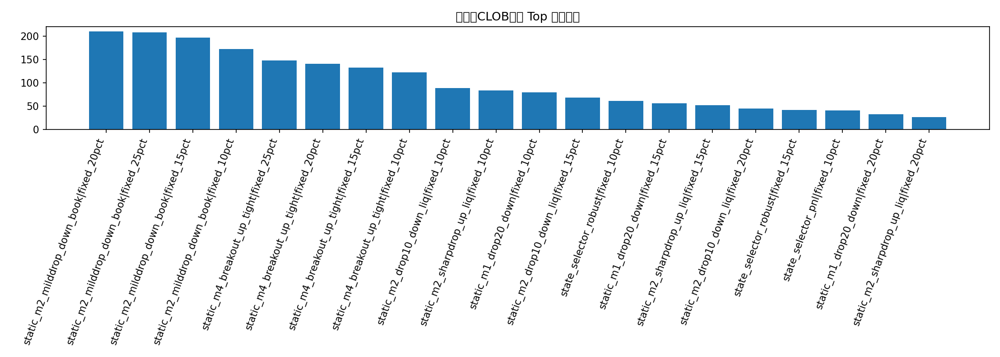
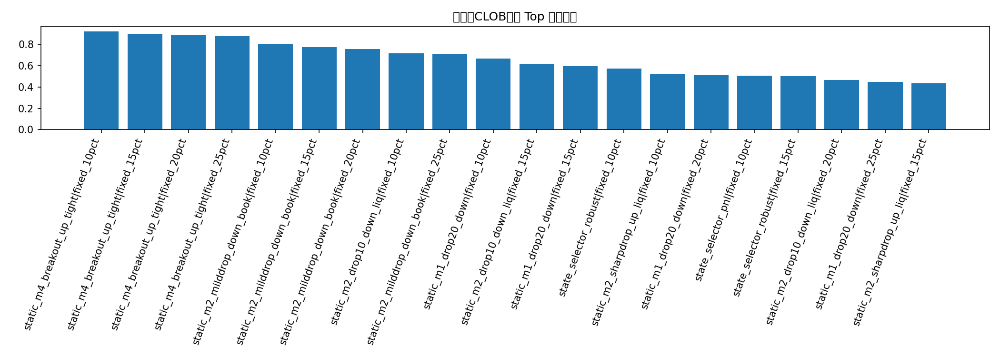

# monthly_runs 全历史 CLOB 数据：系统性策略研究

这份报告只使用 `data/monthly_runs/*` 里已经从 Polymarket CLOB 拉下来的真实事件数据，不依赖额外外部数据。

## 数据覆盖

| run_name             |   file_count |   raw_row_count |   markets |
|:---------------------|-------------:|----------------:|----------:|
| 24949259015_attempt1 |           48 |           39535 |       290 |
| 24952032748_attempt1 |           48 |           36019 |       290 |
| 24986940107_attempt1 |           41 |           35495 |       247 |

## 这版明确用到了哪些 CLOB / 流动性指标

| feature                       | category         | description        |
|:------------------------------|:-----------------|:-------------------|
| buy_up_size_2m                | liquidity        | 2分钟买Up可成交量         |
| buy_down_size_2m              | liquidity        | 2分钟买Down可成交量       |
| sell_up_size_2m               | liquidity        | 2分钟卖Up对手量          |
| sell_down_size_2m             | liquidity        | 2分钟卖Down对手量        |
| bid_depth_imbalance_updown_2m | depth            | bid depth不平衡       |
| book_pressure_up_2m           | book_pressure    | Up侧盘口压力            |
| book_pressure_down_2m         | book_pressure    | Down侧盘口压力          |
| size_imbalance_updown_2m      | imbalance        | 买盘量不平衡             |
| sell_size_imbalance_updown_2m | imbalance        | 卖盘量不平衡             |
| spread_up_median_first2m      | spread           | 前2分钟Up spread中位数   |
| spread_down_median_first2m    | spread           | 前2分钟Down spread中位数 |
| overround_median_first2m      | pricing          | 前2分钟overround中位数   |
| trade_count_sum_first2m       | trading_activity | 前2分钟成交笔数总和         |
| trade_volume_sum_first2m      | trading_activity | 前2分钟成交量总和          |
| quote_count_first2m           | quote_activity   | 前2分钟quote数量        |
| realized_vol_first2m          | path             | 前2分钟路径波动           |
| path_efficiency_first2m       | path             | 前2分钟路径效率           |
| max_drawdown_first2m          | path             | 前2分钟最大下探           |
| max_rebound_first2m           | path             | 前2分钟最大反弹           |

## 收益最高 Top 20

| source_layer                | strategy                     | sizing      |   trades |   ending_bankroll |   total_return |   avg_trade_return_on_cost |   median_trade_return_on_cost |   win_rate |   profit_factor |   max_drawdown |   max_consecutive_losses |   avg_entry_minute |   avg_signal_score |   p10_trade_return_on_cost |   score_end |   score_win |   score_pf |   score_dd |   score_streak |   score_tail |   robustness_score |
|:----------------------------|:-----------------------------|:------------|---------:|------------------:|---------------:|---------------------------:|------------------------------:|-----------:|----------------:|---------------:|-------------------------:|-------------------:|-------------------:|---------------------------:|------------:|------------:|-----------:|-----------:|---------------:|-------------:|-------------------:|
| all_monthly_clob_systematic | static_m2_milddrop_down_book | fixed_20pct |       55 |          210.071  |         1.1007 |                     0.1238 |                        0.4143 |     0.7455 |          1.5497 |         0.7026 |                        3 |             2      |           nan      |                    -1.0159 |      1      |      0.7031 |     0.9062 |     0.7188 |         0.5781 |       0.3281 |             0.7563 |
| all_monthly_clob_systematic | static_m2_milddrop_down_book | fixed_25pct |       55 |          208.229  |         1.0823 |                     0.1238 |                        0.4143 |     0.7455 |          1.4922 |         0.8001 |                        3 |             2      |           nan      |                    -1.0159 |      0.9688 |      0.7031 |     0.875  |     0.5625 |         0.5781 |       0.3281 |             0.7125 |
| all_monthly_clob_systematic | static_m2_milddrop_down_book | fixed_15pct |       55 |          197.08   |         0.9708 |                     0.1238 |                        0.4143 |     0.7455 |          1.5785 |         0.5755 |                        3 |             2      |           nan      |                    -1.0159 |      0.9375 |      0.7031 |     0.9688 |     0.8125 |         0.5781 |       0.3281 |             0.775  |
| all_monthly_clob_systematic | static_m2_milddrop_down_book | fixed_10pct |       55 |          172.322  |         0.7232 |                     0.1238 |                        0.4143 |     0.7455 |          1.588  |         0.4161 |                        3 |             2      |           nan      |                    -1.0159 |      0.9062 |      0.7031 |     1      |     0.9375 |         0.5781 |       0.3281 |             0.8    |
| all_monthly_clob_systematic | static_m4_breakout_up_tight  | fixed_25pct |       23 |          148.341  |         0.4834 |                     0.1006 |                        0.1647 |     0.8696 |          1.3455 |         0.5085 |                        2 |             4      |           nan      |                    -0.7889 |      0.875  |      0.9531 |     0.7812 |     0.875  |         0.8906 |       0.9062 |             0.8766 |
| all_monthly_clob_systematic | static_m4_breakout_up_tight  | fixed_20pct |       23 |          141.505  |         0.4151 |                     0.1006 |                        0.1647 |     0.8696 |          1.4144 |         0.4206 |                        2 |             4      |           nan      |                    -0.7889 |      0.8438 |      0.9531 |     0.8125 |     0.9062 |         0.8906 |       0.9688 |             0.8891 |
| all_monthly_clob_systematic | static_m4_breakout_up_tight  | fixed_15pct |       23 |          132.73   |         0.3273 |                     0.1006 |                        0.1647 |     0.8696 |          1.4896 |         0.3254 |                        2 |             4      |           nan      |                    -0.7889 |      0.8125 |      0.9531 |     0.8438 |     0.9688 |         0.8906 |       0.9688 |             0.9016 |
| all_monthly_clob_systematic | static_m4_breakout_up_tight  | fixed_10pct |       23 |          122.556  |         0.2256 |                     0.1006 |                        0.1647 |     0.8696 |          1.5719 |         0.2233 |                        2 |             4      |           nan      |                    -0.7889 |      0.7812 |      0.9531 |     0.9375 |     1      |         0.8906 |       0.9688 |             0.9203 |
| all_monthly_clob_systematic | static_m2_drop10_down_liq    | fixed_10pct |      138 |           89.235  |        -0.1076 |                     0.0101 |                        0.1857 |     0.7681 |          0.9358 |         0.7366 |                        3 |             2      |           nan      |                    -1.0137 |      0.75   |      0.8281 |     0.6875 |     0.625  |         0.5781 |       0.7969 |             0.7156 |
| all_monthly_clob_systematic | static_m2_sharpdrop_up_liq   | fixed_10pct |       38 |           83.9755 |        -0.1602 |                     0.1101 |                       -1.0408 |     0.2895 |          0.9602 |         0.6613 |                        9 |             2      |           nan      |                    -1.0681 |      0.7188 |      0.2031 |     0.75   |     0.75   |         0.2031 |       0.1875 |             0.5234 |
| all_monthly_clob_systematic | static_m1_drop20_down        | fixed_10pct |      152 |           80.3295 |        -0.1967 |                     0.0099 |                        0.2692 |     0.7434 |          0.9457 |         0.6141 |                        3 |             1      |           nan      |                    -1.0149 |      0.6875 |      0.5781 |     0.7188 |     0.7812 |         0.5781 |       0.5781 |             0.6688 |
| all_monthly_clob_systematic | static_m2_drop10_down_liq    | fixed_15pct |      138 |           68.8274 |        -0.3117 |                     0.0101 |                        0.1857 |     0.7681 |          0.8254 |         0.885  |                        3 |             2      |           nan      |                    -1.0137 |      0.6562 |      0.8281 |     0.4688 |     0.4062 |         0.5781 |       0.8594 |             0.6156 |
| all_monthly_clob_systematic | state_selector_robust        | fixed_10pct |       72 |           61.4864 |        -0.3851 |                    -0.0396 |                        0.2148 |     0.7222 |          0.8089 |         0.556  |                        2 |             1.375  |             0.0598 |                    -1.0149 |      0.625  |      0.3281 |     0.4062 |     0.8438 |         0.8906 |       0.4531 |             0.575  |
| all_monthly_clob_systematic | static_m1_drop20_down        | fixed_15pct |      152 |           56.9336 |        -0.4307 |                     0.0099 |                        0.2692 |     0.7434 |          0.9085 |         0.7723 |                        3 |             1      |           nan      |                    -1.0149 |      0.5938 |      0.5781 |     0.625  |     0.5938 |         0.5781 |       0.5781 |             0.5938 |
| all_monthly_clob_systematic | static_m2_sharpdrop_up_liq   | fixed_15pct |       38 |           52.616  |        -0.4738 |                     0.1101 |                       -1.0408 |     0.2895 |          0.9195 |         0.8146 |                        9 |             2      |           nan      |                    -1.0681 |      0.5625 |      0.2031 |     0.6562 |     0.5312 |         0.2031 |       0.25   |             0.4359 |
| all_monthly_clob_systematic | static_m2_drop10_down_liq    | fixed_20pct |      138 |           45.7477 |        -0.5425 |                     0.0101 |                        0.1857 |     0.7681 |          0.6835 |         0.9555 |                        3 |             2      |           nan      |                    -1.0137 |      0.5312 |      0.8281 |     0.0625 |     0.1875 |         0.5781 |       0.8594 |             0.4656 |
| all_monthly_clob_systematic | state_selector_robust        | fixed_15pct |       72 |           42.4523 |        -0.5755 |                    -0.0396 |                        0.2148 |     0.7222 |          0.7945 |         0.7182 |                        2 |             1.375  |             0.0598 |                    -1.0149 |      0.5    |      0.3281 |     0.3125 |     0.6875 |         0.8906 |       0.4531 |             0.5    |
| all_monthly_clob_systematic | state_selector_pnl           | fixed_10pct |      127 |           41.4578 |        -0.5854 |                    -0.0435 |                        0.2375 |     0.7244 |          0.8103 |         0.7285 |                        4 |             1.5276 |             0.0434 |                    -1.0148 |      0.4688 |      0.4531 |     0.4375 |     0.6562 |         0.3281 |       0.6875 |             0.5047 |
| all_monthly_clob_systematic | static_m1_drop20_down        | fixed_20pct |      152 |           33.0207 |        -0.6698 |                     0.0099 |                        0.2692 |     0.7434 |          0.8666 |         0.8747 |                        3 |             1      |           nan      |                    -1.0149 |      0.4375 |      0.5781 |     0.5312 |     0.4375 |         0.5781 |       0.5781 |             0.5125 |
| all_monthly_clob_systematic | static_m2_sharpdrop_up_liq   | fixed_20pct |       38 |           26.4001 |        -0.736  |                     0.1101 |                       -1.0408 |     0.2895 |          0.8922 |         0.9031 |                        9 |             2      |           nan      |                    -1.0681 |      0.4062 |      0.2031 |     0.5938 |     0.375  |         0.2031 |       0.1875 |             0.3547 |

## 稳健性最好 Top 20

| source_layer                | strategy                     | sizing      |   trades |   ending_bankroll |   total_return |   avg_trade_return_on_cost |   median_trade_return_on_cost |   win_rate |   profit_factor |   max_drawdown |   max_consecutive_losses |   avg_entry_minute |   avg_signal_score |   p10_trade_return_on_cost |   score_end |   score_win |   score_pf |   score_dd |   score_streak |   score_tail |   robustness_score |
|:----------------------------|:-----------------------------|:------------|---------:|------------------:|---------------:|---------------------------:|------------------------------:|-----------:|----------------:|---------------:|-------------------------:|-------------------:|-------------------:|---------------------------:|------------:|------------:|-----------:|-----------:|---------------:|-------------:|-------------------:|
| all_monthly_clob_systematic | static_m4_breakout_up_tight  | fixed_10pct |       23 |          122.556  |         0.2256 |                     0.1006 |                        0.1647 |     0.8696 |          1.5719 |         0.2233 |                        2 |             4      |           nan      |                    -0.7889 |      0.7812 |      0.9531 |     0.9375 |     1      |         0.8906 |       0.9688 |             0.9203 |
| all_monthly_clob_systematic | static_m4_breakout_up_tight  | fixed_15pct |       23 |          132.73   |         0.3273 |                     0.1006 |                        0.1647 |     0.8696 |          1.4896 |         0.3254 |                        2 |             4      |           nan      |                    -0.7889 |      0.8125 |      0.9531 |     0.8438 |     0.9688 |         0.8906 |       0.9688 |             0.9016 |
| all_monthly_clob_systematic | static_m4_breakout_up_tight  | fixed_20pct |       23 |          141.505  |         0.4151 |                     0.1006 |                        0.1647 |     0.8696 |          1.4144 |         0.4206 |                        2 |             4      |           nan      |                    -0.7889 |      0.8438 |      0.9531 |     0.8125 |     0.9062 |         0.8906 |       0.9688 |             0.8891 |
| all_monthly_clob_systematic | static_m4_breakout_up_tight  | fixed_25pct |       23 |          148.341  |         0.4834 |                     0.1006 |                        0.1647 |     0.8696 |          1.3455 |         0.5085 |                        2 |             4      |           nan      |                    -0.7889 |      0.875  |      0.9531 |     0.7812 |     0.875  |         0.8906 |       0.9062 |             0.8766 |
| all_monthly_clob_systematic | static_m2_milddrop_down_book | fixed_10pct |       55 |          172.322  |         0.7232 |                     0.1238 |                        0.4143 |     0.7455 |          1.588  |         0.4161 |                        3 |             2      |           nan      |                    -1.0159 |      0.9062 |      0.7031 |     1      |     0.9375 |         0.5781 |       0.3281 |             0.8    |
| all_monthly_clob_systematic | static_m2_milddrop_down_book | fixed_15pct |       55 |          197.08   |         0.9708 |                     0.1238 |                        0.4143 |     0.7455 |          1.5785 |         0.5755 |                        3 |             2      |           nan      |                    -1.0159 |      0.9375 |      0.7031 |     0.9688 |     0.8125 |         0.5781 |       0.3281 |             0.775  |
| all_monthly_clob_systematic | static_m2_milddrop_down_book | fixed_20pct |       55 |          210.071  |         1.1007 |                     0.1238 |                        0.4143 |     0.7455 |          1.5497 |         0.7026 |                        3 |             2      |           nan      |                    -1.0159 |      1      |      0.7031 |     0.9062 |     0.7188 |         0.5781 |       0.3281 |             0.7563 |
| all_monthly_clob_systematic | static_m2_drop10_down_liq    | fixed_10pct |      138 |           89.235  |        -0.1076 |                     0.0101 |                        0.1857 |     0.7681 |          0.9358 |         0.7366 |                        3 |             2      |           nan      |                    -1.0137 |      0.75   |      0.8281 |     0.6875 |     0.625  |         0.5781 |       0.7969 |             0.7156 |
| all_monthly_clob_systematic | static_m2_milddrop_down_book | fixed_25pct |       55 |          208.229  |         1.0823 |                     0.1238 |                        0.4143 |     0.7455 |          1.4922 |         0.8001 |                        3 |             2      |           nan      |                    -1.0159 |      0.9688 |      0.7031 |     0.875  |     0.5625 |         0.5781 |       0.3281 |             0.7125 |
| all_monthly_clob_systematic | static_m1_drop20_down        | fixed_10pct |      152 |           80.3295 |        -0.1967 |                     0.0099 |                        0.2692 |     0.7434 |          0.9457 |         0.6141 |                        3 |             1      |           nan      |                    -1.0149 |      0.6875 |      0.5781 |     0.7188 |     0.7812 |         0.5781 |       0.5781 |             0.6688 |
| all_monthly_clob_systematic | static_m2_drop10_down_liq    | fixed_15pct |      138 |           68.8274 |        -0.3117 |                     0.0101 |                        0.1857 |     0.7681 |          0.8254 |         0.885  |                        3 |             2      |           nan      |                    -1.0137 |      0.6562 |      0.8281 |     0.4688 |     0.4062 |         0.5781 |       0.8594 |             0.6156 |
| all_monthly_clob_systematic | static_m1_drop20_down        | fixed_15pct |      152 |           56.9336 |        -0.4307 |                     0.0099 |                        0.2692 |     0.7434 |          0.9085 |         0.7723 |                        3 |             1      |           nan      |                    -1.0149 |      0.5938 |      0.5781 |     0.625  |     0.5938 |         0.5781 |       0.5781 |             0.5938 |
| all_monthly_clob_systematic | state_selector_robust        | fixed_10pct |       72 |           61.4864 |        -0.3851 |                    -0.0396 |                        0.2148 |     0.7222 |          0.8089 |         0.556  |                        2 |             1.375  |             0.0598 |                    -1.0149 |      0.625  |      0.3281 |     0.4062 |     0.8438 |         0.8906 |       0.4531 |             0.575  |
| all_monthly_clob_systematic | static_m2_sharpdrop_up_liq   | fixed_10pct |       38 |           83.9755 |        -0.1602 |                     0.1101 |                       -1.0408 |     0.2895 |          0.9602 |         0.6613 |                        9 |             2      |           nan      |                    -1.0681 |      0.7188 |      0.2031 |     0.75   |     0.75   |         0.2031 |       0.1875 |             0.5234 |
| all_monthly_clob_systematic | static_m1_drop20_down        | fixed_20pct |      152 |           33.0207 |        -0.6698 |                     0.0099 |                        0.2692 |     0.7434 |          0.8666 |         0.8747 |                        3 |             1      |           nan      |                    -1.0149 |      0.4375 |      0.5781 |     0.5312 |     0.4375 |         0.5781 |       0.5781 |             0.5125 |
| all_monthly_clob_systematic | state_selector_pnl           | fixed_10pct |      127 |           41.4578 |        -0.5854 |                    -0.0435 |                        0.2375 |     0.7244 |          0.8103 |         0.7285 |                        4 |             1.5276 |             0.0434 |                    -1.0148 |      0.4688 |      0.4531 |     0.4375 |     0.6562 |         0.3281 |       0.6875 |             0.5047 |
| all_monthly_clob_systematic | state_selector_robust        | fixed_15pct |       72 |           42.4523 |        -0.5755 |                    -0.0396 |                        0.2148 |     0.7222 |          0.7945 |         0.7182 |                        2 |             1.375  |             0.0598 |                    -1.0149 |      0.5    |      0.3281 |     0.3125 |     0.6875 |         0.8906 |       0.4531 |             0.5    |
| all_monthly_clob_systematic | static_m2_drop10_down_liq    | fixed_20pct |      138 |           45.7477 |        -0.5425 |                     0.0101 |                        0.1857 |     0.7681 |          0.6835 |         0.9555 |                        3 |             2      |           nan      |                    -1.0137 |      0.5312 |      0.8281 |     0.0625 |     0.1875 |         0.5781 |       0.8594 |             0.4656 |
| all_monthly_clob_systematic | static_m1_drop20_down        | fixed_25pct |      152 |           16.3211 |        -0.8368 |                     0.0099 |                        0.2692 |     0.7434 |          0.8325 |         0.9361 |                        3 |             1      |           nan      |                    -1.0149 |      0.2812 |      0.5781 |     0.5    |     0.3125 |         0.5781 |       0.5781 |             0.45   |
| all_monthly_clob_systematic | static_m2_sharpdrop_up_liq   | fixed_15pct |       38 |           52.616  |        -0.4738 |                     0.1101 |                       -1.0408 |     0.2895 |          0.9195 |         0.8146 |                        9 |             2      |           nan      |                    -1.0681 |      0.5625 |      0.2031 |     0.6562 |     0.5312 |         0.2031 |       0.25   |             0.4359 |

## 两种“最佳”

- 收益最高：**static_m2_milddrop_down_book | fixed_20pct**，期末本金 **210.07 USD**，最大回撤 **70.26%**。
- 稳健性最好：**static_m4_breakout_up_tight | fixed_10pct**，稳健得分 **0.9203**，期末本金 **122.56 USD**，最大回撤 **22.33%**。

## finalist 按 run 的表现

| strategy                     | sizing      | run_name             |   trades |   avg_pnl_usd |   total_pnl_usd |   avg_signal_score |   win_rate |
|:-----------------------------|:------------|:---------------------|---------:|--------------:|----------------:|-------------------:|-----------:|
| static_m1_drop20_down        | fixed_10pct | 24949259015_attempt1 |       48 |        0.5667 |         27.2034 |                nan |     0.7917 |
| static_m1_drop20_down        | fixed_10pct | 24952032748_attempt1 |       50 |       -1.3328 |        -66.6393 |                nan |     0.68   |
| static_m1_drop20_down        | fixed_10pct | 24986940107_attempt1 |       54 |        0.366  |         19.7653 |                nan |     0.7593 |
| static_m2_drop10_down_liq    | fixed_10pct | 24949259015_attempt1 |       46 |       -1.4498 |        -66.6906 |                nan |     0.6304 |
| static_m2_drop10_down_liq    | fixed_10pct | 24952032748_attempt1 |       48 |       -0.0733 |         -3.5174 |                nan |     0.75   |
| static_m2_drop10_down_liq    | fixed_10pct | 24986940107_attempt1 |       44 |        1.351  |         59.4431 |                nan |     0.9318 |
| static_m2_milddrop_down_book | fixed_10pct | 24949259015_attempt1 |       20 |       -1.7663 |        -35.3263 |                nan |     0.55   |
| static_m2_milddrop_down_book | fixed_10pct | 24952032748_attempt1 |       15 |        0.5415 |          8.1227 |                nan |     0.7333 |
| static_m2_milddrop_down_book | fixed_10pct | 24986940107_attempt1 |       20 |        4.9763 |         99.5258 |                nan |     0.95   |
| static_m2_milddrop_down_book | fixed_15pct | 24949259015_attempt1 |       20 |       -2.5303 |        -50.606  |                nan |     0.55   |
| static_m2_milddrop_down_book | fixed_15pct | 24952032748_attempt1 |       15 |        0.5253 |          7.879  |                nan |     0.7333 |
| static_m2_milddrop_down_book | fixed_15pct | 24986940107_attempt1 |       20 |        6.9903 |        139.807  |                nan |     0.95   |
| static_m2_milddrop_down_book | fixed_20pct | 24949259015_attempt1 |       20 |       -3.185  |        -63.7002 |                nan |     0.55   |
| static_m2_milddrop_down_book | fixed_20pct | 24952032748_attempt1 |       15 |        0.4101 |          6.1516 |                nan |     0.7333 |
| static_m2_milddrop_down_book | fixed_20pct | 24986940107_attempt1 |       20 |        8.381  |        167.619  |                nan |     0.95   |
| static_m2_milddrop_down_book | fixed_25pct | 24949259015_attempt1 |       20 |       -3.7216 |        -74.4313 |                nan |     0.55   |
| static_m2_milddrop_down_book | fixed_25pct | 24952032748_attempt1 |       15 |        0.2609 |          3.9133 |                nan |     0.7333 |
| static_m2_milddrop_down_book | fixed_25pct | 24986940107_attempt1 |       20 |        8.9373 |        178.747  |                nan |     0.95   |
| static_m2_sharpdrop_up_liq   | fixed_10pct | 24949259015_attempt1 |       13 |        3.5606 |         46.2879 |                nan |     0.3846 |
| static_m2_sharpdrop_up_liq   | fixed_10pct | 24952032748_attempt1 |       14 |        5.3944 |         75.521  |                nan |     0.3571 |
| static_m2_sharpdrop_up_liq   | fixed_10pct | 24986940107_attempt1 |       11 |      -12.5303 |       -137.833  |                nan |     0.0909 |
| static_m4_breakout_up_tight  | fixed_10pct | 24949259015_attempt1 |       11 |        2.9301 |         32.231  |                nan |     1      |
| static_m4_breakout_up_tight  | fixed_10pct | 24952032748_attempt1 |       11 |       -1.0454 |        -11.4998 |                nan |     0.7273 |
| static_m4_breakout_up_tight  | fixed_10pct | 24986940107_attempt1 |        1 |        1.825  |          1.825  |                nan |     1      |
| static_m4_breakout_up_tight  | fixed_15pct | 24949259015_attempt1 |       11 |        4.665  |         51.3147 |                nan |     1      |
| static_m4_breakout_up_tight  | fixed_15pct | 24952032748_attempt1 |       11 |       -1.9571 |        -21.528  |                nan |     0.7273 |
| static_m4_breakout_up_tight  | fixed_15pct | 24986940107_attempt1 |        1 |        2.9428 |          2.9428 |                nan |     1      |
| static_m4_breakout_up_tight  | fixed_20pct | 24949259015_attempt1 |       11 |        6.6038 |         72.6413 |                nan |     1      |
| static_m4_breakout_up_tight  | fixed_20pct | 24952032748_attempt1 |       11 |       -3.208  |        -35.2885 |                nan |     0.7273 |
| static_m4_breakout_up_tight  | fixed_20pct | 24986940107_attempt1 |        1 |        4.1525 |          4.1525 |                nan |     1      |
| static_m4_breakout_up_tight  | fixed_25pct | 24949259015_attempt1 |       11 |        8.7663 |         96.4294 |                nan |     1      |
| static_m4_breakout_up_tight  | fixed_25pct | 24952032748_attempt1 |       11 |       -4.8628 |        -53.4903 |                nan |     0.7273 |
| static_m4_breakout_up_tight  | fixed_25pct | 24986940107_attempt1 |        1 |        5.4018 |          5.4018 |                nan |     1      |

## 图表

