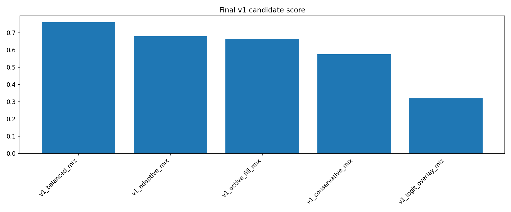
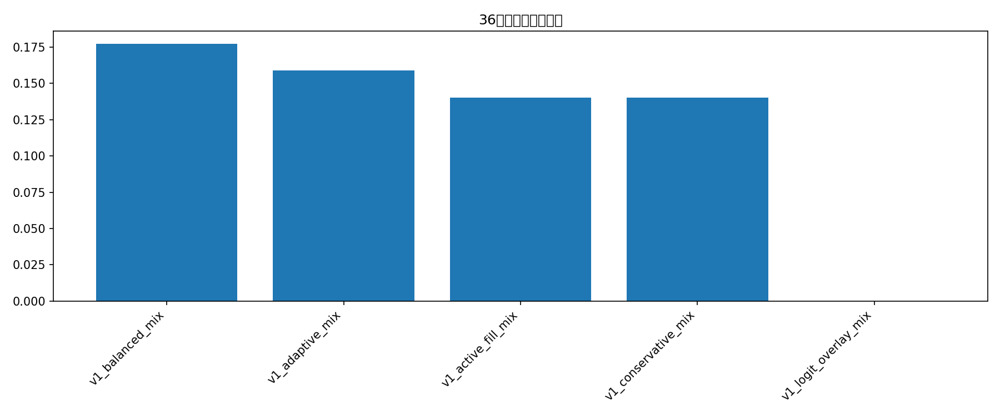

# Final v1 on latest complete monthly run

这份报告只回测 `monthly_runs` 中**最新的完整 run**。完整的定义是：

- 先看当前 `monthly_runs/*` 每个 run 的文件数
- 以**最大文件数 = 48** 作为“完整 run”的标准
- 在所有完整 run 中，取 `run_name` 最新的一个：**24986940107_attempt1**

## 当前 monthly_runs 覆盖

| run_name             |   file_count |   raw_row_count |
|:---------------------|-------------:|----------------:|
| 24949259015_attempt1 |           48 |           39535 |
| 24952032748_attempt1 |           48 |           36019 |
| 24986940107_attempt1 |           48 |           40793 |
| 25044896828_attempt1 |           24 |           18602 |

## 仅针对 `24986940107_attempt1` 的 final v1 候选结果

| strategy             |   trades |   ending_bankroll |   total_return |   avg_trade_return_on_cost |   median_trade_return_on_cost |   win_rate |   profit_factor |   max_drawdown |   avg_fraction |   worst_144_window_return |   median_144_window_return |   pct_positive_144_windows |   pct_over_10pct_144_windows |   active_144_window_rate |   num_144_windows |   score_end |   score_dd |   score_36h |   score_36h_10 |   score_active |   score_pf |   v1_score | meets_dd_lt_30   | meets_36h_gt_10_all   | meets_v1_goal   |
|:---------------------|---------:|------------------:|---------------:|---------------------------:|------------------------------:|-----------:|----------------:|---------------:|---------------:|--------------------------:|---------------------------:|---------------------------:|-----------------------------:|-------------------------:|------------------:|------------:|-----------:|------------:|---------------:|---------------:|-----------:|-----------:|:-----------------|:----------------------|:----------------|
| v1_balanced_mix      |       10 |           151.222 |         0.5122 |                     0.4773 |                        0.535  |          1 |             nan |              0 |         0.086  |                    0.1771 |                     0.2556 |                          1 |                            1 |                        1 |               146 |         0.8 |        0.6 |         1   |            0.7 |            0.7 |        0.6 |      0.76  | True             | True                  | True            |
| v1_adaptive_mix      |        9 |           148.043 |         0.4804 |                     0.5136 |                        0.5469 |          1 |             nan |              0 |         0.087  |                    0.1588 |                     0.2214 |                          1 |                            1 |                        1 |               146 |         0.6 |        0.6 |         0.8 |            0.7 |            0.7 |        0.6 |      0.68  | True             | True                  | True            |
| v1_active_fill_mix   |       13 |           153.605 |         0.5361 |                     0.577  |                        0.5714 |          1 |             nan |              0 |         0.06   |                    0.1402 |                     0.2364 |                          1 |                            1 |                        1 |               146 |         1   |        0.6 |         0.5 |            0.7 |            0.7 |        0.6 |      0.665 | True             | True                  | True            |
| v1_conservative_mix  |        9 |           137.167 |         0.3717 |                     0.5136 |                        0.5469 |          1 |             nan |              0 |         0.0689 |                    0.1402 |                     0.1923 |                          1 |                            1 |                        1 |               146 |         0.4 |        0.6 |         0.5 |            0.7 |            0.7 |        0.6 |      0.575 | True             | True                  | True            |
| v1_logit_overlay_mix |        0 |           100     |         0      |                   nan      |                      nan      |        nan |             nan |              0 |       nan      |                    0      |                     0      |                          0 |                            0 |                        0 |               146 |         0.2 |        0.6 |         0.2 |            0.2 |            0.2 |        0.6 |      0.32  | True             | False                 | False           |

## session / component 拆分

| strategy            | session_et   | component             |   trades |   avg_pnl_usd |   total_pnl_usd |   avg_fraction |   win_rate |
|:--------------------|:-------------|:----------------------|---------:|--------------:|----------------:|---------------:|-----------:|
| v1_active_fill_mix  | london       | london_milddrop       |        8 |        3.507  |         28.0563 |         0.0525 |          1 |
| v1_active_fill_mix  | us_afternoon | us_afternoon_milddrop |        4 |        6.1937 |         24.7746 |         0.08   |          1 |
| v1_active_fill_mix  | us_open      | us_open_breakout      |        1 |        0.7743 |          0.7743 |         0.04   |          1 |
| v1_adaptive_mix     | london       | london_milddrop       |        5 |        4.2412 |         21.2062 |         0.083  |          1 |
| v1_adaptive_mix     | us_afternoon | us_afternoon_milddrop |        4 |        6.7091 |         26.8364 |         0.0919 |          1 |
| v1_balanced_mix     | london       | london_milddrop       |        5 |        4.0873 |         20.4365 |         0.08   |          1 |
| v1_balanced_mix     | us_afternoon | us_afternoon_milddrop |        4 |        7.4232 |         29.693  |         0.1    |          1 |
| v1_balanced_mix     | us_open      | breakout_filler       |        1 |        1.0923 |          1.0923 |         0.06   |          1 |
| v1_conservative_mix | london       | london_milddrop       |        5 |        3.0088 |         15.0441 |         0.06   |          1 |
| v1_conservative_mix | us_afternoon | us_afternoon_milddrop |        4 |        5.5309 |         22.1234 |         0.08   |          1 |

## 当前最新完整 run 的最优候选

- 策略：**v1_balanced_mix**
- 期末本金：**151.22 USD**
- 最大回撤：**0.00%**
- 36小时最差窗口收益：**17.71%**
- 36小时 >10% 窗口占比：**100.00%**
- active 36小时窗口占比：**100.00%**

## 图表

