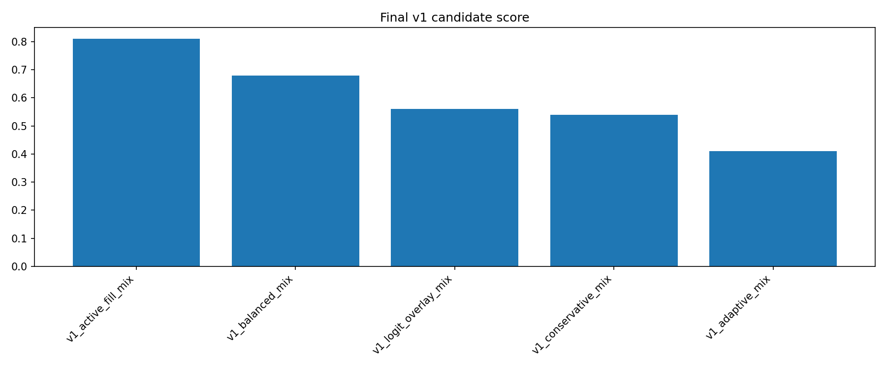
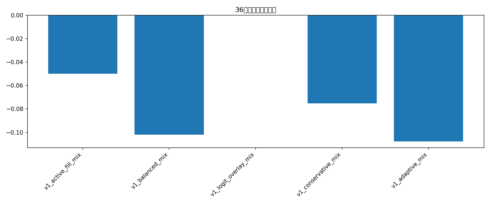

# Final v1 live candidate search

这份报告把之前有效的 session 子策略重新混合，并把目标函数改成更贴近实盘的版本：

- 最大回撤 < 30%
- 任意起点开始，未来 36 小时尽量 > 10%
- 用 session mix + trade quota + cooldown + triple gate + optional logistic overlay

## 满足回撤 < 30% 的候选

| strategy             |   trades |   ending_bankroll |   total_return |   avg_trade_return_on_cost |   median_trade_return_on_cost |   win_rate |   profit_factor |   max_drawdown |   avg_fraction |   worst_144_window_return |   median_144_window_return |   pct_positive_144_windows |   pct_over_10pct_144_windows |   active_144_window_rate |   num_144_windows |   score_end |   score_dd |   score_36h |   score_36h_10 |   score_active |   score_pf |   v1_score | meets_dd_lt_30   | meets_36h_gt_10_all   | meets_v1_goal   |
|:---------------------|---------:|------------------:|---------------:|---------------------------:|------------------------------:|-----------:|----------------:|---------------:|---------------:|--------------------------:|---------------------------:|---------------------------:|-----------------------------:|-------------------------:|------------------:|------------:|-----------:|------------:|---------------:|---------------:|-----------:|-----------:|:-----------------|:----------------------|:----------------|
| v1_active_fill_mix   |       45 |           222.246 |         1.2225 |                     0.2908 |                        0.3562 |     0.9111 |          5.6335 |         0.0825 |         0.0638 |                   -0.05   |                     0.1862 |                     0.9076 |                       0.7633 |                        1 |               714 |         0.8 |        0.8 |         0.8 |            0.8 |            0.7 |        1   |       0.81 | True             | False                 | False           |
| v1_balanced_mix      |       39 |           227.435 |         1.2743 |                     0.2404 |                        0.3562 |     0.8974 |          4.6148 |         0.1188 |         0.0872 |                   -0.102  |                     0.2265 |                     0.8936 |                       0.7703 |                        1 |               714 |         1   |        0.4 |         0.4 |            1   |            0.7 |        0.8 |       0.68 | True             | False                 | False           |
| v1_logit_overlay_mix |        0 |           100     |         0      |                   nan      |                      nan      |   nan      |        nan      |         0      |       nan      |                    0      |                     0      |                     0      |                       0      |                        0 |               714 |         0.2 |        1   |         1   |            0.2 |            0.2 |        0.2 |       0.56 | True             | False                 | False           |
| v1_conservative_mix  |       36 |           182.074 |         0.8207 |                     0.2336 |                        0.3562 |     0.8889 |          4.1965 |         0.0883 |         0.0689 |                   -0.0753 |                     0.1656 |                     0.8936 |                       0.6989 |                        1 |               714 |         0.4 |        0.6 |         0.6 |            0.4 |            0.7 |        0.6 |       0.54 | True             | False                 | False           |
| v1_adaptive_mix      |       36 |           204.05  |         1.0405 |                     0.2336 |                        0.3562 |     0.8889 |          3.917  |         0.1238 |         0.0867 |                   -0.1077 |                     0.2122 |                     0.8936 |                       0.7101 |                        1 |               714 |         0.6 |        0.2 |         0.2 |            0.6 |            0.7 |        0.4 |       0.41 | True             | False                 | False           |

## 满足回撤 < 30% 且 36小时最差窗口 > 10% 的候选

(empty)

## v1 评分 Top

| strategy             |   trades |   ending_bankroll |   total_return |   avg_trade_return_on_cost |   median_trade_return_on_cost |   win_rate |   profit_factor |   max_drawdown |   avg_fraction |   worst_144_window_return |   median_144_window_return |   pct_positive_144_windows |   pct_over_10pct_144_windows |   active_144_window_rate |   num_144_windows |   score_end |   score_dd |   score_36h |   score_36h_10 |   score_active |   score_pf |   v1_score | meets_dd_lt_30   | meets_36h_gt_10_all   | meets_v1_goal   |
|:---------------------|---------:|------------------:|---------------:|---------------------------:|------------------------------:|-----------:|----------------:|---------------:|---------------:|--------------------------:|---------------------------:|---------------------------:|-----------------------------:|-------------------------:|------------------:|------------:|-----------:|------------:|---------------:|---------------:|-----------:|-----------:|:-----------------|:----------------------|:----------------|
| v1_active_fill_mix   |       45 |           222.246 |         1.2225 |                     0.2908 |                        0.3562 |     0.9111 |          5.6335 |         0.0825 |         0.0638 |                   -0.05   |                     0.1862 |                     0.9076 |                       0.7633 |                        1 |               714 |         0.8 |        0.8 |         0.8 |            0.8 |            0.7 |        1   |       0.81 | True             | False                 | False           |
| v1_balanced_mix      |       39 |           227.435 |         1.2743 |                     0.2404 |                        0.3562 |     0.8974 |          4.6148 |         0.1188 |         0.0872 |                   -0.102  |                     0.2265 |                     0.8936 |                       0.7703 |                        1 |               714 |         1   |        0.4 |         0.4 |            1   |            0.7 |        0.8 |       0.68 | True             | False                 | False           |
| v1_logit_overlay_mix |        0 |           100     |         0      |                   nan      |                      nan      |   nan      |        nan      |         0      |       nan      |                    0      |                     0      |                     0      |                       0      |                        0 |               714 |         0.2 |        1   |         1   |            0.2 |            0.2 |        0.2 |       0.56 | True             | False                 | False           |
| v1_conservative_mix  |       36 |           182.074 |         0.8207 |                     0.2336 |                        0.3562 |     0.8889 |          4.1965 |         0.0883 |         0.0689 |                   -0.0753 |                     0.1656 |                     0.8936 |                       0.6989 |                        1 |               714 |         0.4 |        0.6 |         0.6 |            0.4 |            0.7 |        0.6 |       0.54 | True             | False                 | False           |
| v1_adaptive_mix      |       36 |           204.05  |         1.0405 |                     0.2336 |                        0.3562 |     0.8889 |          3.917  |         0.1238 |         0.0867 |                   -0.1077 |                     0.2122 |                     0.8936 |                       0.7101 |                        1 |               714 |         0.6 |        0.2 |         0.2 |            0.6 |            0.7 |        0.4 |       0.41 | True             | False                 | False           |

## session / component 拆分

| strategy            | session_et   | component             |   trades |   avg_pnl_usd |   total_pnl_usd |   avg_fraction |   win_rate |
|:--------------------|:-------------|:----------------------|---------:|--------------:|----------------:|---------------:|-----------:|
| v1_active_fill_mix  | asia         | asia_breakout         |       11 |        2.3085 |         25.3932 |         0.0773 |     1      |
| v1_active_fill_mix  | london       | london_milddrop       |       26 |        1.8801 |         48.8814 |         0.0562 |     0.8462 |
| v1_active_fill_mix  | us_afternoon | us_afternoon_milddrop |        6 |        7.6763 |         46.058  |         0.08   |     1      |
| v1_active_fill_mix  | us_open      | us_open_breakout      |        2 |        0.9567 |          1.9134 |         0.04   |     1      |
| v1_adaptive_mix     | asia         | asia_breakout         |       10 |        2.6923 |         26.9234 |         0.0936 |     1      |
| v1_adaptive_mix     | london       | london_milddrop       |       20 |        1.4648 |         29.2958 |         0.0819 |     0.8    |
| v1_adaptive_mix     | us_afternoon | us_afternoon_milddrop |        6 |        7.9718 |         47.8306 |         0.0915 |     1      |
| v1_balanced_mix     | asia         | asia_breakout         |       10 |        2.9977 |         29.9772 |         0.1    |     1      |
| v1_balanced_mix     | london       | london_milddrop       |       21 |        1.7719 |         37.2098 |         0.08   |     0.8095 |
| v1_balanced_mix     | us_afternoon | us_afternoon_milddrop |        6 |        9.5707 |         57.4244 |         0.1    |     1      |
| v1_balanced_mix     | us_open      | breakout_filler       |        2 |        1.4117 |          2.8234 |         0.06   |     1      |
| v1_conservative_mix | asia         | asia_breakout         |       10 |        2.2693 |         22.693  |         0.08   |     1      |
| v1_conservative_mix | london       | london_milddrop       |       20 |        1.0323 |         20.6459 |         0.06   |     0.8    |
| v1_conservative_mix | us_afternoon | us_afternoon_milddrop |        6 |        6.4559 |         38.7355 |         0.08   |     1      |

## 当前最终候选

- 策略：**v1_active_fill_mix**
- 期末本金：**222.25 USD**
- 最大回撤：**8.25%**
- 36小时最差窗口收益：**-5.00%**
- 36小时 >10% 窗口占比：**76.33%**
- active 36小时窗口占比：**100.00%**

当前还没有策略同时满足你设定的两个硬目标；这里给出的是现阶段最接近实盘要求的候选。

## 图表

