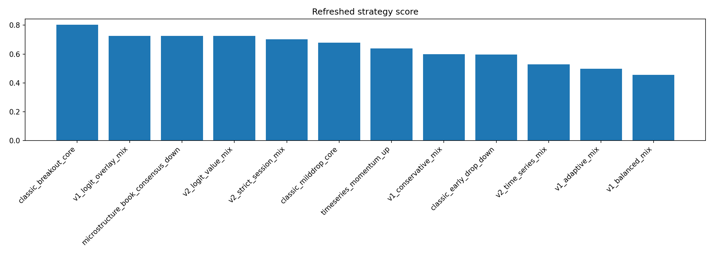
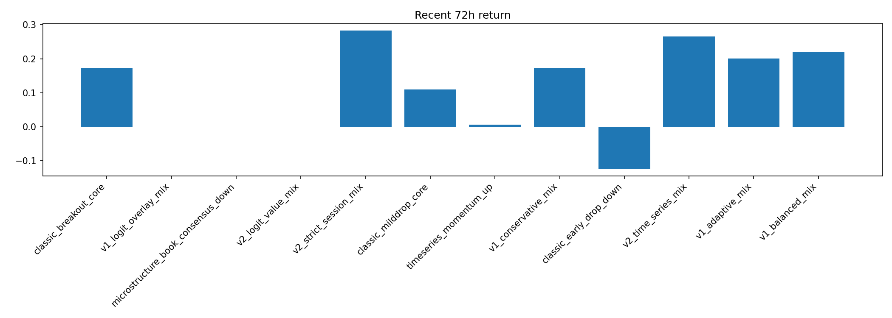

# monthly_runs 全量刷新 v2：微观结构 / 博弈 / 时间序列策略重选

这版使用当前 `data/monthly_runs/*` 的最新全量数据。这里不再把 5 分钟短线简单称为宏观 regime shift，而是复盘微观结构状态变化：盘口深度、spread、overround、订单簿共识、概率过度反应和时间序列路径。

## 当前 monthly_runs 覆盖
| run_name             |   file_count |   raw_row_count |
|:---------------------|-------------:|----------------:|
| 24949259015_attempt1 |           48 |           39535 |
| 24952032748_attempt1 |           48 |           36019 |
| 24986940107_attempt1 |           48 |           40793 |
| 25044896828_attempt1 |           48 |           39723 |
| 25100490855_attempt1 |           48 |           40583 |
| 25157440693_attempt1 |           48 |           40774 |
| 25208977834_attempt1 |           48 |           40558 |
| 25247789591_attempt1 |           48 |           38790 |
| 25274678535_attempt1 |           15 |           11358 |

## v1_active_fill_mix 最近72小时按组件复盘
| session_et   | component             |   trades_all |   pnl_all |   win_rate_all |   trades_recent |   pnl_recent |   win_rate_recent |   avg_pnl_all |   avg_pnl_recent |   avg_pnl_delta |   win_rate_delta |
|:-------------|:----------------------|-------------:|----------:|---------------:|----------------:|-------------:|------------------:|--------------:|-----------------:|----------------:|-----------------:|
| us_open      | us_open_breakout      |            2 |    2.1675 |         1      |               0 |       0      |            0      |        1.0837 |           0      |         -1.0837 |          -1      |
| us_afternoon | us_afternoon_milddrop |           11 |  -35.522  |         0.4545 |               0 |       0      |            0      |       -3.2293 |           0      |          3.2293 |          -0.4545 |
| asia         | asia_breakout         |           12 |    2.6919 |         0.8333 |               1 |       2.8243 |            1      |        0.2243 |           2.8243 |          2.6    |           0.1667 |
| london       | london_milddrop       |           46 |   21.1322 |         0.7826 |              14 |       4.0341 |            0.7857 |        0.4594 |           0.2881 |         -0.1712 |           0.0031 |

## v1_active_fill_mix 最近72小时交易明细
| strategy           | first_quote_ts            | run_name             | market_id                                      | slug                     | session_et   | component       |   entry_minute | side     |   fraction |   target_cost |   entry_price |   pnl_usd |   bankroll_after |   event_ret |   sim_max_drawdown | recent_tail_flag   |
|:-------------------|:--------------------------|:---------------------|:-----------------------------------------------|:-------------------------|:-------------|:----------------|---------------:|:---------|-----------:|--------------:|--------------:|----------:|-----------------:|------------:|-------------------:|:-------------------|
| v1_active_fill_mix | 2026-05-02 06:55:01+00:00 | 25208977834_attempt1 | 25208977834_attempt1::btc-updown-5m-1777704900 | btc-updown-5m-1777704900 | london       | london_milddrop |              2 | buy_down |       0.04 |        3.2    |          0.32 |   -3.3    |          80.3112 |     -0.0395 |             0.3576 | True               |
| v1_active_fill_mix | 2026-05-02 10:45:01+00:00 | 25208977834_attempt1 | 25208977834_attempt1::btc-updown-5m-1777718700 | btc-updown-5m-1777718700 | london       | london_milddrop |              2 | buy_down |       0.04 |        3.2124 |          0.46 |   -3.2823 |          77.0289 |     -0.0409 |             0.3839 | True               |
| v1_active_fill_mix | 2026-05-03 07:50:01+00:00 | 25247789591_attempt1 | 25247789591_attempt1::btc-updown-5m-1777794600 | btc-updown-5m-1777794600 | london       | london_milddrop |              2 | buy_down |       0.04 |        3.0812 |          0.64 |    1.685  |          78.7139 |      0.0219 |             0.3839 | True               |
| v1_active_fill_mix | 2026-05-03 07:55:02+00:00 | 25247789591_attempt1 | 25247789591_attempt1::btc-updown-5m-1777794900 | btc-updown-5m-1777794900 | london       | london_milddrop |              2 | buy_down |       0.04 |        3.1486 |          0.85 |    0.5186 |          79.2325 |      0.0066 |             0.3839 | True               |
| v1_active_fill_mix | 2026-05-03 08:10:01+00:00 | 25247789591_attempt1 | 25247789591_attempt1::btc-updown-5m-1777795800 | btc-updown-5m-1777795800 | london       | london_milddrop |              2 | buy_down |       0.04 |        3.1693 |          0.82 |    0.657  |          79.8895 |      0.0083 |             0.3839 | True               |
| v1_active_fill_mix | 2026-05-03 10:00:01+00:00 | 25247789591_attempt1 | 25247789591_attempt1::btc-updown-5m-1777802400 | btc-updown-5m-1777802400 | london       | london_milddrop |              2 | buy_down |       0.04 |        3.1956 |          0.92 |    0.2431 |          80.1327 |      0.003  |             0.3839 | True               |
| v1_active_fill_mix | 2026-05-03 10:35:01+00:00 | 25247789591_attempt1 | 25247789591_attempt1::btc-updown-5m-1777804500 | btc-updown-5m-1777804500 | london       | london_milddrop |              2 | buy_down |       0.04 |        3.2053 |          0.85 |    0.5279 |          80.6606 |      0.0066 |             0.3839 | True               |
| v1_active_fill_mix | 2026-05-03 10:55:00+00:00 | 25247789591_attempt1 | 25247789591_attempt1::btc-updown-5m-1777805700 | btc-updown-5m-1777805700 | london       | london_milddrop |              2 | buy_down |       0.04 |        3.2264 |          0.74 |    1.09   |          81.7506 |      0.0135 |             0.3839 | True               |
| v1_active_fill_mix | 2026-05-03 12:45:02+00:00 | 25247789591_attempt1 | 25247789591_attempt1::btc-updown-5m-1777812300 | btc-updown-5m-1777812300 | london       | london_milddrop |              2 | buy_down |       0.04 |        3.27   |          0.78 |    0.8804 |          82.631  |      0.0108 |             0.3839 | True               |
| v1_active_fill_mix | 2026-05-03 13:25:01+00:00 | 25247789591_attempt1 | 25247789591_attempt1::btc-updown-5m-1777814700 | btc-updown-5m-1777814700 | london       | london_milddrop |              2 | buy_down |       0.04 |        3.3052 |          0.82 |    0.6852 |          83.3162 |      0.0083 |             0.3839 | True               |
| v1_active_fill_mix | 2026-05-04 02:05:02+00:00 | 25247789591_attempt1 | 25247789591_attempt1::btc-updown-5m-1777860300 | btc-updown-5m-1777860300 | asia         | asia_breakout   |              4 | buy_up   |       0.05 |        4.1658 |          0.59 |    2.8243 |          86.1405 |      0.0339 |             0.3839 | True               |
| v1_active_fill_mix | 2026-05-04 07:10:01+00:00 | 25274678535_attempt1 | 25274678535_attempt1::btc-updown-5m-1777878600 | btc-updown-5m-1777878600 | london       | london_milddrop |              2 | buy_down |       0.04 |        3.4456 |          0.74 |   -3.4922 |          82.6483 |     -0.0405 |             0.3839 | True               |
| v1_active_fill_mix | 2026-05-04 09:55:01+00:00 | 25274678535_attempt1 | 25274678535_attempt1::btc-updown-5m-1777888500 | btc-updown-5m-1777888500 | london       | london_milddrop |              2 | buy_down |       0.04 |        3.3059 |          0.71 |    1.3037 |          83.9521 |      0.0158 |             0.3839 | True               |
| v1_active_fill_mix | 2026-05-04 11:20:01+00:00 | 25274678535_attempt1 | 25274678535_attempt1::btc-updown-5m-1777893600 | btc-updown-5m-1777893600 | london       | london_milddrop |              2 | buy_down |       0.04 |        3.3581 |          0.58 |    2.3738 |          86.3259 |      0.0283 |             0.3839 | True               |
| v1_active_fill_mix | 2026-05-04 13:25:00+00:00 | 25274678535_attempt1 | 25274678535_attempt1::btc-updown-5m-1777901100 | btc-updown-5m-1777901100 | london       | london_milddrop |              2 | buy_down |       0.04 |        3.453  |          0.45 |    4.1436 |          90.4695 |      0.048  |             0.3839 | True               |

## 重新精选 Top 20
| strategy                           |   trades |   ending_bankroll |   total_return |   win_rate |   profit_factor |   max_drawdown |   worst_144_window_return |   median_144_window_return |   pct_positive_144_windows |   active_144_window_rate |   num_144_windows |   worst_864_window_return |   median_864_window_return |   pct_positive_864_windows |   active_864_window_rate |   num_864_windows |   recent_72h_return |   recent_72h_max_drawdown |   recent_72h_trades |   recent_72h_win_rate |   score_end |   score_dd |   score_36 |   score_72 |   score_recent72 |   score_pf |   refreshed_score | meets_dd_lt_30   | meets_recent72_positive   |
|:-----------------------------------|---------:|------------------:|---------------:|-----------:|----------------:|---------------:|--------------------------:|---------------------------:|---------------------------:|-------------------------:|------------------:|--------------------------:|---------------------------:|---------------------------:|-------------------------:|------------------:|--------------------:|--------------------------:|--------------------:|----------------------:|------------:|-----------:|-----------:|-----------:|-----------------:|-----------:|------------------:|:-----------------|:--------------------------|
| classic_breakout_core              |       20 |          125.102  |         0.251  |     0.9    |          3.1347 |         0.0992 |                   -0.0992 |                     0.0082 |                     0.5806 |                   0.6724 |              2265 |                   -0.0741 |                     0.0495 |                     0.7916 |                        1 |              1545 |              0.1719 |                    0      |                   4 |                1      |      1      |     0.8235 |     0.7647 |     0.8235 |           0.6471 |     1      |            0.8029 | True             | True                      |
| v1_logit_overlay_mix               |        0 |          100      |         0      |   nan      |        nan      |         0      |                    0      |                     0      |                     0      |                   0      |              2265 |                    0      |                     0      |                     0      |                        0 |              1545 |              0      |                    0      |                   0 |              nan      |      0.7647 |     0.9412 |     0.9412 |     0.9412 |           0.3529 |     0.1176 |            0.7265 | True             | False                     |
| microstructure_book_consensus_down |        0 |          100      |         0      |   nan      |        nan      |         0      |                    0      |                     0      |                     0      |                   0      |              2265 |                    0      |                     0      |                     0      |                        0 |              1545 |              0      |                    0      |                   0 |              nan      |      0.7647 |     0.9412 |     0.9412 |     0.9412 |           0.3529 |     0.1176 |            0.7265 | True             | False                     |
| v2_logit_value_mix                 |        0 |          100      |         0      |   nan      |        nan      |         0      |                    0      |                     0      |                     0      |                   0      |              2265 |                    0      |                     0      |                     0      |                        0 |              1545 |              0      |                    0      |                   0 |              nan      |      0.7647 |     0.9412 |     0.9412 |     0.9412 |           0.3529 |     0.1176 |            0.7265 | True             | False                     |
| v2_strict_session_mix              |       30 |          114.546  |         0.1455 |     0.7333 |          1.2962 |         0.3235 |                   -0.2346 |                     0      |                     0.4521 |                   0.6525 |              2265 |                   -0.2652 |                    -0.0027 |                     0.4893 |                        1 |              1545 |              0.2825 |                    0      |                   6 |                1      |      0.9412 |     0.5882 |     0.4118 |     0.5294 |           0.9412 |     0.9412 |            0.7029 | False            | True                      |
| classic_milddrop_core              |       46 |          101.358  |         0.0136 |     0.7174 |          1.0199 |         0.2001 |                   -0.1447 |                     0      |                     0.4653 |                   0.7501 |              2265 |                   -0.2001 |                    -0.0511 |                     0.3825 |                        1 |              1545 |              0.1099 |                    0.0507 |                  10 |                0.9    |      0.8824 |     0.6471 |     0.6471 |     0.6471 |           0.5882 |     0.8824 |            0.6794 | True             | True                      |
| timeseries_momentum_up             |       12 |           98.5193 |        -0.0148 |     0.6667 |          0.9128 |         0.1419 |                   -0.0795 |                     0      |                     0.2909 |                   0.5338 |              2265 |                   -0.1169 |                    -0.0657 |                     0.3644 |                        1 |              1545 |              0.0068 |                    0.0406 |                   3 |                0.6667 |      0.4706 |     0.7059 |     0.8235 |     0.7647 |           0.4706 |     0.5882 |            0.6382 | True             | True                      |
| v1_conservative_mix                |       19 |           98.8659 |        -0.0113 |     0.6842 |          0.9784 |         0.3481 |                   -0.2245 |                     0      |                     0.2269 |                   0.3792 |              2265 |                   -0.2567 |                    -0.0139 |                     0.4408 |                        1 |              1545 |              0.1732 |                    0      |                   4 |                1      |      0.5882 |     0.5294 |     0.5294 |     0.5882 |           0.7059 |     0.7059 |            0.6    | False            | True                      |
| classic_early_drop_down            |       54 |           99.1486 |        -0.0085 |     0.7593 |          0.9848 |         0.1329 |                   -0.1178 |                     0      |                     0.3404 |                   0.6071 |              2265 |                   -0.1329 |                     0.0355 |                     0.6537 |                        1 |              1545 |             -0.1242 |                    0.1329 |                  18 |                0.6667 |      0.6471 |     0.7647 |     0.7059 |     0.7059 |           0.2353 |     0.8235 |            0.5971 | True             | False                     |
| v2_time_series_mix                 |       54 |           91.3452 |        -0.0865 |     0.537  |          0.9048 |         0.3673 |                   -0.2272 |                     0      |                     0.294  |                   0.6066 |              2265 |                   -0.3296 |                    -0.1924 |                     0.1657 |                        1 |              1545 |              0.2658 |                    0.0938 |                  18 |                0.5556 |      0.3529 |     0.4706 |     0.4706 |     0.2941 |           0.8824 |     0.4706 |            0.5294 | False            | True                      |
| v1_adaptive_mix                    |       19 |           98.7338 |        -0.0127 |     0.6842 |          0.979  |         0.3864 |                   -0.2539 |                     0      |                     0.2269 |                   0.3792 |              2265 |                   -0.2889 |                    -0.0122 |                     0.2731 |                        1 |              1545 |              0.2011 |                    0      |                   4 |                1      |      0.5294 |     0.3529 |     0.2353 |     0.4706 |           0.7647 |     0.7647 |            0.4971 | False            | True                      |
| v1_balanced_mix                    |       19 |           97.5787 |        -0.0242 |     0.6842 |          0.9637 |         0.4186 |                   -0.2748 |                     0      |                     0.2269 |                   0.3792 |              2265 |                   -0.3156 |                    -0.0221 |                     0.2731 |                        1 |              1545 |              0.2197 |                    0      |                   4 |                1      |      0.4118 |     0.2941 |     0.1765 |     0.4118 |           0.8235 |     0.6471 |            0.4559 | False            | True                      |
| v1_active_fill_mix                 |       71 |           90.4695 |        -0.0953 |     0.7465 |          0.906  |         0.3839 |                   -0.2156 |                     0      |                     0.4375 |                   0.7673 |              2265 |                   -0.3839 |                    -0.2055 |                     0.1722 |                        1 |              1545 |              0.082  |                    0.0787 |                  15 |                0.8    |      0.2941 |     0.4118 |     0.5882 |     0.2353 |           0.5294 |     0.5294 |            0.4382 | False            | True                      |
| timeseries_reversion_down          |       40 |           71.1174 |        -0.2888 |     0.15   |          0.6793 |         0.6763 |                   -0.2417 |                    -0.0444 |                     0.1506 |                   0.7285 |              2265 |                   -0.5655 |                     0.0363 |                     0.5003 |                        1 |              1545 |              0.4118 |                    0.1124 |                  11 |                0.3636 |      0.2353 |     0.0588 |     0.3529 |     0.0588 |           1      |     0.3529 |            0.3941 | False            | True                      |
| v2_micro_game_mix                  |       54 |           47.1921 |        -0.5281 |     0.2963 |          0.4264 |         0.5542 |                   -0.2491 |                     0      |                     0.215  |                   0.6702 |              2265 |                   -0.325  |                    -0.1508 |                     0.0485 |                        1 |              1545 |             -0.224  |                    0.267  |                  18 |                0.2222 |      0.1176 |     0.2353 |     0.2941 |     0.3529 |           0.1765 |     0.2941 |            0.2353 | False            | False                     |
| classic_sharpdrop_reversal         |       54 |           60.5538 |        -0.3945 |     0.2037 |          0.7939 |         0.6203 |                   -0.2881 |                     0      |                     0.2031 |                   0.6993 |              2265 |                   -0.4785 |                    -0.3719 |                     0.1592 |                        1 |              1545 |             -0.2407 |                    0.3139 |                  18 |                0.1667 |      0.1765 |     0.1765 |     0.0588 |     0.1176 |           0.0588 |     0.4118 |            0.1265 | False            | False                     |
| game_pm_overshoot_fade_up          |       54 |           38.2764 |        -0.6172 |     0.2222 |          0.408  |         0.6413 |                   -0.28   |                    -0.0081 |                     0.2013 |                   0.7135 |              2265 |                   -0.3986 |                    -0.2111 |                     0.0039 |                        1 |              1545 |             -0.2375 |                    0.2854 |                  18 |                0.2222 |      0.0588 |     0.1176 |     0.1176 |     0.1765 |           0.1176 |     0.2353 |            0.1235 | False            | False                     |

## 满足回撤 < 30% 且 recent72h 为正 的候选
| strategy               |   trades |   ending_bankroll |   total_return |   win_rate |   profit_factor |   max_drawdown |   worst_144_window_return |   median_144_window_return |   pct_positive_144_windows |   active_144_window_rate |   num_144_windows |   worst_864_window_return |   median_864_window_return |   pct_positive_864_windows |   active_864_window_rate |   num_864_windows |   recent_72h_return |   recent_72h_max_drawdown |   recent_72h_trades |   recent_72h_win_rate |   score_end |   score_dd |   score_36 |   score_72 |   score_recent72 |   score_pf |   refreshed_score | meets_dd_lt_30   | meets_recent72_positive   |
|:-----------------------|---------:|------------------:|---------------:|-----------:|----------------:|---------------:|--------------------------:|---------------------------:|---------------------------:|-------------------------:|------------------:|--------------------------:|---------------------------:|---------------------------:|-------------------------:|------------------:|--------------------:|--------------------------:|--------------------:|----------------------:|------------:|-----------:|-----------:|-----------:|-----------------:|-----------:|------------------:|:-----------------|:--------------------------|
| classic_breakout_core  |       20 |          125.102  |         0.251  |     0.9    |          3.1347 |         0.0992 |                   -0.0992 |                     0.0082 |                     0.5806 |                   0.6724 |              2265 |                   -0.0741 |                     0.0495 |                     0.7916 |                        1 |              1545 |              0.1719 |                    0      |                   4 |                1      |      1      |     0.8235 |     0.7647 |     0.8235 |           0.6471 |     1      |            0.8029 | True             | True                      |
| classic_milddrop_core  |       46 |          101.358  |         0.0136 |     0.7174 |          1.0199 |         0.2001 |                   -0.1447 |                     0      |                     0.4653 |                   0.7501 |              2265 |                   -0.2001 |                    -0.0511 |                     0.3825 |                        1 |              1545 |              0.1099 |                    0.0507 |                  10 |                0.9    |      0.8824 |     0.6471 |     0.6471 |     0.6471 |           0.5882 |     0.8824 |            0.6794 | True             | True                      |
| timeseries_momentum_up |       12 |           98.5193 |        -0.0148 |     0.6667 |          0.9128 |         0.1419 |                   -0.0795 |                     0      |                     0.2909 |                   0.5338 |              2265 |                   -0.1169 |                    -0.0657 |                     0.3644 |                        1 |              1545 |              0.0068 |                    0.0406 |                   3 |                0.6667 |      0.4706 |     0.7059 |     0.8235 |     0.7647 |           0.4706 |     0.5882 |            0.6382 | True             | True                      |

## 当前首选
- 策略：**classic_breakout_core**
- 期末本金：**125.10 USD**
- 最大回撤：**9.92%**
- 最近72小时收益：**17.19%**
- 36小时最差窗口：**-9.92%**
- 72小时最差窗口：**-7.41%**

## 图表

