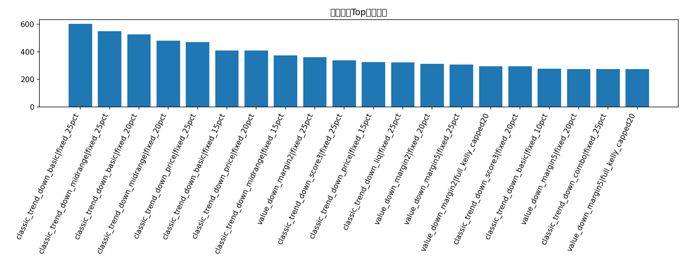
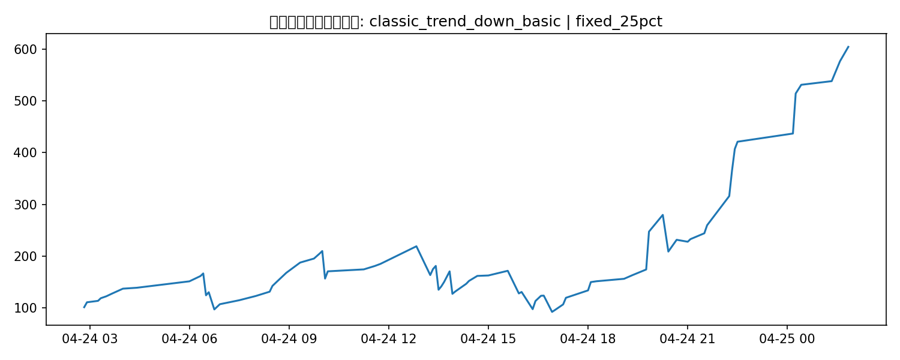

# 经典量化策略补充回测

## 这版试了什么

- 趋势确认 + 盘口确认（price cap / size imbalance / liquidity）
- 历史条件概率 value 策略（fair probability > 市场价格 + margin）
- 规则近期有效性过滤（rolling performance filter）
- 固定 10/15/20/25% 仓位 + capped Kelly

## 候选策略-仓位结果

| strategy                    | sizing              |   trades |   ending_bankroll |   total_return |   avg_trade_return_on_cost |   max_drawdown |
|:----------------------------|:--------------------|---------:|------------------:|---------------:|---------------------------:|---------------:|
| classic_trend_down_basic    | fixed_25pct         |       79 |           604.192 |        5.04192 |                   0.134403 |       0.577723 |
| classic_trend_down_midrange | fixed_25pct         |       54 |           550.752 |        4.50752 |                   0.180096 |       0.601365 |
| classic_trend_down_basic    | fixed_20pct         |       79 |           526.164 |        4.26164 |                   0.134403 |       0.467419 |
| classic_trend_down_midrange | fixed_20pct         |       54 |           481.827 |        3.81827 |                   0.180096 |       0.495034 |
| classic_trend_down_price    | fixed_25pct         |       47 |           471.285 |        3.71285 |                   0.185058 |       0.652705 |
| classic_trend_down_basic    | fixed_15pct         |       79 |           410.151 |        3.10151 |                   0.134403 |       0.346878 |
| classic_trend_down_price    | fixed_20pct         |       47 |           409.375 |        3.09375 |                   0.185058 |       0.548903 |
| classic_trend_down_midrange | fixed_15pct         |       54 |           373.766 |        2.73766 |                   0.180096 |       0.377477 |
| value_down_margin2          | fixed_25pct         |       38 |           360.985 |        2.60985 |                   0.177813 |       0.462851 |
| classic_trend_down_score3   | fixed_25pct         |       43 |           338.721 |        2.38721 |                   0.166122 |       0.655537 |
| classic_trend_down_price    | fixed_15pct         |       47 |           324.723 |        2.24723 |                   0.185058 |       0.432693 |
| classic_trend_down_liq      | fixed_25pct         |       39 |           323.299 |        2.23299 |                   0.159289 |       0.536205 |
| value_down_margin2          | fixed_20pct         |       38 |           312.547 |        2.12547 |                   0.177813 |       0.37162  |
| value_down_margin5          | fixed_25pct         |       35 |           307.174 |        2.07174 |                   0.171148 |       0.480756 |
| value_down_margin2          | full_kelly_capped20 |       38 |           296.053 |        1.96053 |                   0.177813 |       0.37162  |
| classic_trend_down_score3   | fixed_20pct         |       43 |           295.56  |        1.9556  |                   0.166122 |       0.55663  |
| classic_trend_down_basic    | fixed_10pct         |       79 |           277.556 |        1.77556 |                   0.134403 |       0.233971 |
| value_down_margin5          | fixed_20pct         |       35 |           274.771 |        1.74771 |                   0.171148 |       0.388489 |
| classic_trend_down_combo    | fixed_25pct         |       19 |           274.642 |        1.74642 |                   0.271114 |       0.47385  |
| value_down_margin5          | full_kelly_capped20 |       35 |           274.161 |        1.74161 |                   0.171148 |       0.388489 |
| classic_trend_down_liq      | fixed_20pct         |       39 |           272.238 |        1.72238 |                   0.159289 |       0.446937 |
| value_down_margin2_book     | fixed_25pct         |       15 |           268.871 |        1.68871 |                   0.323475 |       0.253731 |
| value_down_margin2          | half_kelly_capped20 |       38 |           258.438 |        1.58438 |                   0.177813 |       0.390877 |
| classic_trend_down_midrange | fixed_10pct         |       54 |           257.361 |        1.57361 |                   0.180096 |       0.260865 |
| value_down_margin2          | fixed_15pct         |       38 |           256.647 |        1.56647 |                   0.177813 |       0.277978 |
| value_down_margin5          | half_kelly_capped20 |       35 |           245.551 |        1.45551 |                   0.171148 |       0.403253 |
| classic_trend_down_score3   | fixed_15pct         |       43 |           243.333 |        1.43333 |                   0.166122 |       0.4416   |
| rolling_rule_drop10_down    | fixed_25pct         |       34 |           242.849 |        1.42849 |                   0.133775 |       0.418737 |
| classic_trend_down_combo    | fixed_20pct         |       19 |           234.623 |        1.34623 |                   0.271114 |       0.387232 |
| classic_trend_down_price    | fixed_10pct         |       47 |           232.77  |        1.3277  |                   0.185058 |       0.302896 |

## 当前最佳经典策略

- 策略：**classic_trend_down_basic**
- 仓位：**fixed_25pct**
- 交易笔数：**79**
- 期末本金：**604.19 USD**
- 总收益率：**504.19%**
- 最大回撤：**57.77%**

## 图表

### 经典策略Top期末本金

### 最佳经典策略本金曲线

