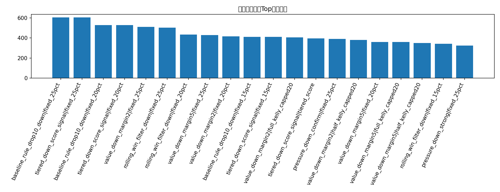
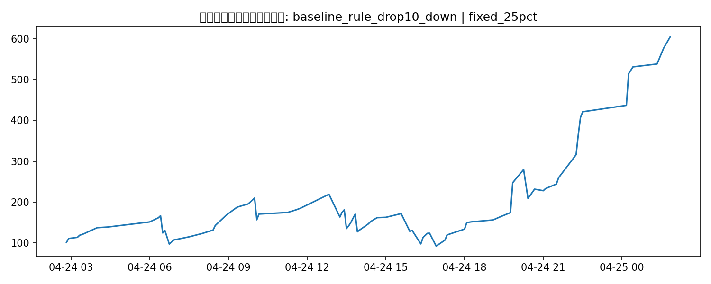

# 扩展经典策略回测

## 这版覆盖的 6 类策略

1. 波动率 / 路径过滤
2. 盘口压力 / 价格冲击
3. Regime filter
4. Rolling 健康度过滤（均值 / 胜率 / Sharpe 代理）
5. 分层仓位（score-based tiered sizing）
6. 价格区间搜索

## 候选策略-仓位结果

| strategy                  | sizing                 |   trades |   ending_bankroll |   total_return |   avg_trade_return_on_cost |   max_drawdown |
|:--------------------------|:-----------------------|---------:|------------------:|---------------:|---------------------------:|---------------:|
| baseline_rule_drop10_down | fixed_25pct            |       79 |           604.192 |        5.04192 |                   0.134403 |       0.577723 |
| tiered_down_score_signal  | fixed_25pct            |       79 |           604.192 |        5.04192 |                   0.134403 |       0.577723 |
| baseline_rule_drop10_down | fixed_20pct            |       79 |           526.164 |        4.26164 |                   0.134403 |       0.467419 |
| tiered_down_score_signal  | fixed_20pct            |       79 |           526.164 |        4.26164 |                   0.134403 |       0.467419 |
| value_down_margin2        | fixed_25pct            |       35 |           510.426 |        4.10426 |                   0.231689 |       0.382682 |
| rolling_win_filter_down   | fixed_25pct            |       71 |           501.832 |        4.01832 |                   0.130019 |       0.560712 |
| rolling_win_filter_down   | fixed_20pct            |       71 |           433.327 |        3.33327 |                   0.130019 |       0.454997 |
| value_down_margin5        | fixed_25pct            |       30 |           428.261 |        3.28261 |                   0.241152 |       0.403259 |
| value_down_margin2        | fixed_20pct            |       35 |           415.971 |        3.15971 |                   0.231689 |       0.309905 |
| baseline_rule_drop10_down | fixed_15pct            |       79 |           410.151 |        3.10151 |                   0.134403 |       0.346878 |
| tiered_down_score_signal  | fixed_15pct            |       79 |           410.151 |        3.10151 |                   0.134403 |       0.346878 |
| value_down_margin2        | full_kelly_capped20    |       35 |           404.89  |        3.0489  |                   0.231689 |       0.309905 |
| tiered_down_score_signal  | tiered_score           |       79 |           395.428 |        2.95428 |                   0.134403 |       0.370651 |
| pressure_down_confirm     | fixed_25pct            |       37 |           388.762 |        2.88762 |                   0.18298  |       0.37873  |
| value_down_margin2        | half_kelly_capped20    |       35 |           380.235 |        2.80235 |                   0.231689 |       0.320886 |
| value_down_margin5        | fixed_20pct            |       30 |           358.606 |        2.58606 |                   0.241152 |       0.328431 |
| value_down_margin5        | full_kelly_capped20    |       30 |           358.606 |        2.58606 |                   0.241152 |       0.328431 |
| value_down_margin5        | half_kelly_capped20    |       30 |           349.095 |        2.49095 |                   0.241152 |       0.334684 |
| rolling_win_filter_down   | fixed_15pct            |       71 |           341.426 |        2.41426 |                   0.130019 |       0.346878 |
| pressure_down_strong      | fixed_25pct            |       28 |           322.51  |        2.2251  |                   0.216264 |       0.403259 |
| value_down_margin2        | fixed_15pct            |       35 |           321.421 |        2.21421 |                   0.231689 |       0.234963 |
| pressure_down_confirm     | fixed_20pct            |       37 |           312.95  |        2.1295  |                   0.18298  |       0.306263 |
| rolling_pnl_filter_down   | fixed_25pct            |       47 |           308.473 |        2.08473 |                   0.130179 |       0.418737 |
| value_down_margin5        | fixed_15pct            |       30 |           284.185 |        1.84185 |                   0.241152 |       0.25047  |
| baseline_rule_drop10_down | fixed_10pct            |       79 |           277.556 |        1.77556 |                   0.134403 |       0.233971 |
| tiered_down_score_signal  | fixed_10pct            |       79 |           277.556 |        1.77556 |                   0.134403 |       0.233971 |
| rolling_pnl_filter_down   | fixed_20pct            |       47 |           277.021 |        1.77021 |                   0.130179 |       0.340579 |
| value_down_margin2_book   | fixed_25pct            |       15 |           274.954 |        1.74954 |                   0.32966  |       0.253731 |
| pressure_down_strong      | fixed_20pct            |       28 |           273.817 |        1.73817 |                   0.216264 |       0.328431 |
| price_interval_down_65_80 | fixed_25pct            |       36 |           266.608 |        1.66608 |                   0.133098 |       0.545538 |
| pressure_down_confirm     | fixed_15pct            |       37 |           244.951 |        1.44951 |                   0.18298  |       0.231843 |
| rolling_win_filter_down   | fixed_10pct            |       71 |           242.189 |        1.42189 |                   0.130019 |       0.233971 |
| price_interval_down_65_80 | fixed_20pct            |       36 |           240.607 |        1.40607 |                   0.133098 |       0.450923 |
| value_down_margin2_book   | half_kelly_capped20    |       15 |           234.572 |        1.34572 |                   0.32966  |       0.202985 |
| value_down_margin2_book   | fixed_20pct            |       15 |           232.647 |        1.32647 |                   0.32966  |       0.202985 |
| value_down_margin2_book   | full_kelly_capped20    |       15 |           232.647 |        1.32647 |                   0.32966  |       0.202985 |
| rolling_pnl_filter_down   | fixed_15pct            |       47 |           231.323 |        1.31323 |                   0.130179 |       0.260758 |
| value_down_margin2        | quarter_kelly_capped20 |       35 |           227.759 |        1.27759 |                   0.231689 |       0.319133 |
| value_down_margin2        | fixed_10pct            |       35 |           226.798 |        1.26798 |                   0.231689 |       0.158144 |
| pressure_down_strong      | fixed_15pct            |       28 |           223.408 |        1.23408 |                   0.216264 |       0.25047  |

## 当前最佳扩展经典策略

- 策略：**baseline_rule_drop10_down**
- 仓位：**fixed_25pct**
- 交易笔数：**79**
- 期末本金：**604.19 USD**
- 总收益率：**504.19%**
- 最大回撤：**57.77%**

## 图表

### 扩展经典策略Top期末本金

### 最佳扩展经典策略本金曲线

