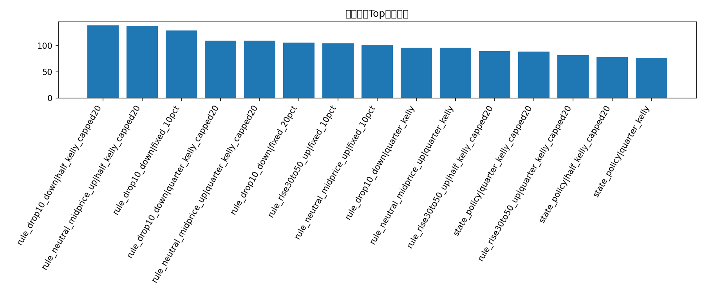
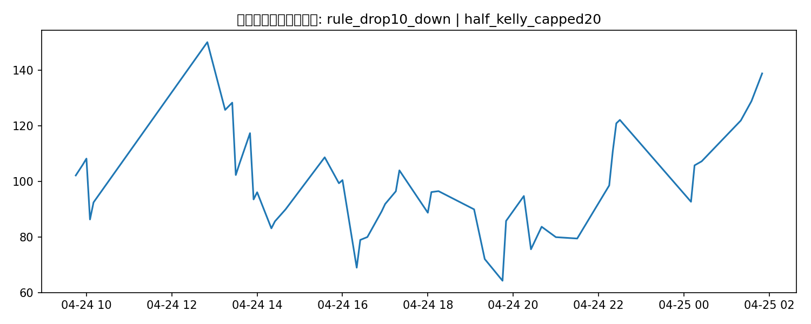

# 优化策略回测补充报告

## 这版在优化什么

当前最强基线是 `rule_drop10_down + fixed_20pct`。这版补做两类优化：

- 把 size/depth 真正变成开仓过滤器
- 用 walk-forward 历史条件概率来替代之前 Kelly 里过于保守的固定概率

## 候选策略-仓位结果

| strategy_group   | strategy_name            | sizing                 |   trades |   ending_bankroll |   total_return |   avg_trade_return_on_cost |   max_drawdown |
|:-----------------|:-------------------------|:-----------------------|---------:|------------------:|---------------:|---------------------------:|---------------:|
| opt_strategy     | rule_drop10_down         | half_kelly_capped20    |       48 |         138.871   |      0.388709  |                 0.124476   |       0.61771  |
| opt_strategy     | rule_neutral_midprice_up | half_kelly_capped20    |       22 |         138.636   |      0.386362  |                -0.115753   |       0.61771  |
| opt_strategy     | rule_drop10_down         | fixed_10pct            |       53 |         129.009   |      0.29009   |                 0.122353   |       0.334079 |
| opt_strategy     | rule_drop10_down         | quarter_kelly_capped20 |       48 |         109.936   |      0.0993588 |                 0.124476   |       0.551928 |
| opt_strategy     | rule_neutral_midprice_up | quarter_kelly_capped20 |       22 |         109.843   |      0.0984297 |                -0.115753   |       0.551928 |
| opt_strategy     | rule_drop10_down         | fixed_20pct            |       53 |         106.022   |      0.0602178 |                 0.122353   |       0.641141 |
| opt_strategy     | rule_rise30to50_up       | fixed_10pct            |       18 |         104.511   |      0.0451144 |                 0.0459442  |       0.334079 |
| opt_strategy     | rule_neutral_midprice_up | fixed_10pct            |       25 |         101.097   |      0.0109717 |                -0.223896   |       0.334079 |
| opt_strategy     | rule_drop10_down         | quarter_kelly          |       48 |          96.3716  |     -0.0362838 |                 0.124476   |       0.583491 |
| opt_strategy     | rule_neutral_midprice_up | quarter_kelly          |       22 |          96.2902  |     -0.0370983 |                -0.115753   |       0.583491 |
| opt_strategy     | rule_rise30to50_up       | half_kelly_capped20    |       13 |          89.8177  |     -0.101823  |                -0.0180465  |       0.61771  |
| state_strategy   | state_policy             | quarter_kelly_capped20 |      137 |          88.8338  |     -0.111662  |                -0.0206174  |       0.662018 |
| opt_strategy     | rule_rise30to50_up       | quarter_kelly_capped20 |       13 |          82.1177  |     -0.178823  |                -0.0180465  |       0.551928 |
| state_strategy   | state_policy             | half_kelly_capped20    |      137 |          78.5173  |     -0.214827  |                -0.0206174  |       0.800268 |
| state_strategy   | state_policy             | quarter_kelly          |      137 |          77.0503  |     -0.229497  |                -0.0206174  |       0.684202 |
| opt_strategy     | rule_rise30to50_up       | fixed_20pct            |       18 |          73.4965  |     -0.265035  |                 0.0459442  |       0.641141 |
| opt_strategy     | rule_rise30to50_up       | quarter_kelly          |       13 |          71.9857  |     -0.280143  |                -0.0180465  |       0.583491 |
| opt_strategy     | rule_neutral_midprice_up | fixed_20pct            |       25 |          64.2701  |     -0.357299  |                -0.223896   |       0.641141 |
| opt_strategy     | rule_drop10_down         | half_kelly             |       48 |          36.3504  |     -0.636496  |                 0.124476   |       0.90017  |
| opt_strategy     | rule_neutral_midprice_up | half_kelly             |       22 |          36.2889  |     -0.637111  |                -0.115753   |       0.90017  |
| state_strategy   | state_policy             | fixed_10pct            |      160 |          27.7216  |     -0.722784  |                -0.00347797 |       0.836366 |
| opt_strategy     | rule_rise30to50_up       | half_kelly             |       13 |          20.6627  |     -0.793373  |                -0.0180465  |       0.90017  |
| state_strategy   | state_policy             | half_kelly             |      137 |          17.3705  |     -0.826295  |                -0.0206174  |       0.942036 |
| state_strategy   | state_policy             | fixed_20pct            |      160 |           1.68464 |     -0.983154  |                -0.00347797 |       0.993019 |
| opt_strategy     | rule_drop10_down         | full_kelly             |        4 |          -1.50977 |     -1.0151    |                -0.13868    |       1.0122   |

## 当前最佳补充策略

- 策略组：**opt_strategy**
- 策略名：**rule_drop10_down**
- 仓位：**half_kelly_capped20**
- 交易笔数：**48**
- 期末本金：**138.87 USD**
- 总收益率：**38.87%**
- 最大回撤：**61.77%**

## 图表

### 优化策略Top期末本金

### 最佳优化策略本金曲线

