# 前2分钟信息 deep dive 研究报告：24869603988_attempt1

## 这版新增

- 二维错价热力图：前2分钟BTC涨跌幅 × 2分钟盘口Up概率
- 系统搜索组合策略：自动枚举区间并比较买Up / 买Down
- 更多图表，直接看哪些区域真的更有 edge

## 数据概览

- 原始分块文件数：**50**
- 清洗后 quotes 行数：**36399**
- 市场级特征行数：**302**
- 固定单笔成本 fee：**0.0100**
- 已解析 outcome 的样本 Up 比例：**0.4805**

## 关键直觉

1. 前2分钟大跌后的 Down 动量，仍然是当前最值得优先观察的信号。
2. 上涨后的信号并不单调，不是所有上涨区间都值得追。
3. 比起单独看涨跌幅，更应该看“涨跌幅 + 盘口概率”这个二维区域。

## 前2分钟特征样例

| slug                     | window_text   |   btc_move_2m |   mid_up_prob_2m |   outcome_up |   realized_pnl_buy_up_from_2m |   realized_pnl_buy_down_from_2m |
|:-------------------------|:--------------|--------------:|-----------------:|-------------:|------------------------------:|--------------------------------:|
| btc-updown-5m-1776998700 | 10:45-10:50   |        nan    |            0.015 |          nan |                       nan     |                         nan     |
| btc-updown-5m-1776999000 | 10:50-10:55   |        -90.69 |            0.075 |            0 |                        -0.085 |                           0.065 |
| btc-updown-5m-1776999300 | 10:55-11:00   |        -29.38 |            0.285 |            0 |                        -0.295 |                           0.275 |
| btc-updown-5m-1776999600 | 11:00-11:05   |          6.4  |            0.595 |            1 |                         0.395 |                          -0.415 |
| btc-updown-5m-1776999900 | 11:05-11:10   |        nan    |            0.375 |          nan |                       nan     |                         nan     |
| btc-updown-5m-1777000200 | 11:10-11:15   |        nan    |            0.285 |          nan |                       nan     |                         nan     |
| btc-updown-5m-1777000500 | 11:15-11:20   |        -72.66 |            0.105 |            0 |                        -0.115 |                           0.095 |
| btc-updown-5m-1777000800 | 11:20-11:25   |        -45.81 |            0.165 |            0 |                        -0.175 |                           0.155 |
| btc-updown-5m-1777001100 | 11:25-11:30   |         77.5  |            0.905 |            1 |                         0.085 |                          -0.105 |
| btc-updown-5m-1777001400 | 11:30-11:35   |        -90.69 |            0.105 |            0 |                        -0.115 |                           0.095 |
| btc-updown-5m-1777001700 | 11:35-11:40   |         73.97 |            0.815 |            1 |                         0.175 |                          -0.195 |
| btc-updown-5m-1777002000 | 11:40-11:45   |        -65.43 |            0.155 |            0 |                        -0.165 |                           0.145 |
| btc-updown-5m-1777002300 | 11:45-11:50   |          7.58 |            0.495 |            1 |                         0.495 |                          -0.515 |
| btc-updown-5m-1777002600 | 11:50-11:55   |         49.56 |            0.855 |            1 |                         0.135 |                          -0.155 |
| btc-updown-5m-1777002900 | 11:55-12:00   |        nan    |            0.475 |          nan |                       nan     |                         nan     |
| btc-updown-5m-1777003200 | 12:00-12:05   |        -36.44 |            0.245 |            0 |                        -0.255 |                           0.235 |
| btc-updown-5m-1777003500 | 12:05-12:10   |        nan    |            0.465 |          nan |                       nan     |                         nan     |
| btc-updown-5m-1777003800 | 12:10-12:15   |         -5.13 |            0.515 |            1 |                         0.475 |                          -0.495 |
| btc-updown-5m-1777004100 | 12:15-12:20   |        nan    |            0.285 |          nan |                       nan     |                         nan     |
| btc-updown-5m-1777004400 | 12:20-12:25   |        nan    |            0.865 |          nan |                       nan     |                         nan     |

## BTC前2分钟涨跌分桶结果

| move_bucket   |   count |   avg_btc_move_2m |   avg_entry_prob |   realized_up_rate |   avg_pnl_buy_up |   avg_pnl_buy_down |    edge | best_side   |   best_avg_pnl |
|:--------------|--------:|------------------:|-----------------:|-------------------:|-----------------:|-------------------:|--------:|:------------|---------------:|
| <=-100        |       4 |         -145.26   |           0.07   |             0      |          -0.08   |             0.06   | -0.07   | buy_down    |         0.06   |
| -100~-50      |      21 |          -73.3171 |           0.1471 |             0.0952 |          -0.0619 |             0.0419 | -0.0519 | buy_down    |         0.0419 |
| -50~-30       |      28 |          -39.2318 |           0.2427 |             0.1786 |          -0.0741 |             0.0541 | -0.0641 | buy_down    |         0.0541 |
| -30~-10       |      26 |          -20.6927 |           0.3487 |             0.1538 |          -0.2048 |             0.1848 | -0.1948 | buy_down    |         0.1848 |
| -10~10        |      57 |            0.0961 |           0.5053 |             0.5263 |           0.0111 |            -0.0311 |  0.0211 | buy_up      |         0.0111 |
| 10~30         |      47 |           19.1843 |           0.6616 |             0.6596 |          -0.012  |            -0.008  | -0.002  | buy_down    |        -0.008  |
| 30~50         |      25 |           39.8108 |           0.7402 |             0.8    |           0.0498 |            -0.0698 |  0.0598 | buy_up      |         0.0498 |
| 50~100        |      20 |           70.6435 |           0.8365 |             0.8    |          -0.0465 |             0.0265 | -0.0365 | buy_down    |         0.0265 |
| >=100         |       3 |          173.783  |           0.965  |             1      |           0.025  |            -0.045  |  0.035  | buy_up      |         0.025  |

## 2分钟盘口概率校准

| prob_bin      |   count |   avg_entry_prob |   realized_up_rate |   avg_pnl_buy_up |   avg_pnl_buy_down |    edge | best_side   |   best_avg_pnl |
|:--------------|--------:|-----------------:|-------------------:|-----------------:|-------------------:|--------:|:------------|---------------:|
| (-0.001, 0.1] |       8 |           0.0713 |             0      |          -0.0812 |             0.0612 | -0.0713 | buy_down    |         0.0612 |
| (0.1, 0.2]    |      24 |           0.1529 |             0.0833 |          -0.0796 |             0.0596 | -0.0696 | buy_down    |         0.0596 |
| (0.2, 0.3]    |      23 |           0.2513 |             0.2174 |          -0.0439 |             0.0239 | -0.0339 | buy_down    |         0.0239 |
| (0.3, 0.4]    |      26 |           0.3462 |             0.2308 |          -0.1254 |             0.1054 | -0.1154 | buy_down    |         0.1054 |
| (0.4, 0.5]    |      26 |           0.4583 |             0.5385 |           0.0702 |            -0.0902 |  0.0802 | buy_up      |         0.0702 |
| (0.5, 0.6]    |      31 |           0.5634 |             0.5161 |          -0.0573 |             0.0373 | -0.0473 | buy_down    |         0.0373 |
| (0.6, 0.7]    |      39 |           0.6472 |             0.641  |          -0.0162 |            -0.0038 | -0.0062 | buy_down    |        -0.0038 |
| (0.7, 0.8]    |      26 |           0.7431 |             0.7308 |          -0.0223 |             0.0023 | -0.0123 | buy_down    |         0.0023 |
| (0.8, 0.9]    |      21 |           0.8429 |             0.8095 |          -0.0433 |             0.0233 | -0.0333 | buy_down    |         0.0233 |
| (0.9, 1.0]    |       7 |           0.9421 |             1      |           0.0479 |            -0.0679 |  0.0579 | buy_up      |         0.0479 |

## 二维错价热力表

| move_bucket   | prob_bucket   |   count |   avg_btc_move_2m |   avg_entry_prob |   realized_up_rate |   avg_pnl_buy_up |   avg_pnl_buy_down |     edge | best_side   |   best_avg_pnl |
|:--------------|:--------------|--------:|------------------:|-----------------:|-------------------:|-----------------:|-------------------:|---------:|:------------|---------------:|
| <=-100        | 0.0~0.2       |       4 |         -145.26   |           0.07   |             0      |          -0.08   |             0.06   |  -0.07   | buy_down    |         0.06   |
| <=-100        | 0.2~0.4       |       0 |          nan      |         nan      |           nan      |         nan      |           nan      | nan      | buy_down    |       nan      |
| <=-100        | 0.4~0.6       |       0 |          nan      |         nan      |           nan      |         nan      |           nan      | nan      | buy_down    |       nan      |
| <=-100        | 0.6~0.8       |       0 |          nan      |         nan      |           nan      |         nan      |           nan      | nan      | buy_down    |       nan      |
| <=-100        | 0.8~1.0       |       0 |          nan      |         nan      |           nan      |         nan      |           nan      | nan      | buy_down    |       nan      |
| -100~-50      | 0.0~0.2       |      18 |          -74.0217 |           0.1297 |             0.0556 |          -0.0842 |             0.0642 |  -0.0742 | buy_down    |         0.0642 |
| -100~-50      | 0.2~0.4       |       3 |          -69.09   |           0.2517 |             0.3333 |           0.0717 |            -0.0917 |   0.0817 | buy_up      |         0.0717 |
| -100~-50      | 0.4~0.6       |       0 |          nan      |         nan      |           nan      |         nan      |           nan      | nan      | buy_down    |       nan      |
| -100~-50      | 0.6~0.8       |       0 |          nan      |         nan      |           nan      |         nan      |           nan      | nan      | buy_down    |       nan      |
| -100~-50      | 0.8~1.0       |       0 |          nan      |         nan      |           nan      |         nan      |           nan      | nan      | buy_down    |       nan      |
| -50~-30       | 0.0~0.2       |       9 |          -42.76   |           0.1611 |             0.1111 |          -0.06   |             0.04   |  -0.05   | buy_down    |         0.04   |
| -50~-30       | 0.2~0.4       |      18 |          -37.8772 |           0.27   |             0.2222 |          -0.0578 |             0.0378 |  -0.0478 | buy_down    |         0.0378 |
| -50~-30       | 0.4~0.6       |       1 |          -31.86   |           0.485  |             0      |          -0.495  |             0.475  |  -0.485  | buy_down    |         0.475  |
| -50~-30       | 0.6~0.8       |       0 |          nan      |         nan      |           nan      |         nan      |           nan      | nan      | buy_down    |       nan      |
| -50~-30       | 0.8~1.0       |       0 |          nan      |         nan      |           nan      |         nan      |           nan      | nan      | buy_down    |       nan      |
| -30~-10       | 0.0~0.2       |       1 |          -19.48   |           0.175  |             0      |          -0.185  |             0.165  |  -0.175  | buy_down    |         0.165  |
| -30~-10       | 0.2~0.4       |      18 |          -22.2833 |           0.3089 |             0.1111 |          -0.2078 |             0.1878 |  -0.1978 | buy_down    |         0.1878 |
| -30~-10       | 0.4~0.6       |       6 |          -17.6417 |           0.4492 |             0.3333 |          -0.1258 |             0.1058 |  -0.1158 | buy_down    |         0.1058 |
| -30~-10       | 0.6~0.8       |       1 |          -11.58   |           0.635  |             0      |          -0.645  |             0.625  |  -0.635  | buy_down    |         0.625  |
| -30~-10       | 0.8~1.0       |       0 |          nan      |         nan      |           nan      |         nan      |           nan      | nan      | buy_down    |       nan      |
| -10~10        | 0.0~0.2       |       0 |          nan      |         nan      |           nan      |         nan      |           nan      | nan      | buy_down    |       nan      |
| -10~10        | 0.2~0.4       |      10 |           -5.666  |           0.3605 |             0.4    |           0.0295 |            -0.0495 |   0.0395 | buy_up      |         0.0295 |
| -10~10        | 0.4~0.6       |      39 |            0.9903 |           0.5101 |             0.5385 |           0.0183 |            -0.0383 |   0.0283 | buy_up      |         0.0183 |
| -10~10        | 0.6~0.8       |       8 |            2.94   |           0.6625 |             0.625  |          -0.0475 |             0.0275 |  -0.0375 | buy_down    |         0.0275 |
| -10~10        | 0.8~1.0       |       0 |          nan      |         nan      |           nan      |         nan      |           nan      | nan      | buy_down    |       nan      |
| 10~30         | 0.0~0.2       |       0 |          nan      |         nan      |           nan      |         nan      |           nan      | nan      | buy_down    |       nan      |
| 10~30         | 0.2~0.4       |       0 |          nan      |         nan      |           nan      |         nan      |           nan      | nan      | buy_down    |       nan      |
| 10~30         | 0.4~0.6       |       9 |           19.9178 |           0.5733 |             0.6667 |           0.0833 |            -0.1033 |   0.0933 | buy_up      |         0.0833 |
| 10~30         | 0.6~0.8       |      35 |           18.6577 |           0.6677 |             0.6571 |          -0.0206 |             0.0006 |  -0.0106 | buy_down    |         0.0006 |
| 10~30         | 0.8~1.0       |       3 |           23.1267 |           0.855  |             0.6667 |          -0.1983 |             0.1783 |  -0.1883 | buy_down    |         0.1783 |
| 30~50         | 0.0~0.2       |       0 |          nan      |         nan      |           nan      |         nan      |           nan      | nan      | buy_down    |       nan      |
| 30~50         | 0.2~0.4       |       0 |          nan      |         nan      |           nan      |         nan      |           nan      | nan      | buy_down    |       nan      |
| 30~50         | 0.4~0.6       |       2 |           31.855  |           0.5725 |             0.5    |          -0.0825 |             0.0625 |  -0.0725 | buy_down    |         0.0625 |
| 30~50         | 0.6~0.8       |      18 |           39.1028 |           0.7283 |             0.7778 |           0.0394 |            -0.0594 |   0.0494 | buy_up      |         0.0394 |
| 30~50         | 0.8~1.0       |       5 |           45.542  |           0.85   |             1      |           0.14   |            -0.16   |   0.15   | buy_up      |         0.14   |
| 50~100        | 0.0~0.2       |       0 |          nan      |         nan      |           nan      |         nan      |           nan      | nan      | buy_down    |       nan      |
| 50~100        | 0.2~0.4       |       0 |          nan      |         nan      |           nan      |         nan      |           nan      | nan      | buy_down    |       nan      |
| 50~100        | 0.4~0.6       |       0 |          nan      |         nan      |           nan      |         nan      |           nan      | nan      | buy_down    |       nan      |
| 50~100        | 0.6~0.8       |       3 |           68.97   |           0.715  |             0.6667 |          -0.0583 |             0.0383 |  -0.0483 | buy_down    |         0.0383 |
| 50~100        | 0.8~1.0       |      17 |           70.9388 |           0.8579 |             0.8235 |          -0.0444 |             0.0244 |  -0.0344 | buy_down    |         0.0244 |

这里的 `best_side` 表示在该二维区域里，历史上买 Up 还是买 Down 的平均PnL更高。

## 常见阈值策略对比

| strategy                     |   threshold_usd | side     |   trades |   avg_btc_move_2m |   avg_entry_prob |   win_rate |   avg_pnl |   cum_pnl |
|:-----------------------------|----------------:|:---------|---------:|------------------:|-----------------:|-----------:|----------:|----------:|
| momentum_buy_down_after_drop |              10 | buy_down |       79 |          -47.5595 |           0.2434 |     0.8608 |    0.0942 |     7.44  |
| momentum_buy_down_after_drop |              20 | buy_down |       68 |          -52.8166 |           0.2242 |     0.8529 |    0.0671 |     4.565 |
| momentum_buy_down_after_drop |              30 | buy_down |       53 |          -60.7394 |           0.1918 |     0.8679 |    0.0497 |     2.635 |
| momentum_buy_down_after_drop |              40 | buy_down |       37 |          -71.9543 |           0.1601 |     0.9189 |    0.0691 |     2.555 |
| momentum_buy_up_after_rise   |              20 | buy_up   |       71 |           48.9138 |           0.758  |     0.7887 |    0.0207 |     1.47  |
| momentum_buy_down_after_drop |              50 | buy_down |       25 |          -84.828  |           0.1348 |     0.92   |    0.0448 |     1.12  |
| momentum_buy_down_after_drop |              75 | buy_down |       11 |         -111.976  |           0.1059 |     1      |    0.0959 |     1.055 |
| momentum_buy_up_after_rise   |              40 | buy_up   |       35 |           70.6591 |           0.8243 |     0.8571 |    0.0229 |     0.8   |
| meanrev_buy_down_after_rise  |              50 | buy_down |       23 |           84.0965 |           0.8533 |     0.1739 |    0.0172 |     0.395 |
| momentum_buy_up_after_rise   |              30 | buy_up   |       48 |           61.031  |           0.7944 |     0.8125 |    0.0081 |     0.39  |
| momentum_buy_down_after_drop |             100 | buy_down |        4 |         -145.26   |           0.07   |     1      |    0.06   |     0.24  |
| momentum_buy_up_after_rise   |              75 | buy_up   |       12 |          108.215  |           0.895  |     0.9167 |    0.0117 |     0.14  |
| momentum_buy_up_after_rise   |             100 | buy_up   |        3 |          173.783  |           0.965  |     1      |    0.025  |     0.075 |
| meanrev_buy_down_after_rise  |             100 | buy_down |        3 |          173.783  |           0.965  |     0      |   -0.045  |    -0.135 |
| momentum_buy_up_after_rise   |              10 | buy_up   |       95 |           40.3279 |           0.7287 |     0.7368 |   -0.0018 |    -0.175 |
| meanrev_buy_up_after_drop    |             100 | buy_up   |        4 |         -145.26   |           0.07   |     0      |   -0.08   |    -0.32  |
| meanrev_buy_down_after_rise  |              75 | buy_down |       12 |          108.215  |           0.895  |     0.0833 |   -0.0317 |    -0.38  |
| momentum_buy_up_after_rise   |              50 | buy_up   |       23 |           84.0965 |           0.8533 |     0.8261 |   -0.0372 |    -0.855 |
| meanrev_buy_up_after_drop    |              75 | buy_up   |       11 |         -111.976  |           0.1059 |     0      |   -0.1159 |    -1.275 |
| meanrev_buy_down_after_rise  |              30 | buy_down |       48 |           61.031  |           0.7944 |     0.1875 |   -0.0281 |    -1.35  |

## 系统搜索得到的Top组合策略

| strategy_name                         | side     |   move_low |   move_high |   prob_low |   prob_high |   trades |   avg_btc_move_2m |   avg_entry_prob |   win_rate |   avg_pnl |   cum_pnl |
|:--------------------------------------|:---------|-----------:|------------:|-----------:|------------:|---------:|------------------:|-----------------:|-----------:|----------:|----------:|
| buy_down|move(-30,-10]|prob[0.0,1.0]  | buy_down |        -30 |         -10 |        0   |         1   |       26 |          -20.6927 |           0.3487 |     0.8462 |    0.1848 |     4.805 |
| buy_down|move(-30,-10]|prob[0.2,0.4]  | buy_down |        -30 |         -10 |        0.2 |         0.4 |       18 |          -22.2833 |           0.3089 |     0.8889 |    0.1878 |     3.38  |
| buy_down|move(-50,-30]|prob[0.0,1.0]  | buy_down |        -50 |         -30 |        0   |         1   |       28 |          -39.2318 |           0.2427 |     0.8214 |    0.0541 |     1.515 |
| buy_up|move(30,50]|prob[0.0,1.0]      | buy_up   |         30 |          50 |        0   |         1   |       25 |           39.8108 |           0.7402 |     0.8    |    0.0498 |     1.245 |
| buy_down|move(-100,-50]|prob[0.0,0.2] | buy_down |       -100 |         -50 |        0   |         0.2 |       18 |          -74.0217 |           0.1297 |     0.9444 |    0.0642 |     1.155 |
| buy_down|move(-100,-50]|prob[0.0,1.0] | buy_down |       -100 |         -50 |        0   |         1   |       21 |          -73.3171 |           0.1471 |     0.9048 |    0.0419 |     0.88  |
| buy_up|move(10,30]|prob[0.4,0.6]      | buy_up   |         10 |          30 |        0.4 |         0.6 |        9 |           19.9178 |           0.5733 |     0.6667 |    0.0833 |     0.75  |
| buy_up|move(-10,10]|prob[0.4,0.6]     | buy_up   |        -10 |          10 |        0.4 |         0.6 |       39 |            0.9903 |           0.5101 |     0.5385 |    0.0183 |     0.715 |
| buy_up|move(30,50]|prob[0.6,0.8]      | buy_up   |         30 |          50 |        0.6 |         0.8 |       18 |           39.1028 |           0.7283 |     0.7778 |    0.0394 |     0.71  |
| buy_up|move(30,50]|prob[0.8,1.0]      | buy_up   |         30 |          50 |        0.8 |         1   |        5 |           45.542  |           0.85   |     1      |    0.14   |     0.7   |
| buy_down|move(-50,-30]|prob[0.2,0.4]  | buy_down |        -50 |         -30 |        0.2 |         0.4 |       18 |          -37.8772 |           0.27   |     0.7778 |    0.0378 |     0.68  |
| buy_down|move(-30,-10]|prob[0.4,0.6]  | buy_down |        -30 |         -10 |        0.4 |         0.6 |        6 |          -17.6417 |           0.4492 |     0.6667 |    0.1058 |     0.635 |
| buy_up|move(-10,10]|prob[0.0,1.0]     | buy_up   |        -10 |          10 |        0   |         1   |       57 |            0.0961 |           0.5053 |     0.5263 |    0.0111 |     0.63  |
| buy_down|move(50,100]|prob[0.0,1.0]   | buy_down |         50 |         100 |        0   |         1   |       20 |           70.6435 |           0.8365 |     0.2    |    0.0265 |     0.53  |
| buy_down|move(50,100]|prob[0.8,1.0]   | buy_down |         50 |         100 |        0.8 |         1   |       17 |           70.9388 |           0.8579 |     0.1765 |    0.0244 |     0.415 |
| buy_down|move(-50,-30]|prob[0.0,0.2]  | buy_down |        -50 |         -30 |        0   |         0.2 |        9 |          -42.76   |           0.1611 |     0.8889 |    0.04   |     0.36  |
| buy_up|move(-10,10]|prob[0.2,0.4]     | buy_up   |        -10 |          10 |        0.2 |         0.4 |       10 |           -5.666  |           0.3605 |     0.4    |    0.0295 |     0.295 |
| buy_down|move(-10,10]|prob[0.6,0.8]   | buy_down |        -10 |          10 |        0.6 |         0.8 |        8 |            2.94   |           0.6625 |     0.375  |    0.0275 |     0.22  |
| buy_down|move(10,30]|prob[0.6,0.8]    | buy_down |         10 |          30 |        0.6 |         0.8 |       35 |           18.6577 |           0.6677 |     0.3429 |    0.0006 |     0.02  |
| buy_down|move(10,30]|prob[0.0,1.0]    | buy_down |         10 |          30 |        0   |         1   |       47 |           19.1843 |           0.6616 |     0.3404 |   -0.008  |    -0.375 |
| buy_up|move(-10,10]|prob[0.6,0.8]     | buy_up   |        -10 |          10 |        0.6 |         0.8 |        8 |            2.94   |           0.6625 |     0.625  |   -0.0475 |    -0.38  |
| buy_down|move(-10,10]|prob[0.2,0.4]   | buy_down |        -10 |          10 |        0.2 |         0.4 |       10 |           -5.666  |           0.3605 |     0.6    |   -0.0495 |    -0.495 |
| buy_up|move(-50,-30]|prob[0.0,0.2]    | buy_up   |        -50 |         -30 |        0   |         0.2 |        9 |          -42.76   |           0.1611 |     0.1111 |   -0.06   |    -0.54  |
| buy_up|move(10,30]|prob[0.0,1.0]      | buy_up   |         10 |          30 |        0   |         1   |       47 |           19.1843 |           0.6616 |     0.6596 |   -0.012  |    -0.565 |
| buy_up|move(10,30]|prob[0.6,0.8]      | buy_up   |         10 |          30 |        0.6 |         0.8 |       35 |           18.6577 |           0.6677 |     0.6571 |   -0.0206 |    -0.72  |
| buy_up|move(50,100]|prob[0.8,1.0]     | buy_up   |         50 |         100 |        0.8 |         1   |       17 |           70.9388 |           0.8579 |     0.8235 |   -0.0444 |    -0.755 |
| buy_up|move(-30,-10]|prob[0.4,0.6]    | buy_up   |        -30 |         -10 |        0.4 |         0.6 |        6 |          -17.6417 |           0.4492 |     0.3333 |   -0.1258 |    -0.755 |
| buy_down|move(30,50]|prob[0.8,1.0]    | buy_down |         30 |          50 |        0.8 |         1   |        5 |           45.542  |           0.85   |     0      |   -0.16   |    -0.8   |
| buy_up|move(50,100]|prob[0.0,1.0]     | buy_up   |         50 |         100 |        0   |         1   |       20 |           70.6435 |           0.8365 |     0.8    |   -0.0465 |    -0.93  |
| buy_down|move(10,30]|prob[0.4,0.6]    | buy_down |         10 |          30 |        0.4 |         0.6 |        9 |           19.9178 |           0.5733 |     0.3333 |   -0.1033 |    -0.93  |

## 简单模型对比（时间顺序切分）

| model                  |   test_rows |   accuracy |   brier |   log_loss |   trades |   trade_ratio |   avg_pnl |   cum_pnl |   win_rate |
|:-----------------------|------------:|-----------:|--------:|-----------:|---------:|--------------:|----------:|----------:|-----------:|
| random_forest          |          70 |     0.6857 |  0.2012 |     0.5888 |       64 |        0.9143 |    0.0073 |     0.47  |     0.5469 |
| baseline_train_up_rate |          70 |     0.5286 |  0.2494 |     0.6919 |       67 |        0.9571 |   -0.0034 |    -0.225 |     0.3284 |

## 缺失值概览

| column               |   missing_ratio |   non_null |
|:---------------------|----------------:|-----------:|
| trade_count_1s       |          1      |          0 |
| trade_volume_1s      |          1      |          0 |
| target_price         |          0.2783 |      26269 |
| btc_move_from_target |          0.2783 |      26269 |
| mid_overround_cents  |          0.0568 |      34332 |
| mid_sum_cents        |          0.0568 |      34332 |
| spread_down_cents    |          0.0565 |      34342 |
| mid_down_cents       |          0.0565 |      34342 |
| mid_down_prob        |          0.0565 |      34342 |
| mid_up_prob          |          0.0558 |      34367 |
| spread_up_cents      |          0.0558 |      34367 |
| mid_up_cents         |          0.0558 |      34367 |
| buy_down_cents       |          0.0301 |      35303 |
| buy_down_size        |          0.0301 |      35303 |
| ask_depth_down_5     |          0.0301 |      35303 |

## 图表

### 前2分钟BTC涨跌幅分布

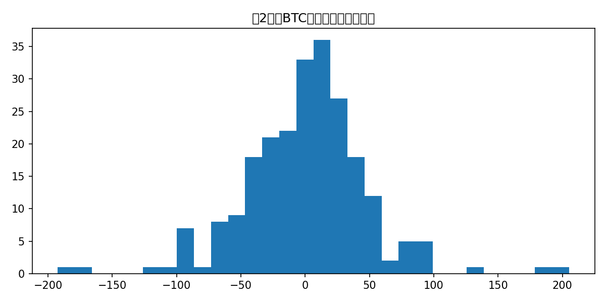

### 2分钟盘口Up概率分布

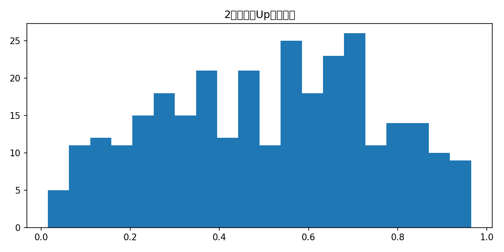

### 前2分钟BTC涨跌幅 vs 2分钟盘口Up概率

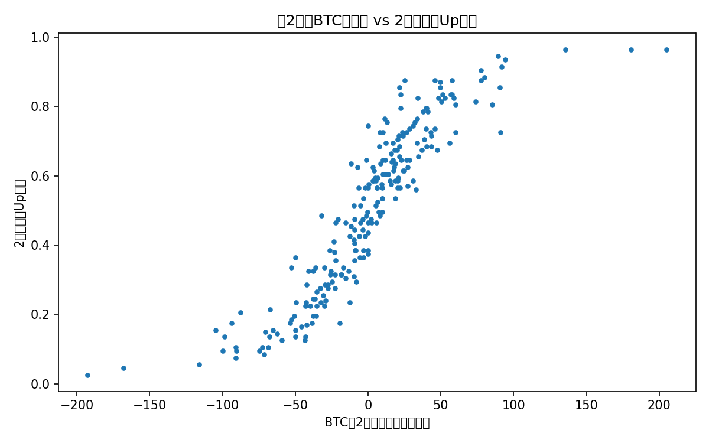

### 按涨跌分桶的最终上涨率

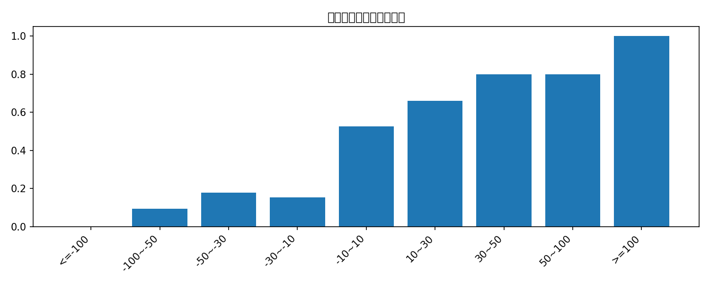

### 按涨跌分桶的最佳方向平均PnL

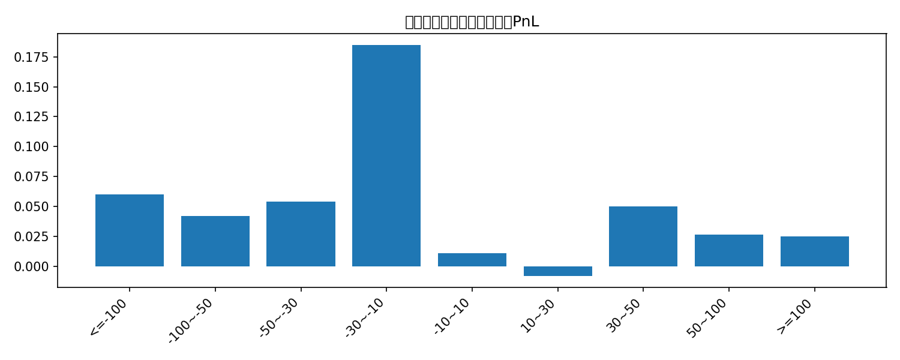

### 2分钟盘口概率校准图

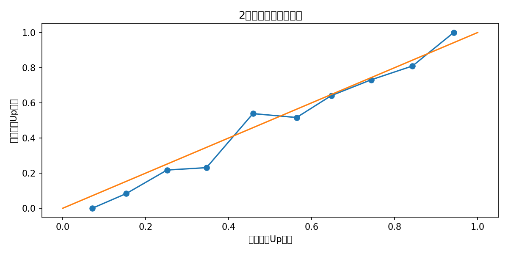

### 二维区域最佳方向平均PnL热力图

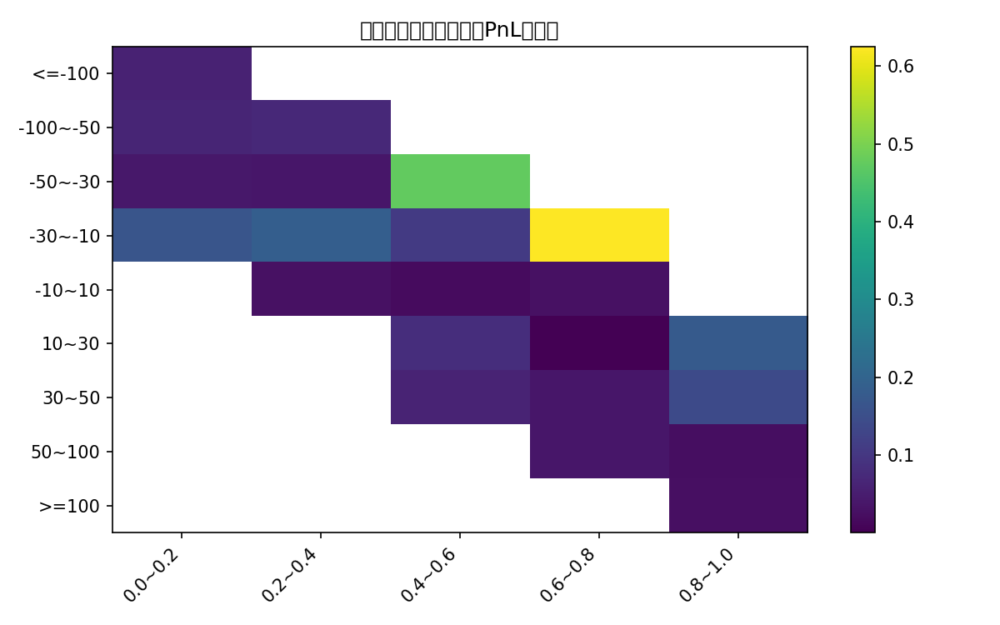

### Top阈值策略累计PnL

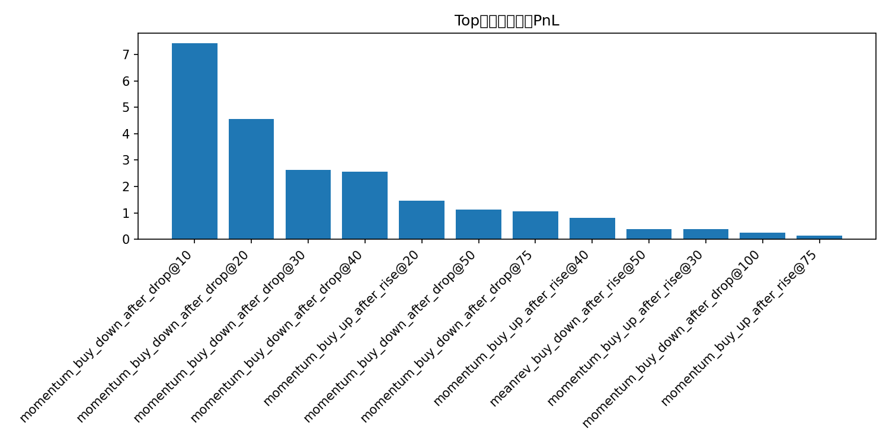

### Top组合策略累计PnL

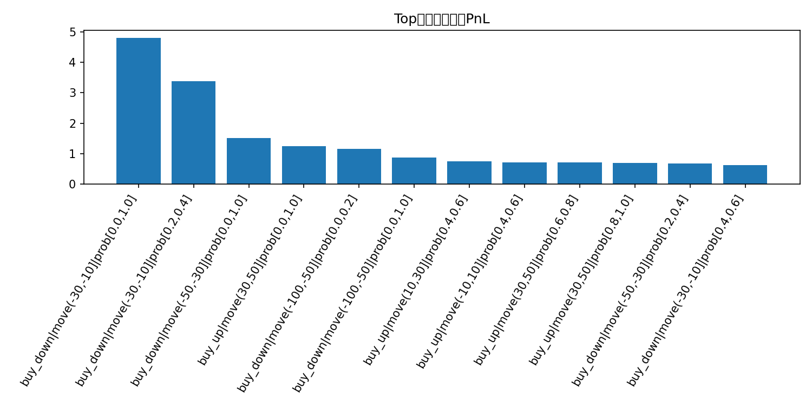

### 模型累计PnL对比

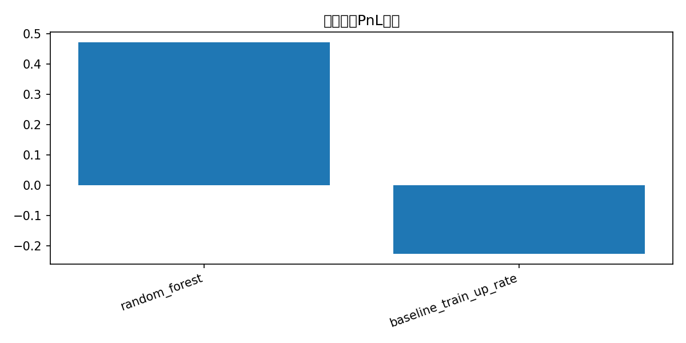

### 最佳阈值规则累计PnL

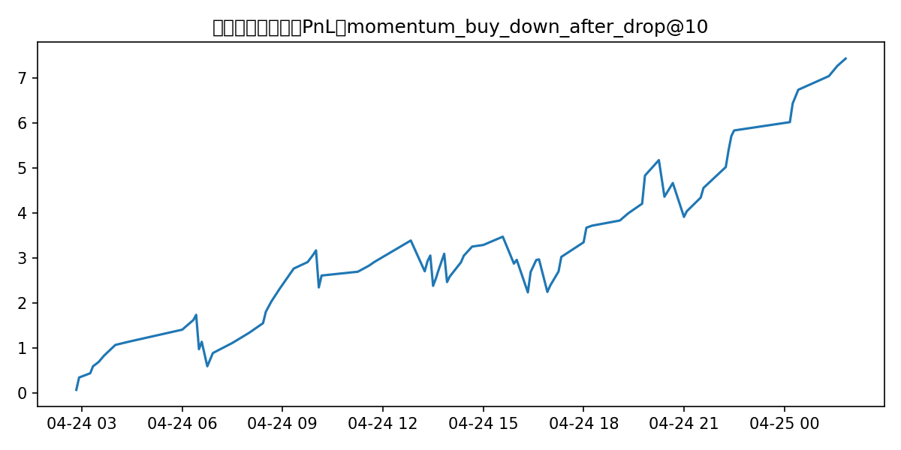

### 最佳模型累计PnL

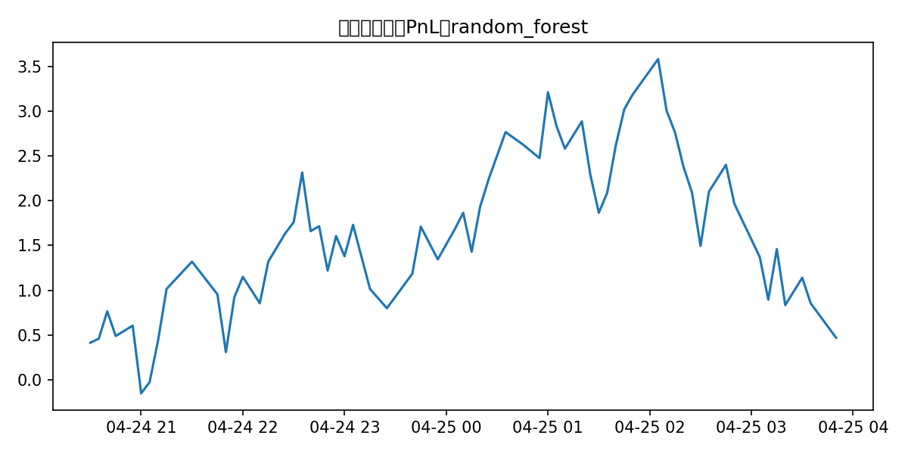
