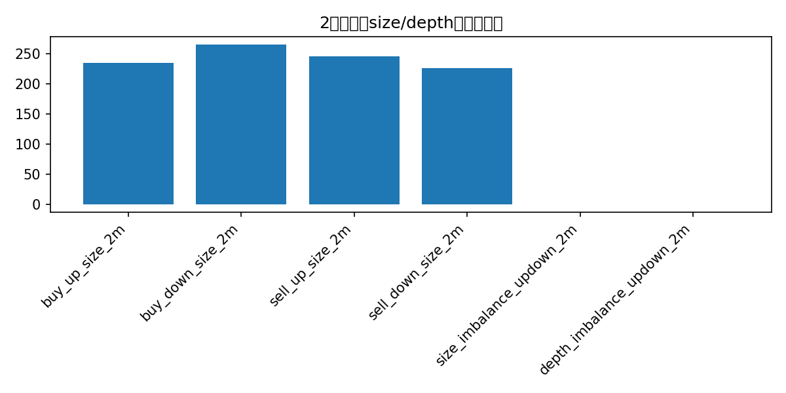
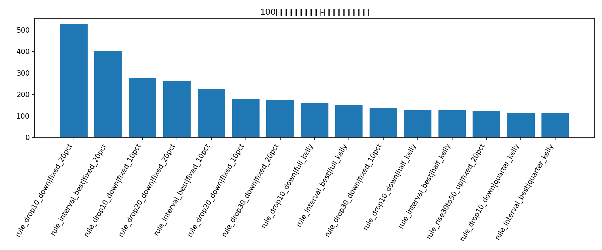
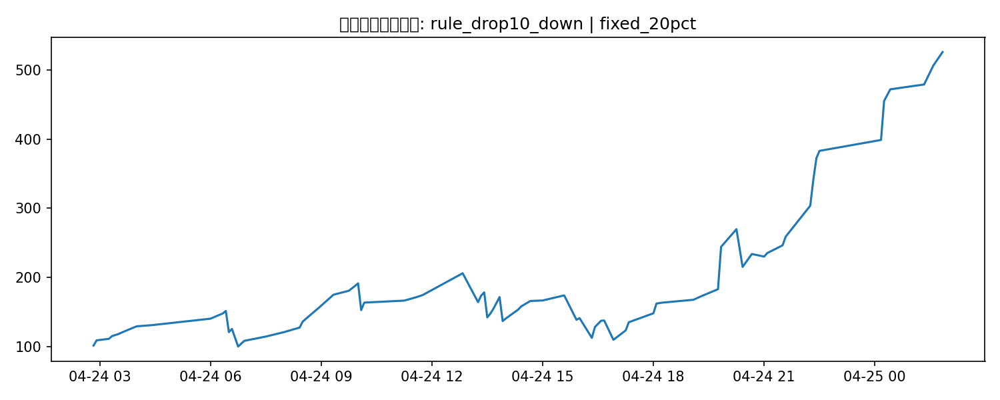
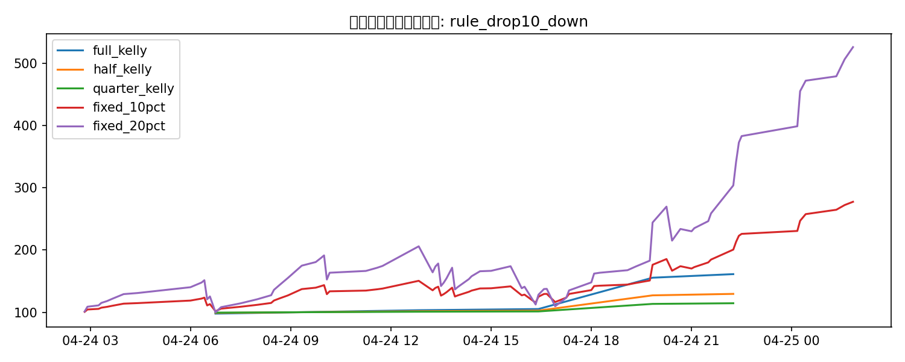

# 100美元本金 + Kelly 仓位的 5分钟交易回测报告：24869603988_attempt1

## 这次升级了什么

- 用 `buy_up_cents / buy_down_cents` 作为真实入场价格，而不是 mid price
- 把 `buy_up_size / buy_down_size / sell_up_size / sell_down_size` 当作盘口可成交量/流动性特征
- 按 100 美元初始本金，顺序滚动做 bankroll 回测
- 同时测试全凯利、半凯利、0.25 凯利、固定 10% 仓位、固定 20% 仓位
- 回测对象包括规则策略和 walk-forward 模型价值策略

## 关于 volume / size

这次不再把 volume 只理解成 `trade_volume_1s`。在这份 CLOB 快照数据里，更有信息量的是盘口 size：

- `buy_up_size / buy_down_size`：当前最优买入价位可成交的份数上限
- `sell_up_size / sell_down_size`：对侧卖出挂单的份数快照
- 同时加入了 `size_imbalance_updown_2m` 和 `depth_imbalance_updown_2m`

| feature                   |   non_null |     mean |   median |      p90 |
|:--------------------------|-----------:|---------:|---------:|---------:|
| buy_up_size_2m            |        302 | 339.066  | 234.27   | 810.63   |
| buy_down_size_2m          |        302 | 373.179  | 264.51   | 834.42   |
| sell_up_size_2m           |        302 | 371.848  | 245.505  | 847.114  |
| sell_down_size_2m         |        302 | 365.226  | 225.31   | 817.358  |
| size_imbalance_updown_2m  |        302 |  -0.0287 |  -0.0115 |   0.8199 |
| depth_imbalance_updown_2m |        302 |   0.0029 |   0.0024 |   0.0868 |

## 数据概览

- 原始分块文件数：**50**
- 市场级回测样本数：**302**
- 每份合约固定附加成本 fee：**0.0100**
- 已解析 outcome 的 Up 比例：**0.4805**

## 涨跌分桶的单位PnL

| move_bucket   |   count |   avg_btc_move_2m |   avg_buy_up_price |   avg_buy_down_price |   avg_buy_up_size |   avg_buy_down_size |   realized_up_rate |   avg_pnl_buy_up |   avg_pnl_buy_down | best_side   |   best_avg_pnl |
|:--------------|--------:|------------------:|-------------------:|---------------------:|------------------:|--------------------:|-------------------:|-----------------:|-------------------:|:------------|---------------:|
| <=-100        |       4 |         -145.26   |             0.0775 |               0.94   |           642.342 |             981.548 |             0      |          -0.0875 |             0.05   | buy_down    |         0.05   |
| -100~-50      |      21 |          -73.3171 |             0.1524 |               0.8571 |           448.356 |             367.42  |             0.0952 |          -0.0671 |             0.0376 | buy_down    |         0.0376 |
| -50~-30       |      28 |          -39.2318 |             0.2479 |               0.7629 |           310.377 |             392.582 |             0.1786 |          -0.0793 |             0.0486 | buy_down    |         0.0486 |
| -30~-10       |      26 |          -20.6927 |             0.3554 |               0.6573 |           400.334 |             342.578 |             0.1538 |          -0.2115 |             0.1788 | buy_down    |         0.1788 |
| -10~10        |      57 |            0.0961 |             0.5104 |               0.5005 |           340.308 |             322.631 |             0.5263 |           0.006  |            -0.0368 | buy_up      |         0.006  |
| 10~30         |      47 |           19.1843 |             0.667  |               0.3415 |           218.126 |             340.225 |             0.6596 |          -0.0174 |            -0.0111 | buy_down    |        -0.0111 |
| 30~50         |      25 |           39.8108 |             0.7456 |               0.2676 |           352.284 |             315.412 |             0.8    |           0.0444 |            -0.0776 | buy_up      |         0.0444 |
| 50~100        |      20 |           70.6435 |             0.842  |               0.1675 |           341.817 |             358.729 |             0.8    |          -0.052  |             0.0225 | buy_down    |         0.0225 |
| >=100         |       3 |          173.783  |             0.97   |               0.04   |           595.163 |             658.74  |             1      |           0.02   |            -0.05   | buy_up      |         0.02   |

## 简单模型的单位份额比较

| model                  |   test_rows |   accuracy |   brier |   log_loss |   trades |   trade_ratio |   avg_pnl |   cum_pnl |   win_rate |
|:-----------------------|------------:|-----------:|--------:|-----------:|---------:|--------------:|----------:|----------:|-----------:|
| baseline_train_up_rate |          70 |     0.5286 |  0.2494 |     0.6919 |       67 |        0.9571 |   -0.0081 |     -0.54 |     0.3284 |
| random_forest          |          70 |     0.6286 |  0.2107 |     0.6057 |       63 |        0.9    |   -0.0103 |     -0.65 |     0.4762 |
| logistic_regression    |          70 |     0.6286 |  0.208  |     0.5982 |       62 |        0.8857 |   -0.0242 |     -1.5  |     0.4194 |

## 100美元本金 bankroll 回测结果

这里的本金曲线是按时间顺序逐笔滚动的，下一笔交易使用上一笔结算后的本金。

| strategy                           | sizing        |   trades |   ending_bankroll |   total_return |   avg_trade_return_on_cost |   max_drawdown |
|:-----------------------------------|:--------------|---------:|------------------:|---------------:|---------------------------:|---------------:|
| rule_drop10_down                   | fixed_20pct   |       79 |          526.164  |         4.2616 |                     0.1344 |         0.4674 |
| rule_interval_best                 | fixed_20pct   |       51 |          400.242  |         3.0024 |                     0.1797 |         0.5961 |
| rule_drop10_down                   | fixed_10pct   |       79 |          277.556  |         1.7756 |                     0.1344 |         0.234  |
| rule_drop20_down                   | fixed_20pct   |       68 |          261.072  |         1.6107 |                     0.0856 |         0.4692 |
| rule_interval_best                 | fixed_10pct   |       51 |          225.091  |         1.2509 |                     0.1797 |         0.3356 |
| rule_drop20_down                   | fixed_10pct   |       68 |          177.598  |         0.776  |                     0.0856 |         0.234  |
| rule_drop30_down                   | fixed_20pct   |       53 |          174.5    |         0.745  |                     0.0552 |         0.3099 |
| rule_drop10_down                   | full_kelly    |        5 |          161.283  |         0.6128 |                     0.6525 |         0.0221 |
| rule_interval_best                 | full_kelly    |        4 |          152.659  |         0.5266 |                     0.5896 |         0.0221 |
| rule_drop30_down                   | fixed_10pct   |       53 |          137.105  |         0.371  |                     0.0552 |         0.1581 |
| rule_drop10_down                   | half_kelly    |        5 |          129.518  |         0.2952 |                     0.6525 |         0.0111 |
| rule_interval_best                 | half_kelly    |        4 |          125.96   |         0.2596 |                     0.5896 |         0.0111 |
| rule_rise30to50_up                 | fixed_20pct   |       25 |          124.797  |         0.248  |                     0.0588 |         0.3632 |
| rule_drop10_down                   | quarter_kelly |        5 |          114.481  |         0.1448 |                     0.6525 |         0.0055 |
| rule_interval_best                 | quarter_kelly |        4 |          112.886  |         0.1289 |                     0.5896 |         0.0055 |
| rule_drop20_down                   | full_kelly    |        3 |          111.536  |         0.1154 |                     0.8684 |         0      |
| rule_rise30to50_up                 | fixed_10pct   |       25 |          111.282  |         0.1128 |                     0.0588 |         0.1882 |
| rule_drop20_down                   | half_kelly    |        3 |          105.672  |         0.0567 |                     0.8684 |         0      |
| rule_drop30_down                   | full_kelly    |        1 |          105.649  |         0.0565 |                     0.9038 |         0      |
| rule_drop30_down                   | half_kelly    |        1 |          102.825  |         0.0282 |                     0.9038 |         0      |
| rule_drop20_down                   | quarter_kelly |        3 |          102.812  |         0.0281 |                     0.8684 |         0      |
| rule_drop30_down                   | quarter_kelly |        1 |          101.412  |         0.0141 |                     0.9038 |         0      |
| rule_rise30to50_up                 | full_kelly    |        0 |          100      |         0      |                   nan      |         0      |
| rule_rise30to50_up                 | half_kelly    |        0 |          100      |         0      |                   nan      |         0      |
| rule_rise30to50_up                 | quarter_kelly |        0 |          100      |         0      |                   nan      |         0      |
| model_value_logistic               | quarter_kelly |      153 |           67.0035 |        -0.33   |                    -0.0339 |         0.6966 |
| model_value_logistic_edge2pct      | quarter_kelly |      135 |           63.9035 |        -0.361  |                    -0.0791 |         0.6994 |
| model_value_logistic               | fixed_10pct   |      153 |           34.3448 |        -0.6566 |                    -0.0339 |         0.8246 |
| model_value_random_forest_edge2pct | quarter_kelly |      139 |           23.0932 |        -0.7691 |                    -0.2291 |         0.8786 |
| model_value_random_forest          | quarter_kelly |      152 |           22.9932 |        -0.7701 |                    -0.228  |         0.8818 |

## 当前最优组合

- 策略：**rule_drop10_down**
- 仓位：**fixed_20pct**
- 交易笔数：**79**
- 期末本金：**526.16 USD**
- 总收益率：**426.16%**
- 最大回撤：**46.74%**

## 图表

### 前2分钟BTC涨跌幅分布

### 不同涨跌区间的最佳方向平均每份PnL

### 盘口size/depth特征中位数

### 各策略-仓位组合的期末本金

### 最佳组合本金曲线

### 最佳策略的不同仓位曲线

## 缺失值概览

| column                        |   missing_ratio |   non_null |
|:------------------------------|----------------:|-----------:|
| trade_count_sum_first2m       |          1      |          0 |
| trade_volume_sum_first2m      |          1      |          0 |
| btc_return_bps_2m             |          0.2351 |        231 |
| realized_pnl_buy_up_from_2m   |          0.2351 |        231 |
| btc_move_2m                   |          0.2351 |        231 |
| target_price                  |          0.2351 |        231 |
| outcome_up                    |          0.2351 |        231 |
| realized_pnl_buy_down_from_2m |          0.2351 |        231 |
| close_ts_utc                  |          0      |        302 |
| quote_count_total             |          0      |        302 |
| quote_count_first2m           |          0      |        302 |
| first_quote_ts                |          0      |        302 |
| slug                          |          0      |        302 |
| window_text                   |          0      |        302 |
| mid_up_prob_change_2m         |          0      |        302 |
| mid_up_prob_2m                |          0      |        302 |
| mid_up_prob_open              |          0      |        302 |
| final_price_last              |          0      |        302 |
| price_after_2m                |          0      |        302 |
| buy_up_price_2m               |          0      |        302 |

## 备注

- 这里把 `buy_*_cents` 当作买入该方向的入场价格，`buy_*_size` 当作该最优价位可成交的份数上限。
- 这是按 top-of-book 的简化回测，还没有模拟扫多档深度。
- 但它已经比之前的 mid-price 假设更接近真实的 Polymarket CLOB 交易。