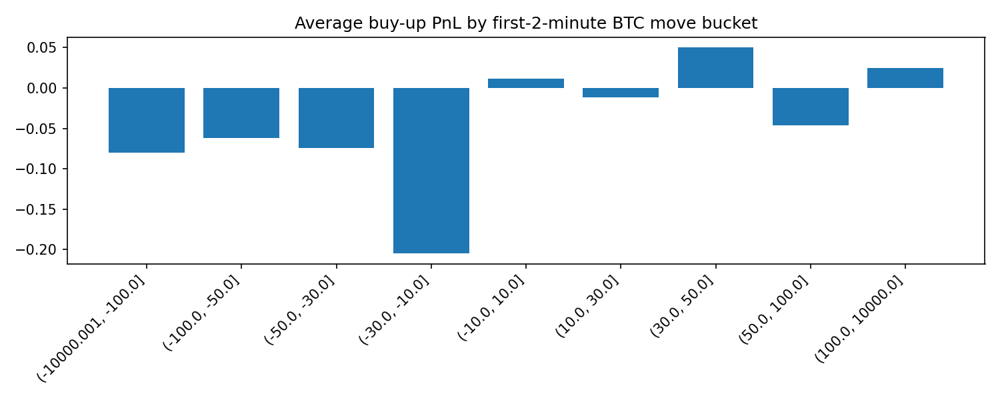

# 基于前2分钟信息的预测研究报告：24869603988_attempt1

## 研究问题

我们关心的是：**只看前 2 分钟的 BTC 价格变化、盘口概率和交易活跃度，能否更好地预测后 3 分钟 / 最终 5 分钟 Up/Down 结果，并形成比盲目下单更优的策略？**

## 数据概览

- 原始分块文件数：**50**
- 清洗后 quotes 行数：**36399**
- 市场级特征行数：**302**
- 评估使用的固定单笔成本 fee：**0.0100**
- 已解析 outcome 的样本 Up 比例：**0.4805**

## 直观理解

这里的核心特征是 `btc_move_2m`：表示从该 5 分钟窗口起点到第 2 分钟时，BTC 价格一共偏离了多少美元。
例如，如果前 2 分钟已经上涨了 30 美元，那么我们会进一步检验：

- 这是否意味着最终更容易继续收涨（动量）
- 还是说已经涨得过多，后面更容易回落（均值回归）

## 前2分钟特征样例

| slug                     | window_text   |   btc_move_2m |   mid_up_prob_2m |   outcome_up |   realized_pnl_buy_up_from_2m |
|:-------------------------|:--------------|--------------:|-----------------:|-------------:|------------------------------:|
| btc-updown-5m-1776998700 | 10:45-10:50   |        nan    |            0.015 |          nan |                       nan     |
| btc-updown-5m-1776999000 | 10:50-10:55   |        -90.69 |            0.075 |            0 |                        -0.085 |
| btc-updown-5m-1776999300 | 10:55-11:00   |        -29.38 |            0.285 |            0 |                        -0.295 |
| btc-updown-5m-1776999600 | 11:00-11:05   |          6.4  |            0.595 |            1 |                         0.395 |
| btc-updown-5m-1776999900 | 11:05-11:10   |        nan    |            0.375 |          nan |                       nan     |
| btc-updown-5m-1777000200 | 11:10-11:15   |        nan    |            0.285 |          nan |                       nan     |
| btc-updown-5m-1777000500 | 11:15-11:20   |        -72.66 |            0.105 |            0 |                        -0.115 |
| btc-updown-5m-1777000800 | 11:20-11:25   |        -45.81 |            0.165 |            0 |                        -0.175 |
| btc-updown-5m-1777001100 | 11:25-11:30   |         77.5  |            0.905 |            1 |                         0.085 |
| btc-updown-5m-1777001400 | 11:30-11:35   |        -90.69 |            0.105 |            0 |                        -0.115 |
| btc-updown-5m-1777001700 | 11:35-11:40   |         73.97 |            0.815 |            1 |                         0.175 |
| btc-updown-5m-1777002000 | 11:40-11:45   |        -65.43 |            0.155 |            0 |                        -0.165 |
| btc-updown-5m-1777002300 | 11:45-11:50   |          7.58 |            0.495 |            1 |                         0.495 |
| btc-updown-5m-1777002600 | 11:50-11:55   |         49.56 |            0.855 |            1 |                         0.135 |
| btc-updown-5m-1777002900 | 11:55-12:00   |        nan    |            0.475 |          nan |                       nan     |
| btc-updown-5m-1777003200 | 12:00-12:05   |        -36.44 |            0.245 |            0 |                        -0.255 |
| btc-updown-5m-1777003500 | 12:05-12:10   |        nan    |            0.465 |          nan |                       nan     |
| btc-updown-5m-1777003800 | 12:10-12:15   |         -5.13 |            0.515 |            1 |                         0.475 |
| btc-updown-5m-1777004100 | 12:15-12:20   |        nan    |            0.285 |          nan |                       nan     |
| btc-updown-5m-1777004400 | 12:20-12:25   |        nan    |            0.865 |          nan |                       nan     |

## BTC前2分钟涨跌幅分桶结果

| move_bucket          |   count |   avg_btc_move_2m |   avg_entry_prob |   realized_up_rate |   avg_pnl_buy_up |    edge |
|:---------------------|--------:|------------------:|-----------------:|-------------------:|-----------------:|--------:|
| (-10000.001, -100.0] |       4 |         -145.26   |           0.07   |             0      |          -0.08   | -0.07   |
| (-100.0, -50.0]      |      21 |          -73.3171 |           0.1471 |             0.0952 |          -0.0619 | -0.0519 |
| (-50.0, -30.0]       |      28 |          -39.2318 |           0.2427 |             0.1786 |          -0.0741 | -0.0641 |
| (-30.0, -10.0]       |      26 |          -20.6927 |           0.3487 |             0.1538 |          -0.2048 | -0.1948 |
| (-10.0, 10.0]        |      57 |            0.0961 |           0.5053 |             0.5263 |           0.0111 |  0.0211 |
| (10.0, 30.0]         |      47 |           19.1843 |           0.6616 |             0.6596 |          -0.012  | -0.002  |
| (30.0, 50.0]         |      25 |           39.8108 |           0.7402 |             0.8    |           0.0498 |  0.0598 |
| (50.0, 100.0]        |      20 |           70.6435 |           0.8365 |             0.8    |          -0.0465 | -0.0365 |
| (100.0, 10000.0]     |       3 |          173.783  |           0.965  |             1      |           0.025  |  0.035  |

这里最值得看的是：

- `realized_up_rate`：该分桶里最终收涨的实际比例
- `avg_entry_prob`：2分钟时盘口给出的平均 Up 概率
- `edge`：实际收涨率减去盘口概率，正值说明盘口低估了 Up，负值说明盘口高估了 Up

## 2分钟时盘口概率的校准情况

| prob_bin      |   count |   avg_entry_prob |   realized_up_rate |   avg_pnl_buy_up |    edge |
|:--------------|--------:|-----------------:|-------------------:|-----------------:|--------:|
| (-0.001, 0.1] |       8 |           0.0713 |             0      |          -0.0812 | -0.0713 |
| (0.1, 0.2]    |      24 |           0.1529 |             0.0833 |          -0.0796 | -0.0696 |
| (0.2, 0.3]    |      23 |           0.2513 |             0.2174 |          -0.0439 | -0.0339 |
| (0.3, 0.4]    |      26 |           0.3462 |             0.2308 |          -0.1254 | -0.1154 |
| (0.4, 0.5]    |      26 |           0.4583 |             0.5385 |           0.0702 |  0.0802 |
| (0.5, 0.6]    |      31 |           0.5634 |             0.5161 |          -0.0573 | -0.0473 |
| (0.6, 0.7]    |      39 |           0.6472 |             0.641  |          -0.0162 | -0.0062 |
| (0.7, 0.8]    |      26 |           0.7431 |             0.7308 |          -0.0223 | -0.0123 |
| (0.8, 0.9]    |      21 |           0.8429 |             0.8095 |          -0.0433 | -0.0333 |
| (0.9, 1.0]    |       7 |           0.9421 |             1      |           0.0479 |  0.0579 |

## 常见阈值策略对比

这里测试了几类简单规则：

- `momentum_buy_up_after_rise`：前2分钟上涨超过阈值后，继续买 Up
- `meanrev_buy_down_after_rise`：前2分钟上涨超过阈值后，反手买 Down
- `momentum_buy_down_after_drop`：前2分钟下跌超过阈值后，继续买 Down
- `meanrev_buy_up_after_drop`：前2分钟下跌超过阈值后，反手买 Up

| strategy                     |   threshold_usd | side     |   trades |   avg_btc_move_2m |   avg_entry_prob |   win_rate |   avg_pnl |   cum_pnl |
|:-----------------------------|----------------:|:---------|---------:|------------------:|-----------------:|-----------:|----------:|----------:|
| momentum_buy_down_after_drop |              10 | buy_down |       79 |          -47.5595 |           0.2434 |     0.8608 |    0.0942 |     7.44  |
| momentum_buy_down_after_drop |              20 | buy_down |       68 |          -52.8166 |           0.2242 |     0.8529 |    0.0671 |     4.565 |
| momentum_buy_down_after_drop |              30 | buy_down |       53 |          -60.7394 |           0.1918 |     0.8679 |    0.0497 |     2.635 |
| momentum_buy_down_after_drop |              40 | buy_down |       37 |          -71.9543 |           0.1601 |     0.9189 |    0.0691 |     2.555 |
| momentum_buy_up_after_rise   |              20 | buy_up   |       71 |           48.9138 |           0.758  |     0.7887 |    0.0207 |     1.47  |
| momentum_buy_down_after_drop |              50 | buy_down |       25 |          -84.828  |           0.1348 |     0.92   |    0.0448 |     1.12  |
| momentum_buy_down_after_drop |              75 | buy_down |       11 |         -111.976  |           0.1059 |     1      |    0.0959 |     1.055 |
| momentum_buy_up_after_rise   |              40 | buy_up   |       35 |           70.6591 |           0.8243 |     0.8571 |    0.0229 |     0.8   |
| meanrev_buy_down_after_rise  |              50 | buy_down |       23 |           84.0965 |           0.8533 |     0.1739 |    0.0172 |     0.395 |
| momentum_buy_up_after_rise   |              30 | buy_up   |       48 |           61.031  |           0.7944 |     0.8125 |    0.0081 |     0.39  |
| momentum_buy_down_after_drop |             100 | buy_down |        4 |         -145.26   |           0.07   |     1      |    0.06   |     0.24  |
| momentum_buy_up_after_rise   |              75 | buy_up   |       12 |          108.215  |           0.895  |     0.9167 |    0.0117 |     0.14  |
| momentum_buy_up_after_rise   |             100 | buy_up   |        3 |          173.783  |           0.965  |     1      |    0.025  |     0.075 |
| meanrev_buy_down_after_rise  |             100 | buy_down |        3 |          173.783  |           0.965  |     0      |   -0.045  |    -0.135 |
| momentum_buy_up_after_rise   |              10 | buy_up   |       95 |           40.3279 |           0.7287 |     0.7368 |   -0.0018 |    -0.175 |
| meanrev_buy_up_after_drop    |             100 | buy_up   |        4 |         -145.26   |           0.07   |     0      |   -0.08   |    -0.32  |
| meanrev_buy_down_after_rise  |              75 | buy_down |       12 |          108.215  |           0.895  |     0.0833 |   -0.0317 |    -0.38  |
| momentum_buy_up_after_rise   |              50 | buy_up   |       23 |           84.0965 |           0.8533 |     0.8261 |   -0.0372 |    -0.855 |
| meanrev_buy_up_after_drop    |              75 | buy_up   |       11 |         -111.976  |           0.1059 |     0      |   -0.1159 |    -1.275 |
| meanrev_buy_down_after_rise  |              30 | buy_down |       48 |           61.031  |           0.7944 |     0.1875 |   -0.0281 |    -1.35  |
| meanrev_buy_down_after_rise  |              40 | buy_down |       35 |           70.6591 |           0.8243 |     0.1429 |   -0.0429 |    -1.5   |
| meanrev_buy_up_after_drop    |              50 | buy_up   |       25 |          -84.828  |           0.1348 |     0.08   |   -0.0648 |    -1.62  |
| meanrev_buy_down_after_rise  |              10 | buy_down |       95 |           40.3279 |           0.7287 |     0.2632 |   -0.0182 |    -1.725 |
| meanrev_buy_down_after_rise  |              20 | buy_down |       71 |           48.9138 |           0.758  |     0.2113 |   -0.0407 |    -2.89  |
| meanrev_buy_up_after_drop    |              40 | buy_up   |       37 |          -71.9543 |           0.1601 |     0.0811 |   -0.0891 |    -3.295 |
| meanrev_buy_up_after_drop    |              30 | buy_up   |       53 |          -60.7394 |           0.1918 |     0.1321 |   -0.0697 |    -3.695 |
| meanrev_buy_up_after_drop    |              20 | buy_up   |       68 |          -52.8166 |           0.2242 |     0.1471 |   -0.0871 |    -5.925 |
| meanrev_buy_up_after_drop    |              10 | buy_up   |       79 |          -47.5595 |           0.2434 |     0.1392 |   -0.1142 |    -9.02  |

## 简单模型对比（时间顺序切分）

| model                  |   test_rows |   accuracy |   brier |   log_loss |   trades |   trade_ratio |   avg_pnl |   cum_pnl |   win_rate |
|:-----------------------|------------:|-----------:|--------:|-----------:|---------:|--------------:|----------:|----------:|-----------:|
| random_forest          |          70 |     0.6857 |  0.2012 |     0.5888 |       64 |        0.9143 |    0.0073 |     0.47  |     0.5469 |
| baseline_train_up_rate |          70 |     0.5286 |  0.2494 |     0.6919 |       67 |        0.9571 |   -0.0034 |    -0.225 |     0.3284 |

## 缺失值概览

| column               |   missing_ratio |   non_null |
|:---------------------|----------------:|-----------:|
| trade_volume_1s      |          1      |          0 |
| trade_count_1s       |          1      |          0 |
| btc_move_from_target |          0.2783 |      26269 |
| target_price         |          0.2783 |      26269 |
| mid_sum_cents        |          0.0568 |      34332 |
| mid_overround_cents  |          0.0568 |      34332 |
| mid_down_cents       |          0.0565 |      34342 |
| mid_down_prob        |          0.0565 |      34342 |
| spread_down_cents    |          0.0565 |      34342 |
| spread_up_cents      |          0.0558 |      34367 |
| mid_up_prob          |          0.0558 |      34367 |
| mid_up_cents         |          0.0558 |      34367 |
| ask_depth_down_5     |          0.0301 |      35303 |
| buy_down_cents       |          0.0301 |      35303 |
| buy_down_size        |          0.0301 |      35303 |

## 图表

### 前2分钟BTC涨跌幅分布

### 2分钟时入场概率分布

### 前2分钟BTC涨跌幅 vs 入场概率

### 按BTC前2分钟涨跌分桶的最终上涨率

### 按BTC前2分钟涨跌分桶的买Up平均收益

### 2分钟时盘口概率的校准图

### 收益最高的阈值策略

### 模型累计收益对比

### 最佳阈值规则累计收益曲线

### 最佳模型累计收益曲线

## 当前可怎么解读

这份报告最适合先回答几个直觉问题：

1. **前2分钟已经大涨 30 美元以后，继续追涨更好，还是反手更好？**
2. **盘口在2分钟时给出的概率是否校准？**
3. **简单阈值规则和简单模型，哪个在扣成本后更有优势？**

后续如果你要，我可以继续把报告升级成更完整的版本，例如：

- 做严格 train/validation/test 切分
- 引入更多盘口深度特征
- 做 rolling / walk-forward 回测
- 比较不同 fee 假设下策略是否仍然赚钱
