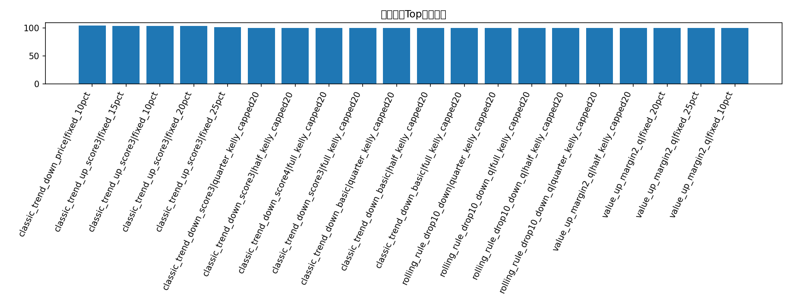
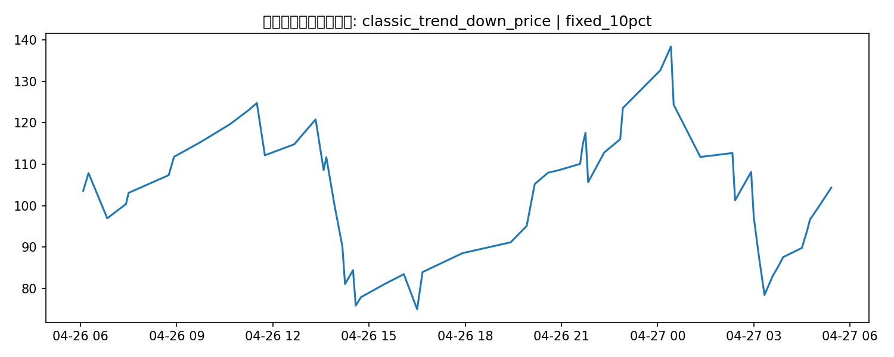

# 经典量化策略补充回测

## 这版试了什么

- 趋势确认 + 盘口确认（price cap / size imbalance / liquidity）
- 历史条件概率 value 策略（fair probability > 市场价格 + margin）
- 规则近期有效性过滤（rolling performance filter）
- 固定 10/15/20/25% 仓位 + capped Kelly

## 候选策略-仓位结果

| strategy                    | sizing                 |   trades |   ending_bankroll |   total_return |   avg_trade_return_on_cost |   max_drawdown |
|:----------------------------|:-----------------------|---------:|------------------:|---------------:|---------------------------:|---------------:|
| classic_trend_down_price    | fixed_10pct            |       57 |           104.349 |      0.0434899 |                  0.0602041 |       0.433785 |
| classic_trend_up_score3     | fixed_15pct            |       11 |           103.953 |      0.0395336 |                  0.0453643 |       0.251766 |
| classic_trend_up_score3     | fixed_10pct            |       11 |           103.481 |      0.0348147 |                  0.0453643 |       0.170593 |
| classic_trend_up_score3     | fixed_20pct            |       11 |           103.466 |      0.0346553 |                  0.0453643 |       0.329914 |
| classic_trend_up_score3     | fixed_25pct            |       11 |           101.944 |      0.0194449 |                  0.0453643 |       0.404829 |
| classic_trend_down_score3   | quarter_kelly_capped20 |        0 |           100     |      0         |                nan         |       0        |
| classic_trend_down_score3   | half_kelly_capped20    |        0 |           100     |      0         |                nan         |       0        |
| classic_trend_down_score4   | full_kelly_capped20    |        0 |           100     |      0         |                nan         |       0        |
| classic_trend_down_score3   | full_kelly_capped20    |        0 |           100     |      0         |                nan         |       0        |
| classic_trend_down_basic    | quarter_kelly_capped20 |        0 |           100     |      0         |                nan         |       0        |
| classic_trend_down_basic    | half_kelly_capped20    |        0 |           100     |      0         |                nan         |       0        |
| classic_trend_down_basic    | full_kelly_capped20    |        0 |           100     |      0         |                nan         |       0        |
| rolling_rule_drop10_down    | quarter_kelly_capped20 |        0 |           100     |      0         |                nan         |       0        |
| rolling_rule_drop10_down_q  | full_kelly_capped20    |        0 |           100     |      0         |                nan         |       0        |
| rolling_rule_drop10_down_q  | half_kelly_capped20    |        0 |           100     |      0         |                nan         |       0        |
| rolling_rule_drop10_down_q  | quarter_kelly_capped20 |        0 |           100     |      0         |                nan         |       0        |
| value_up_margin2_q          | half_kelly_capped20    |        0 |           100     |      0         |                nan         |       0        |
| value_up_margin2_q          | fixed_20pct            |        0 |           100     |      0         |                nan         |       0        |
| value_up_margin2_q          | fixed_25pct            |        0 |           100     |      0         |                nan         |       0        |
| value_up_margin2_q          | fixed_10pct            |        0 |           100     |      0         |                nan         |       0        |
| classic_trend_down_liq      | half_kelly_capped20    |        0 |           100     |      0         |                nan         |       0        |
| classic_trend_down_price    | full_kelly_capped20    |        0 |           100     |      0         |                nan         |       0        |
| classic_trend_down_price    | quarter_kelly_capped20 |        0 |           100     |      0         |                nan         |       0        |
| classic_trend_down_price    | half_kelly_capped20    |        0 |           100     |      0         |                nan         |       0        |
| classic_trend_down_midrange | full_kelly_capped20    |        0 |           100     |      0         |                nan         |       0        |
| classic_trend_down_midrange | half_kelly_capped20    |        0 |           100     |      0         |                nan         |       0        |
| classic_trend_down_midrange | quarter_kelly_capped20 |        0 |           100     |      0         |                nan         |       0        |
| classic_trend_down_score4   | half_kelly_capped20    |        0 |           100     |      0         |                nan         |       0        |
| classic_trend_up_score3     | full_kelly_capped20    |        0 |           100     |      0         |                nan         |       0        |
| classic_trend_up_score3     | half_kelly_capped20    |        0 |           100     |      0         |                nan         |       0        |

## 当前最佳经典策略

- 策略：**classic_trend_down_price**
- 仓位：**fixed_10pct**
- 交易笔数：**57**
- 期末本金：**104.35 USD**
- 总收益率：**4.35%**
- 最大回撤：**43.38%**

## 图表

### 经典策略Top期末本金

### 最佳经典策略本金曲线

