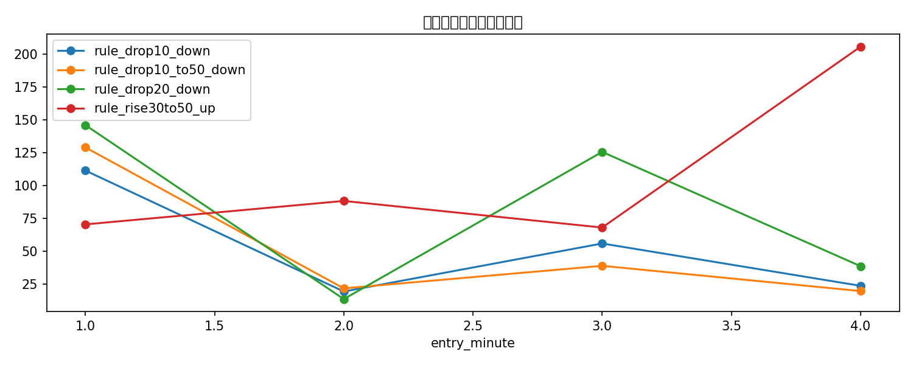
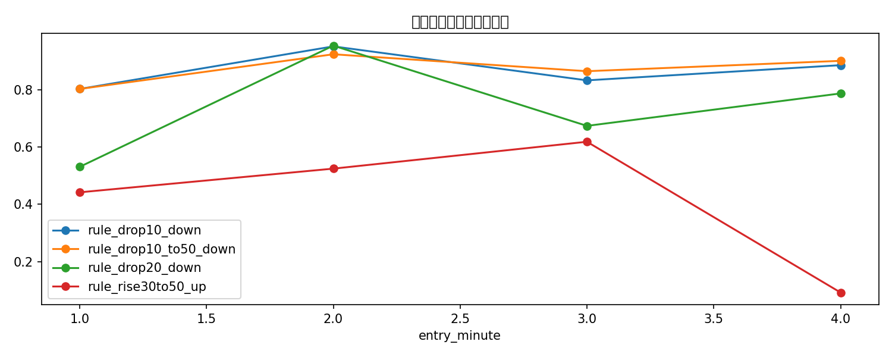
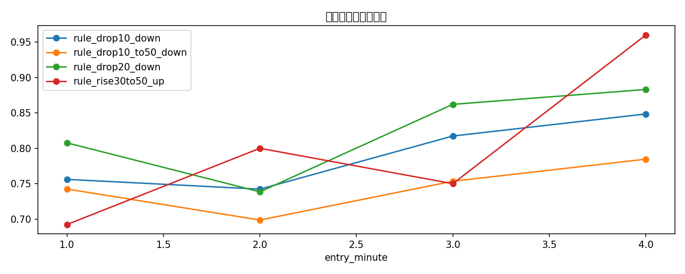

# 入场时点与剩余持有时间体验分析

这份报告用于观察：如果在不同的时间入场，剩余交易时间不够长，是否会显著降低体验。

## 回测设置

- 入场时点：第 1 / 2 / 3 / 4 分钟
- 代表性策略：drop10_down / drop20_down / drop10_to50_down / rise30to50_up
- 仓位：fixed 20% / fixed 25%

## 结果表

| strategy              | sizing      |   entry_minute |   remaining_minutes |   trades |   ending_bankroll |   total_return |   avg_trade_return_on_cost |   win_rate |   max_drawdown |   max_consecutive_losses |
|:----------------------|:------------|---------------:|--------------------:|---------:|------------------:|---------------:|---------------------------:|-----------:|---------------:|-------------------------:|
| rule_rise30to50_up    | fixed_25pct |              4 |                   1 |       25 |          205.856  |         1.0586 |                     0.1167 |     0.96   |         0.0805 |                        1 |
| rule_rise30to50_up    | fixed_20pct |              4 |                   1 |       25 |          175.21   |         0.7521 |                     0.1167 |     0.96   |         0.0914 |                        1 |
| rule_drop20_down      | fixed_20pct |              1 |                   4 |       52 |          146.095  |         0.4609 |                     0.102  |     0.8077 |         0.4559 |                        2 |
| rule_drop20_down      | fixed_25pct |              1 |                   4 |       52 |          144.988  |         0.4499 |                     0.102  |     0.8077 |         0.5315 |                        2 |
| rule_drop10_to50_down | fixed_20pct |              1 |                   4 |       66 |          129.107  |         0.2911 |                     0.0764 |     0.7424 |         0.7086 |                        2 |
| rule_drop20_down      | fixed_20pct |              3 |                   2 |       87 |          125.693  |         0.2569 |                     0.0262 |     0.8621 |         0.5793 |                        4 |
| rule_drop10_to50_down | fixed_25pct |              1 |                   4 |       66 |          115.522  |         0.1552 |                     0.0764 |     0.7424 |         0.8041 |                        2 |
| rule_drop20_down      | fixed_25pct |              3 |                   2 |       87 |          115.052  |         0.1505 |                     0.0262 |     0.8621 |         0.6749 |                        4 |
| rule_drop10_down      | fixed_20pct |              1 |                   4 |       82 |          111.472  |         0.1147 |                     0.0718 |     0.7561 |         0.7086 |                        2 |
| rule_drop10_down      | fixed_25pct |              1 |                   4 |       82 |           93.0461 |        -0.0695 |                     0.0718 |     0.7561 |         0.8041 |                        2 |
| rule_rise30to50_up    | fixed_20pct |              2 |                   3 |       20 |           88.3245 |        -0.1168 |                     0.034  |     0.8    |         0.4294 |                        2 |
| rule_rise30to50_up    | fixed_25pct |              2 |                   3 |       20 |           81.1364 |        -0.1886 |                     0.034  |     0.8    |         0.5252 |                        2 |
| rule_rise30to50_up    | fixed_20pct |              1 |                   4 |       13 |           70.4778 |        -0.2952 |                    -0.0425 |     0.6923 |         0.3641 |                        2 |
| rule_rise30to50_up    | fixed_20pct |              3 |                   2 |       20 |           68.0573 |        -0.3194 |                    -0.1159 |     0.75   |         0.525  |                        2 |
| rule_rise30to50_up    | fixed_25pct |              1 |                   4 |       13 |           60.443  |        -0.3956 |                    -0.0425 |     0.6923 |         0.4423 |                        2 |
| rule_rise30to50_up    | fixed_25pct |              3 |                   2 |       20 |           59.5332 |        -0.4047 |                    -0.1159 |     0.75   |         0.6193 |                        2 |
| rule_drop10_down      | fixed_20pct |              3 |                   2 |      104 |           55.9032 |        -0.441  |                    -0.0003 |     0.8173 |         0.7536 |                        4 |
| rule_drop10_down      | fixed_25pct |              3 |                   2 |      104 |           41.5872 |        -0.5841 |                    -0.0003 |     0.8173 |         0.8342 |                        4 |
| rule_drop10_to50_down | fixed_20pct |              3 |                   2 |       73 |           38.8892 |        -0.6111 |                    -0.0322 |     0.7534 |         0.7814 |                        4 |
| rule_drop20_down      | fixed_20pct |              4 |                   1 |       77 |           38.6106 |        -0.6139 |                    -0.0448 |     0.8831 |         0.6931 |                        2 |
| rule_drop20_down      | fixed_25pct |              4 |                   1 |       77 |           28.164  |        -0.7184 |                    -0.0448 |     0.8831 |         0.7884 |                        2 |
| rule_drop10_to50_down | fixed_25pct |              3 |                   2 |       73 |           27.1784 |        -0.7282 |                    -0.0322 |     0.7534 |         0.8662 |                        4 |
| rule_drop10_down      | fixed_20pct |              4 |                   1 |       99 |           23.6536 |        -0.7635 |                    -0.0552 |     0.8485 |         0.8055 |                        3 |
| rule_drop10_to50_down | fixed_20pct |              2 |                   3 |       73 |           21.695  |        -0.7831 |                    -0.04   |     0.6986 |         0.8566 |                        4 |
| rule_drop10_to50_down | fixed_20pct |              4 |                   1 |       65 |           19.6496 |        -0.8035 |                    -0.1018 |     0.7846 |         0.8286 |                        3 |
| rule_drop10_down      | fixed_20pct |              2 |                   3 |       97 |           19.3203 |        -0.8068 |                    -0.0329 |     0.7423 |         0.9001 |                        3 |
| rule_drop10_down      | fixed_25pct |              4 |                   1 |       99 |           14.3746 |        -0.8563 |                    -0.0552 |     0.8485 |         0.8874 |                        3 |
| rule_drop20_down      | fixed_20pct |              2 |                   3 |       65 |           13.5491 |        -0.8645 |                    -0.1048 |     0.7385 |         0.9069 |                        2 |
| rule_drop10_to50_down | fixed_25pct |              2 |                   3 |       73 |           12.0018 |        -0.88   |                    -0.04   |     0.6986 |         0.9256 |                        4 |
| rule_drop10_to50_down | fixed_25pct |              4 |                   1 |       65 |           11.5541 |        -0.8845 |                    -0.1018 |     0.7846 |         0.9025 |                        3 |
| rule_drop10_down      | fixed_25pct |              2 |                   3 |       97 |           10.2484 |        -0.8975 |                    -0.0329 |     0.7423 |         0.9532 |                        3 |
| rule_drop20_down      | fixed_25pct |              2 |                   3 |       65 |            6.9895 |        -0.9301 |                    -0.1048 |     0.7385 |         0.9557 |                        2 |

## 观察

- 最佳组合：**rule_rise30to50_up | fixed_25pct | 第4分钟入场**，期末本金 **205.86 USD**。
- 最差组合：**rule_drop20_down | fixed_25pct | 第2分钟入场**，期末本金 **6.99 USD**。
- 重点看 `max_drawdown`、`win_rate` 和 `max_consecutive_losses`，它们更能反映“体验差不差”。

## 图表

### 不同入场时点的期末本金

### 不同入场时点的最大回撤

### 不同入场时点的胜率

