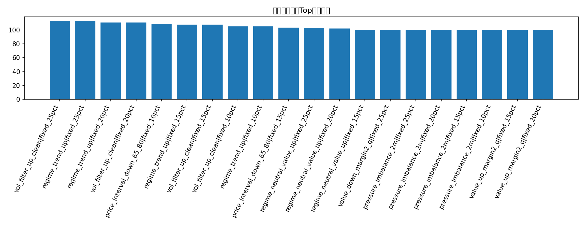
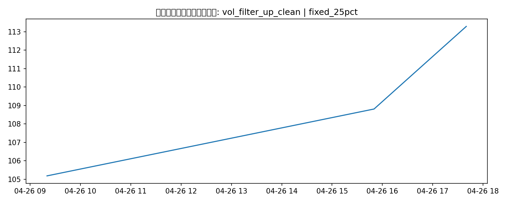

# 扩展经典策略回测

## 这版覆盖的 6 类策略

1. 波动率 / 路径过滤
2. 盘口压力 / 价格冲击
3. Regime filter
4. Rolling 健康度过滤（均值 / 胜率 / Sharpe 代理）
5. 分层仓位（score-based tiered sizing）
6. 价格区间搜索

## 候选策略-仓位结果

| strategy                  | sizing      |   trades |   ending_bankroll |   total_return |   avg_trade_return_on_cost |   max_drawdown |
|:--------------------------|:------------|---------:|------------------:|---------------:|---------------------------:|---------------:|
| vol_filter_up_clean       | fixed_25pct |        3 |           113.29  |     0.132903   |                  0.169985  |       0        |
| regime_trend_up           | fixed_25pct |        3 |           113.29  |     0.132903   |                  0.169985  |       0        |
| regime_trend_up           | fixed_20pct |        3 |           110.545 |     0.105447   |                  0.169985  |       0        |
| vol_filter_up_clean       | fixed_20pct |        3 |           110.545 |     0.105447   |                  0.169985  |       0        |
| price_interval_down_65_80 | fixed_10pct |       42 |           108.819 |     0.0881931  |                  0.0587628 |       0.323635 |
| regime_trend_up           | fixed_15pct |        3 |           107.843 |     0.0784318  |                  0.169985  |       0        |
| vol_filter_up_clean       | fixed_15pct |        3 |           107.843 |     0.0784318  |                  0.169985  |       0        |
| vol_filter_up_clean       | fixed_10pct |        3 |           105.185 |     0.0518547  |                  0.169985  |       0        |
| regime_trend_up           | fixed_10pct |        3 |           105.185 |     0.0518547  |                  0.169985  |       0        |
| price_interval_down_65_80 | fixed_15pct |       42 |           103.478 |     0.0347793  |                  0.0587628 |       0.464176 |
| regime_neutral_value_up   | fixed_25pct |        3 |           103.032 |     0.030324   |                 -0.0365923 |       0.313117 |
| regime_neutral_value_up   | fixed_20pct |        3 |           102.113 |     0.0211285  |                 -0.0365923 |       0.270622 |
| regime_neutral_value_up   | fixed_15pct |        3 |           100.174 |     0.00174442 |                 -0.0365923 |       0.229427 |
| value_down_margin2_q      | fixed_25pct |        0 |           100     |     0          |                nan         |       0        |
| pressure_imbalance_2m     | fixed_25pct |        0 |           100     |     0          |                nan         |       0        |
| pressure_imbalance_2m     | fixed_20pct |        0 |           100     |     0          |                nan         |       0        |
| pressure_imbalance_2m     | fixed_15pct |        0 |           100     |     0          |                nan         |       0        |
| pressure_imbalance_2m     | fixed_10pct |        0 |           100     |     0          |                nan         |       0        |
| value_up_margin2_q        | fixed_15pct |        0 |           100     |     0          |                nan         |       0        |
| value_up_margin2_q        | fixed_20pct |        0 |           100     |     0          |                nan         |       0        |
| value_up_margin2_q        | fixed_25pct |        0 |           100     |     0          |                nan         |       0        |
| value_down_margin2_book_q | fixed_25pct |        0 |           100     |     0          |                nan         |       0        |
| rolling_mean_pnl_20       | fixed_20pct |        0 |           100     |     0          |                nan         |       0        |
| rolling_mean_pnl_20       | fixed_15pct |        0 |           100     |     0          |                nan         |       0        |
| rolling_mean_pnl_20       | fixed_25pct |        0 |           100     |     0          |                nan         |       0        |
| rolling_mean_pnl_20       | fixed_10pct |        0 |           100     |     0          |                nan         |       0        |
| value_down_margin2_q      | fixed_20pct |        0 |           100     |     0          |                nan         |       0        |
| value_down_margin2_q      | fixed_15pct |        0 |           100     |     0          |                nan         |       0        |
| value_down_margin2_q      | fixed_10pct |        0 |           100     |     0          |                nan         |       0        |
| value_down_margin5_q      | fixed_25pct |        0 |           100     |     0          |                nan         |       0        |
| value_down_margin5_q      | fixed_20pct |        0 |           100     |     0          |                nan         |       0        |
| value_down_margin5_q      | fixed_15pct |        0 |           100     |     0          |                nan         |       0        |
| value_down_margin5_q      | fixed_10pct |        0 |           100     |     0          |                nan         |       0        |
| rolling_sharpe_proxy_20   | fixed_25pct |        0 |           100     |     0          |                nan         |       0        |
| rolling_sharpe_proxy_20   | fixed_20pct |        0 |           100     |     0          |                nan         |       0        |
| rolling_sharpe_proxy_20   | fixed_15pct |        0 |           100     |     0          |                nan         |       0        |
| rolling_sharpe_proxy_20   | fixed_10pct |        0 |           100     |     0          |                nan         |       0        |
| rolling_winrate_20        | fixed_25pct |        0 |           100     |     0          |                nan         |       0        |
| rolling_winrate_20        | fixed_20pct |        0 |           100     |     0          |                nan         |       0        |
| rolling_winrate_20        | fixed_15pct |        0 |           100     |     0          |                nan         |       0        |

## 当前最佳扩展经典策略

- 策略：**vol_filter_up_clean**
- 仓位：**fixed_25pct**
- 交易笔数：**3**
- 期末本金：**113.29 USD**
- 总收益率：**13.29%**
- 最大回撤：**0.00%**

## 图表

### 扩展经典策略Top期末本金

### 最佳扩展经典策略本金曲线

