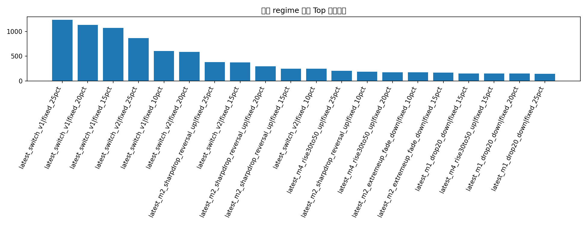
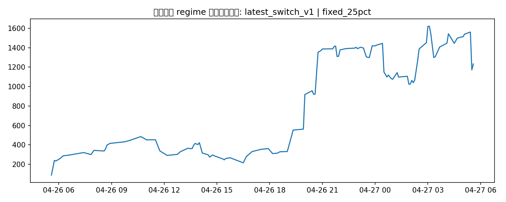

# 最新数据集上的新 regime 策略探索

- `latest_m1_drop20_down`：第1分钟跌超20，买Down
- `latest_m2_sharpdrop_reversal_up`：第2分钟跌在(-50,-30]，买Up
- `latest_m2_milddrop_down`：第2分钟跌在(-30,-10]，买Down
- `latest_m2_neutral_down`：第2分钟在(-10,10]，买Down
- `latest_m2_extremeup_fade_down`：第2分钟涨超50，买Down
- `latest_m4_rise30to50_up`：第4分钟涨在(30,50]，买Up
- `latest_switch_v1 / v2`：分钟感知组合策略

## 回测结果

| strategy                        | sizing      |   trades |   ending_bankroll |   total_return |   avg_trade_return_on_cost |   max_drawdown |   avg_entry_minute |
|:--------------------------------|:------------|---------:|------------------:|---------------:|---------------------------:|---------------:|-------------------:|
| latest_switch_v1                | fixed_25pct |      110 |         1232.84   |     11.3284    |                  0.38922   |      0.556194  |            1.73636 |
| latest_switch_v1                | fixed_20pct |      110 |         1133.18   |     10.3318    |                  0.38922   |      0.610711  |            1.73636 |
| latest_switch_v1                | fixed_15pct |      110 |         1070.49   |      9.70486   |                  0.38922   |      0.652626  |            1.73636 |
| latest_switch_v2                | fixed_25pct |       87 |          866.777  |      7.66777   |                  0.241574  |      0.879662  |            1.85057 |
| latest_switch_v1                | fixed_10pct |      110 |          602.314  |      5.02314   |                  0.38922   |      0.614218  |            1.73636 |
| latest_switch_v2                | fixed_20pct |       87 |          585.973  |      4.85973   |                  0.241574  |      0.874144  |            1.85057 |
| latest_m2_sharpdrop_reversal_up | fixed_25pct |       23 |          379.724  |      2.79724   |                  0.645568  |      0.656915  |            2       |
| latest_switch_v2                | fixed_15pct |       87 |          370.888  |      2.70888   |                  0.241574  |      0.818799  |            1.85057 |
| latest_m2_sharpdrop_reversal_up | fixed_20pct |       23 |          293.463  |      1.93463   |                  0.645568  |      0.619195  |            2       |
| latest_m2_sharpdrop_reversal_up | fixed_15pct |       23 |          244.272  |      1.44272   |                  0.645568  |      0.554955  |            2       |
| latest_switch_v2                | fixed_10pct |       87 |          243.958  |      1.43958   |                  0.241574  |      0.710748  |            1.85057 |
| latest_m4_rise30to50_up         | fixed_25pct |       25 |          205.856  |      1.05856   |                  0.116683  |      0.0805309 |            4       |
| latest_m2_sharpdrop_reversal_up | fixed_10pct |       23 |          187.4    |      0.873996  |                  0.645568  |      0.442988  |            2       |
| latest_m4_rise30to50_up         | fixed_20pct |       25 |          175.21   |      0.752096  |                  0.116683  |      0.0914413 |            4       |
| latest_m2_extremeup_fade_down   | fixed_10pct |       22 |          174.537  |      0.745369  |                  0.630166  |      0.623815  |            2       |
| latest_m2_extremeup_fade_down   | fixed_15pct |       22 |          168.567  |      0.685667  |                  0.630166  |      0.76248   |            2       |
| latest_m1_drop20_down           | fixed_15pct |       52 |          151.104  |      0.511043  |                  0.102011  |      0.349726  |            1       |
| latest_m4_rise30to50_up         | fixed_15pct |       25 |          148.465  |      0.484648  |                  0.116683  |      0.10408   |            4       |
| latest_m1_drop20_down           | fixed_20pct |       52 |          146.095  |      0.460949  |                  0.102011  |      0.455902  |            1       |
| latest_m1_drop20_down           | fixed_25pct |       52 |          144.988  |      0.449876  |                  0.102011  |      0.531455  |            1       |
| latest_m1_drop20_down           | fixed_10pct |       52 |          144.967  |      0.449674  |                  0.102011  |      0.241778  |            1       |
| latest_m2_extremeup_fade_down   | fixed_20pct |       22 |          141.517  |      0.41517   |                  0.630166  |      0.857802  |            2       |
| latest_m2_neutral_down          | fixed_20pct |       68 |          134.278  |      0.342778  |                  0.0815704 |      0.863272  |            2       |
| latest_m2_neutral_down          | fixed_25pct |       68 |          132.023  |      0.32023   |                  0.0815704 |      0.917251  |            2       |
| latest_m4_rise30to50_up         | fixed_10pct |       25 |          127.597  |      0.275972  |                  0.116683  |      0.101299  |            4       |
| latest_m2_neutral_down          | fixed_10pct |       68 |          127.177  |      0.271773  |                  0.0815704 |      0.635981  |            2       |
| latest_m2_neutral_down          | fixed_15pct |       68 |          123.325  |      0.233247  |                  0.0815704 |      0.784168  |            2       |
| latest_m2_extremeup_fade_down   | fixed_25pct |       22 |          107.645  |      0.0764482 |                  0.630166  |      0.918064  |            2       |
| latest_m2_milddrop_down         | fixed_10pct |       50 |           92.8252 |     -0.0717484 |                  0.0373346 |      0.428123  |            2       |
| latest_m2_milddrop_down         | fixed_15pct |       50 |           84.1638 |     -0.158362  |                  0.0373346 |      0.561627  |            2       |
| latest_m2_milddrop_down         | fixed_20pct |       50 |           71.7128 |     -0.282872  |                  0.0373346 |      0.673515  |            2       |
| latest_m2_milddrop_down         | fixed_25pct |       50 |           57.0406 |     -0.429594  |                  0.0373346 |      0.764485  |            2       |

当前最佳：**latest_switch_v1 | fixed_25pct**，期末本金 **1232.84 USD**，最大回撤 **55.62%**。

