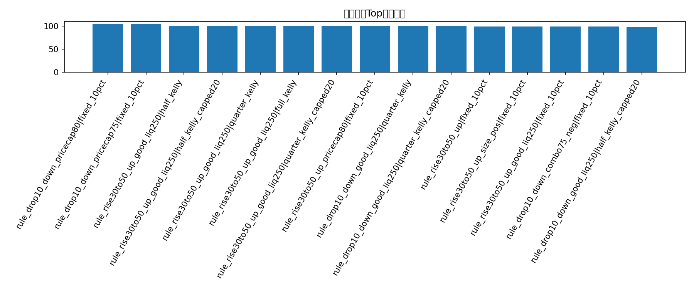
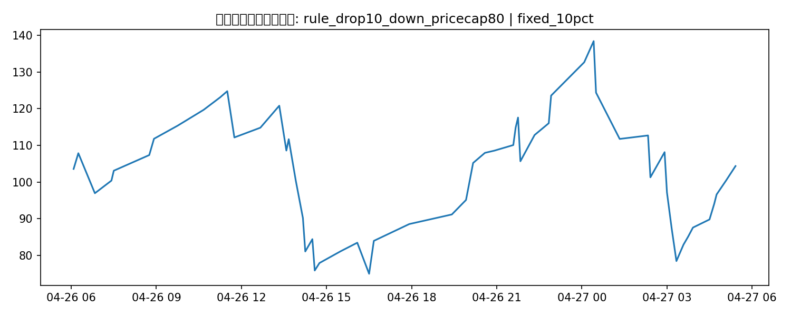

# 优化策略回测补充报告

## 修正说明

上一版优化报告把多条策略放在同一条资金路径里再按策略名切片汇总，口径不对。这一版已经改成**每条策略独立回测**，因此现在可以和 `rule_drop10_down + fixed_20pct` 做正面对比。

## 这版优化在搜什么

- 基线：`rule_drop10_down`
- 过滤器：price cap、size imbalance、流动性阈值、组合过滤
- 仓位：fixed 10%、fixed 20%、历史命中率版 Kelly / capped Kelly

## 候选策略-仓位结果

| strategy                         | sizing                 |   trades |   ending_bankroll |   total_return |   avg_trade_return_on_cost |   max_drawdown |
|:---------------------------------|:-----------------------|---------:|------------------:|---------------:|---------------------------:|---------------:|
| rule_drop10_down_pricecap80      | fixed_10pct            |       57 |          104.349  |     0.0434899  |                 0.0602041  |      0.433785  |
| rule_drop10_down_pricecap75      | fixed_10pct            |       41 |          103.347  |     0.0334744  |                 0.073153   |      0.438558  |
| rule_rise30to50_up_good_liq250   | half_kelly             |        0 |          100      |     0          |               nan          |      0         |
| rule_rise30to50_up_good_liq250   | half_kelly_capped20    |        0 |          100      |     0          |               nan          |      0         |
| rule_rise30to50_up_good_liq250   | quarter_kelly          |        0 |          100      |     0          |               nan          |      0         |
| rule_rise30to50_up_good_liq250   | full_kelly             |        0 |          100      |     0          |               nan          |      0         |
| rule_rise30to50_up_good_liq250   | quarter_kelly_capped20 |        0 |          100      |     0          |               nan          |      0         |
| rule_rise30to50_up_pricecap80    | fixed_10pct            |       12 |           99.7022 |    -0.00297778 |                 0.050486   |      0.238588  |
| rule_drop10_down_good_liq250     | quarter_kelly          |        5 |           99.5237 |    -0.00476276 |                 0.0120416  |      0.0740666 |
| rule_drop10_down_good_liq250     | quarter_kelly_capped20 |        5 |           99.5237 |    -0.00476276 |                 0.0120416  |      0.0740666 |
| rule_rise30to50_up               | fixed_10pct            |       20 |           99.1726 |    -0.00827427 |                 0.0340163  |      0.226048  |
| rule_rise30to50_up_size_pos      | fixed_10pct            |       11 |           99.0017 |    -0.00998317 |                 0.00893447 |      0.157067  |
| rule_rise30to50_up_good_liq250   | fixed_10pct            |        6 |           98.9879 |    -0.0101214  |                -0.00574456 |      0.101408  |
| rule_drop10_down_combo75_neg     | fixed_10pct            |       23 |           98.688  |    -0.0131199  |                 0.0212272  |      0.327513  |
| rule_drop10_down_good_liq250     | half_kelly_capped20    |        5 |           98.1019 |    -0.018981   |                 0.0120416  |      0.148133  |
| rule_drop10_down_good_liq250     | half_kelly             |        5 |           98.1019 |    -0.018981   |                 0.0120416  |      0.148133  |
| rule_drop10_down_combo80_liq     | quarter_kelly          |        4 |           97.7088 |    -0.0229122  |                 0.268477   |      0.0740666 |
| rule_drop10_down_combo80_liq     | quarter_kelly_capped20 |        4 |           97.7088 |    -0.0229122  |                 0.268477   |      0.0740666 |
| rule_rise30to50_up_pricecap80    | quarter_kelly          |        3 |           97.6096 |    -0.0239039  |                 0.0283126  |      0.0775825 |
| rule_rise30to50_up_pricecap80    | quarter_kelly_capped20 |        3 |           97.6096 |    -0.0239039  |                 0.0283126  |      0.0775825 |
| rule_drop30_down                 | quarter_kelly          |        6 |           97.4989 |    -0.0250112  |                -0.065163   |      0.0839187 |
| rule_drop30_down                 | quarter_kelly_capped20 |        6 |           97.4989 |    -0.0250112  |                -0.065163   |      0.0839187 |
| rule_rise30to50_up_good_liq250   | fixed_20pct            |        6 |           96.5132 |    -0.0348683  |                -0.00574456 |      0.202817  |
| rule_drop10_down_size_strong_neg | quarter_kelly_capped20 |       11 |           95.0482 |    -0.0495179  |                -0.163786   |      0.0660829 |
| rule_drop10_down_size_strong_neg | quarter_kelly          |       11 |           95.0482 |    -0.0495179  |                -0.163786   |      0.0660829 |
| rule_drop10_down_combo80_liq     | half_kelly             |        4 |           94.7417 |    -0.0525826  |                 0.268477   |      0.148133  |
| rule_drop10_down_combo80_liq     | half_kelly_capped20    |        4 |           94.7417 |    -0.0525826  |                 0.268477   |      0.148133  |
| rule_drop30_down                 | half_kelly_capped20    |        6 |           94.5688 |    -0.0543124  |                -0.065163   |      0.164231  |
| rule_drop30_down                 | half_kelly             |        6 |           94.5688 |    -0.0543124  |                -0.065163   |      0.164231  |
| rule_rise30to50_up_pricecap80    | half_kelly_capped20    |        3 |           94.4022 |    -0.0559784  |                 0.0283126  |      0.155165  |

## 当前最佳优化结果

- 策略：**rule_drop10_down_pricecap80**
- 仓位：**fixed_10pct**
- 交易笔数：**57**
- 期末本金：**104.35 USD**
- 总收益率：**4.35%**
- 最大回撤：**43.38%**

## 图表

### 优化策略Top期末本金

### 最佳优化策略本金曲线

