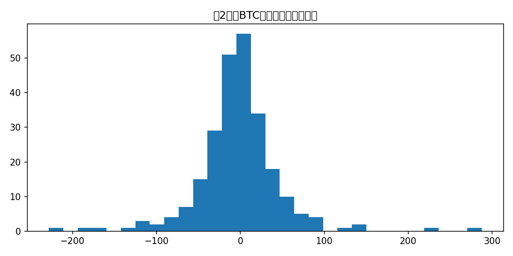
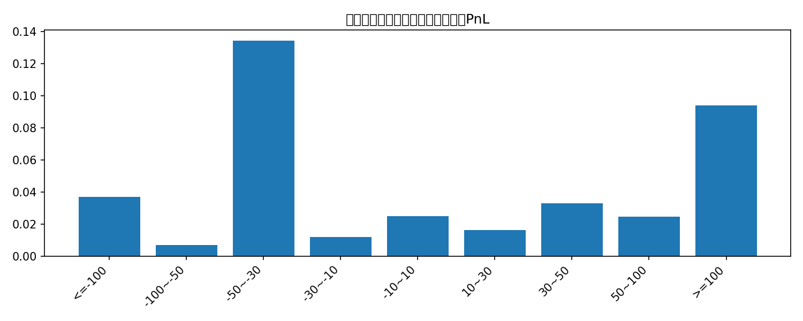
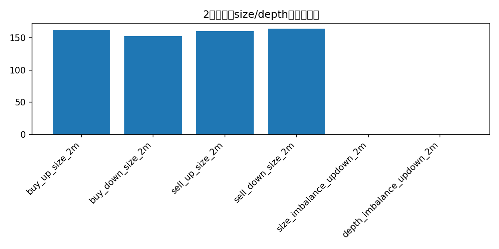
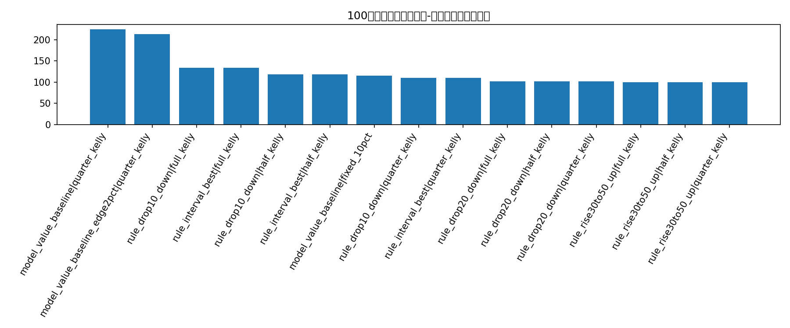
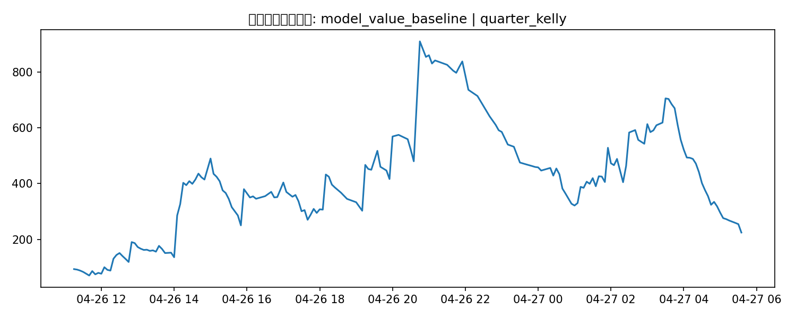
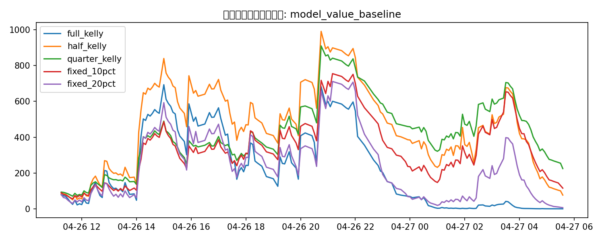

# 100美元本金 + Kelly 仓位的 5分钟交易回测报告：24869603988_attempt1

## 这次升级了什么

- 用 `buy_up_cents / buy_down_cents` 作为真实入场价格，而不是 mid price
- 把 `buy_up_size / buy_down_size / sell_up_size / sell_down_size` 当作盘口可成交量/流动性特征
- 按 100 美元初始本金，顺序滚动做 bankroll 回测
- 同时测试全凯利、半凯利、0.25 凯利、固定 10% 仓位、固定 20% 仓位
- 回测对象包括规则策略和 walk-forward 模型价值策略

## 关于 volume / size

这次不再把 volume 只理解成 `trade_volume_1s`。在这份 CLOB 快照数据里，更有信息量的是盘口 size：

- `buy_up_size / buy_down_size`：当前最优买入价位可成交的份数上限
- `sell_up_size / sell_down_size`：对侧卖出挂单的份数快照
- 同时加入了 `size_imbalance_updown_2m` 和 `depth_imbalance_updown_2m`

| feature                   |   non_null |     mean |   median |      p90 |
|:--------------------------|-----------:|---------:|---------:|---------:|
| buy_up_size_2m            |        290 | 425.614  | 162.565  | 543.471  |
| buy_down_size_2m          |        288 | 276.928  | 152.37   | 482.843  |
| sell_up_size_2m           |        288 | 279.534  | 160.125  | 488.008  |
| sell_down_size_2m         |        290 | 420.232  | 164.33   | 501.076  |
| size_imbalance_updown_2m  |        288 |   0.0352 |   0.0114 |   0.879  |
| depth_imbalance_updown_2m |        288 |  -0.0008 |   0.001  |   0.0782 |

## 数据概览

- 原始分块文件数：**48**
- 市场级回测样本数：**290**
- 每份合约固定附加成本 fee：**0.0100**
- 已解析 outcome 的 Up 比例：**0.4758**

## 涨跌分桶的单位PnL

| move_bucket   |   count |   avg_btc_move_2m |   avg_buy_up_price |   avg_buy_down_price |   avg_buy_up_size |   avg_buy_down_size |   realized_up_rate |   avg_pnl_buy_up |   avg_pnl_buy_down | best_side   |   best_avg_pnl |
|:--------------|--------:|------------------:|-------------------:|---------------------:|------------------:|--------------------:|-------------------:|-----------------:|-------------------:|:------------|---------------:|
| <=-100        |       8 |         -145.295  |             0.0512 |               0.9529 |           313.913 |            1084.75  |             0      |          -0.0612 |             0.0371 | buy_down    |         0.0371 |
| -100~-50      |      17 |          -66.2535 |             0.1594 |               0.8506 |           195.559 |             268.312 |             0.1765 |           0.0071 |            -0.0371 | buy_up      |         0.0071 |
| -50~-30       |      23 |          -38.6313 |             0.2035 |               0.807  |           246.25  |             193.654 |             0.3478 |           0.1343 |            -0.1648 | buy_up      |         0.1343 |
| -30~-10       |      50 |          -18.7624 |             0.313  |               0.6982 |           231.424 |             241.208 |             0.28   |          -0.043  |             0.0118 | buy_down    |         0.0118 |
| -10~10        |      68 |            0.7866 |             0.5022 |               0.5093 |           378.711 |             340.077 |             0.4559 |          -0.0563 |             0.0249 | buy_down    |         0.0249 |
| 10~30         |      40 |           19.5528 |             0.6738 |               0.338  |           326.953 |             295.221 |             0.7    |           0.0162 |            -0.048  | buy_up      |         0.0162 |
| 30~50         |      20 |           38.223  |             0.757  |               0.252  |           320.662 |             228.734 |             0.8    |           0.033  |            -0.062  | buy_up      |         0.033  |
| 50~100        |      17 |           69.2147 |             0.8671 |               0.1418 |           250.094 |             176.781 |             0.8235 |          -0.0535 |             0.0247 | buy_down    |         0.0247 |
| >=100         |       5 |          187.208  |             0.914  |               0.096  |           688.168 |             397.706 |             0.8    |          -0.124  |             0.094  | buy_down    |         0.094  |

## 简单模型的单位份额比较

| model                  |   test_rows |   accuracy |   brier |   log_loss |   trades |   trade_ratio |   avg_pnl |   cum_pnl |   win_rate |
|:-----------------------|------------:|-----------:|--------:|-----------:|---------:|--------------:|----------:|----------:|-----------:|
| random_forest          |          75 |     0.7733 |  0.1962 |     0.5823 |       68 |        0.9067 |    0.0256 |      1.74 |     0.4265 |
| baseline_train_up_rate |          75 |     0.5467 |  0.2489 |     0.6909 |       71 |        0.9467 |   -0.0208 |     -1.48 |     0.2676 |
| logistic_regression    |          75 |     0.6933 |  0.2029 |     0.6269 |       63 |        0.84   |   -0.0443 |     -2.79 |     0.5873 |

## 100美元本金 bankroll 回测结果

这里的本金曲线是按时间顺序逐笔滚动的，下一笔交易使用上一笔结算后的本金。

| strategy                           | sizing        |   trades |   ending_bankroll |   total_return |   avg_trade_return_on_cost |   max_drawdown |
|:-----------------------------------|:--------------|---------:|------------------:|---------------:|---------------------------:|---------------:|
| model_value_baseline               | quarter_kelly |      178 |          224.471  |         1.2447 |                     0.1964 |         0.7532 |
| model_value_baseline_edge2pct      | quarter_kelly |      164 |          213.378  |         1.1338 |                     0.1715 |         0.7613 |
| rule_drop10_down                   | full_kelly    |        4 |          133.117  |         0.3312 |                     0.5462 |         0.0434 |
| rule_interval_best                 | full_kelly    |        4 |          133.117  |         0.3312 |                     0.5462 |         0.0434 |
| rule_drop10_down                   | half_kelly    |        4 |          117.753  |         0.1775 |                     0.5462 |         0.0217 |
| rule_interval_best                 | half_kelly    |        4 |          117.753  |         0.1775 |                     0.5462 |         0.0217 |
| model_value_baseline               | fixed_10pct   |      178 |          115.311  |         0.1531 |                     0.1964 |         0.8472 |
| rule_drop10_down                   | quarter_kelly |        4 |          109.546  |         0.0955 |                     0.5462 |         0.0108 |
| rule_interval_best                 | quarter_kelly |        4 |          109.546  |         0.0955 |                     0.5462 |         0.0108 |
| rule_drop20_down                   | full_kelly    |        1 |          101.522  |         0.0152 |                     0.9412 |         0      |
| rule_drop20_down                   | half_kelly    |        1 |          101.522  |         0.0152 |                     0.9412 |         0      |
| rule_drop20_down                   | quarter_kelly |        1 |          101.522  |         0.0152 |                     0.9412 |         0      |
| rule_rise30to50_up                 | full_kelly    |        0 |          100      |         0      |                   nan      |         0      |
| rule_rise30to50_up                 | half_kelly    |        0 |          100      |         0      |                   nan      |         0      |
| rule_rise30to50_up                 | quarter_kelly |        0 |          100      |         0      |                   nan      |         0      |
| rule_drop30_down                   | quarter_kelly |        0 |          100      |         0      |                   nan      |         0      |
| rule_drop30_down                   | full_kelly    |        0 |          100      |         0      |                   nan      |         0      |
| rule_drop30_down                   | half_kelly    |        0 |          100      |         0      |                   nan      |         0      |
| rule_rise30to50_up                 | fixed_10pct   |       20 |           99.1726 |        -0.0083 |                     0.034  |         0.226  |
| rule_interval_best                 | fixed_10pct   |       70 |           93.1903 |        -0.0681 |                     0.0364 |         0.4703 |
| rule_rise30to50_up                 | fixed_20pct   |       20 |           88.3245 |        -0.1168 |                     0.034  |         0.4294 |
| model_value_baseline               | half_kelly    |      178 |           76.5625 |        -0.2344 |                     0.1964 |         0.9227 |
| rule_interval_best                 | fixed_20pct   |       70 |           65.2616 |        -0.3474 |                     0.0364 |         0.7228 |
| model_value_baseline_edge2pct      | half_kelly    |      164 |           59.9226 |        -0.4008 |                     0.1715 |         0.9366 |
| model_value_baseline_edge2pct      | fixed_10pct   |      164 |           59.6985 |        -0.403  |                     0.1715 |         0.8777 |
| rule_drop30_down                   | fixed_10pct   |       47 |           55.1297 |        -0.4487 |                    -0.1076 |         0.5079 |
| rule_drop10_down                   | fixed_10pct   |       97 |           51.9081 |        -0.4809 |                    -0.0329 |         0.6394 |
| model_value_random_forest_edge2pct | fixed_10pct   |      152 |           47.2112 |        -0.5279 |                     0.0947 |         0.8181 |
| rule_drop20_down                   | fixed_10pct   |       65 |           41.8431 |        -0.5816 |                    -0.1048 |         0.657  |
| model_value_random_forest_edge2pct | quarter_kelly |      152 |           30.4001 |        -0.696  |                     0.0947 |         0.7695 |

## 当前最优组合

- 策略：**model_value_baseline**
- 仓位：**quarter_kelly**
- 交易笔数：**178**
- 期末本金：**224.47 USD**
- 总收益率：**124.47%**
- 最大回撤：**75.32%**

## 图表

### 前2分钟BTC涨跌幅分布

### 不同涨跌区间的最佳方向平均每份PnL

### 盘口size/depth特征中位数

### 各策略-仓位组合的期末本金

### 最佳组合本金曲线

### 最佳策略的不同仓位曲线

## 缺失值概览

| column                        |   missing_ratio |   non_null |
|:------------------------------|----------------:|-----------:|
| trade_count_sum_first2m       |          1      |          0 |
| trade_volume_sum_first2m      |          1      |          0 |
| realized_pnl_buy_down_from_2m |          0.1483 |        247 |
| btc_return_bps_2m             |          0.1448 |        248 |
| btc_move_2m                   |          0.1448 |        248 |
| target_price                  |          0.1448 |        248 |
| outcome_up                    |          0.1448 |        248 |
| realized_pnl_buy_up_from_2m   |          0.1448 |        248 |
| buy_down_price_2m             |          0.0069 |        288 |
| size_imbalance_updown_2m      |          0.0069 |        288 |
| buy_down_size_2m              |          0.0069 |        288 |
| mid_up_prob_2m                |          0.0069 |        288 |
| mid_up_prob_change_2m         |          0.0069 |        288 |
| sell_up_size_2m               |          0.0069 |        288 |
| depth_imbalance_updown_2m     |          0.0069 |        288 |
| mid_up_prob_open              |          0      |        290 |
| price_after_2m                |          0      |        290 |
| window_text                   |          0      |        290 |
| first_quote_ts                |          0      |        290 |
| close_ts_utc                  |          0      |        290 |

## 备注

- 这里把 `buy_*_cents` 当作买入该方向的入场价格，`buy_*_size` 当作该最优价位可成交的份数上限。
- 这是按 top-of-book 的简化回测，还没有模拟扫多档深度。
- 但它已经比之前的 mid-price 假设更接近真实的 Polymarket CLOB 交易。