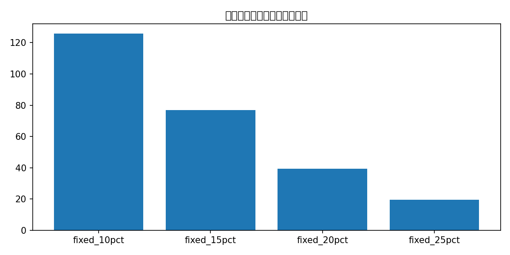
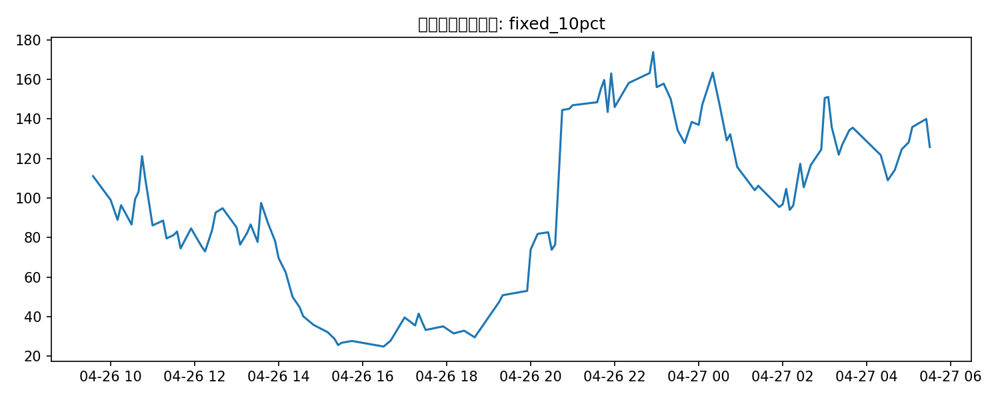

# 最新整天数据：精选策略与 fair probability / regime gate 回测

这份报告专门针对最新整天的 5 分钟 BTC 事件做策略精选，并尽量贴近你 comment 里的思路：

- 不直接做硬方向预测，而是先估计 fair probability
- 再跟市场买价比较，只在 edge 足够大时交易
- 用 regime + 微观结构近似（分钟、价格、size、spread、流动性）做 gating

## 这版补了什么

- `selected_fairprob_switch`：用 walk-forward 历史条件概率估计 fair p
- 候选微策略包括：early_drop_continuation / sharp_drop_reversal / mild_drop_continuation / neutral_down_value / extreme_up_fade / late_breakout_up
- 只有当 `fair_prob - market_price > fee + safety_margin + spread_penalty` 时才开仓
- safety margin 对 high-vol / low-support / expensive breakout 做了额外加严

## 仓位结果

| strategy                 | sizing      |   trades |   ending_bankroll |   total_return |   avg_trade_return_on_cost |   max_drawdown |   avg_entry_minute |   avg_edge |
|:-------------------------|:------------|---------:|------------------:|---------------:|---------------------------:|---------------:|-------------------:|-----------:|
| selected_fairprob_switch | fixed_10pct |      112 |          125.798  |         0.258  |                     0.1539 |         0.7947 |                  2 |     0.1883 |
| selected_fairprob_switch | fixed_15pct |      112 |           76.9253 |        -0.2307 |                     0.1539 |         0.9195 |                  2 |     0.1883 |
| selected_fairprob_switch | fixed_20pct |      112 |           39.3661 |        -0.6063 |                     0.1539 |         0.9717 |                  2 |     0.1883 |
| selected_fairprob_switch | fixed_25pct |      112 |           19.6029 |        -0.804  |                     0.1539 |         0.9907 |                  2 |     0.1883 |

## 微策略拆分

| micro_strategy          | side     |   entry_minute |   trades |   avg_edge |   avg_pnl_usd |   total_pnl_usd |
|:------------------------|:---------|---------------:|---------:|-----------:|--------------:|----------------:|
| neutral_down_value      | buy_down |              2 |      120 |     0.1872 |        0.7778 |         93.3335 |
| early_drop_continuation | buy_down |              1 |       64 |     0.1314 |        0.7959 |         50.9365 |
| sharp_drop_reversal     | buy_up   |              2 |       56 |     0.2499 |        0.6797 |         38.0617 |
| late_breakout_up        | buy_up   |              4 |       32 |     0.1435 |        0.0938 |          3.0027 |
| mild_drop_continuation  | buy_down |              2 |      120 |     0.1563 |       -1.0243 |       -122.911  |
| extreme_up_fade         | buy_down |              2 |       56 |     0.2879 |       -3.5845 |       -200.732  |

## 当前精选结果

- 策略：**selected_fairprob_switch**
- 仓位：**fixed_10pct**
- 交易笔数：**112**
- 期末本金：**125.80 USD**
- 总收益率：**25.80%**
- 最大回撤：**79.47%**
- 平均入场分钟：**2.00**
- 平均 edge：**0.1883**

## 查缺补漏说明

这版已经把你 comment 里能用现有数据实现的部分尽量补了：

- fair probability > market price 的价值交易视角
- regime gate
- 微观结构近似（盘口 size、spread、流动性、分钟路径）

但以下缺口仍然存在，当前 repo 里还没有原始数据，所以只能在报告里保留为下一步：

- Chainlink 对齐标签 / Chainlink bid-ask / volatility
- Polymarket 自己的更细 orderbook / trade stream
- Binance perp OI / taker flow / liquidation
- Deribit IV / basis / OI
- 宏观事件日历

## 图表

