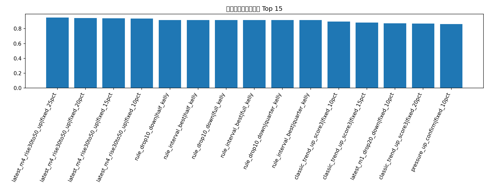
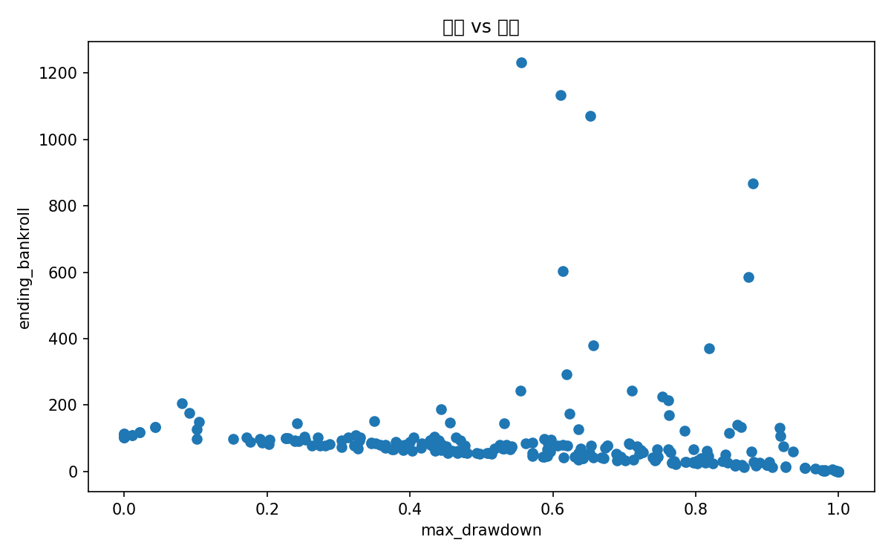

# 策略稳定性 / 失败体验评估

这份报告不只看谁赚得多，还看谁更稳、更少失败。

## 指标说明

- `ending_bankroll`：期末本金
- `max_drawdown`：最大回撤，越低越好
- `win_rate`：单笔胜率，越高越好
- `profit_factor`：总盈利 / 总亏损绝对值，越高越好
- `max_consecutive_losses`：最大连续亏损笔数，越低越好
- `p10_trade_return_on_cost`：最差 10% 左右单笔体验的代表值，越高越好
- `robustness_score`：把收益、胜率、利润因子、回撤、连亏、尾部体验综合后的稳定性分数

## 稳定性 Top 20

| strategy                  | sizing        |   trades |   ending_bankroll |   total_return |   avg_trade_return_on_cost |   max_drawdown | source_layer     |   avg_entry_minute |   trades_from_logs |   win_rate |   loss_rate |   profit_factor |   median_trade_return_on_cost |   p10_trade_return_on_cost |   worst_trade_return_on_cost |   max_consecutive_losses |   downside_deviation |   score_end |   score_win |   score_pf |   score_dd |   score_streak |   score_tail |   robustness_score |
|:--------------------------|:--------------|---------:|------------------:|---------------:|---------------------------:|---------------:|:-----------------|-------------------:|-------------------:|-----------:|------------:|----------------:|------------------------------:|---------------------------:|-----------------------------:|-------------------------:|---------------------:|------------:|------------:|-----------:|-----------:|---------------:|-------------:|-------------------:|
| latest_m4_rise30to50_up   | fixed_25pct   |       25 |          205.856  |         1.0586 |                     0.1167 |         0.0805 | latest_regime    |                  4 |                 25 |     0.96   |      0.04   |          7.7856 |                        0.1    |                     0.0249 |                      -1.013  |                        1 |               1.013  |      0.9496 |      0.9516 |     0.9845 |     0.9341 |         0.9244 |       0.9535 |             0.9505 |
| latest_m4_rise30to50_up   | fixed_20pct   |       25 |          175.21   |         0.7521 |                     0.1167 |         0.0914 | latest_regime    |                  4 |                 25 |     0.96   |      0.04   |          5.8211 |                        0.1    |                     0.0249 |                      -1.013  |                        1 |               1.013  |      0.9419 |      0.9516 |     0.9729 |     0.9302 |         0.9244 |       0.9457 |             0.9454 |
| latest_m4_rise30to50_up   | fixed_15pct   |       25 |          148.465  |         0.4846 |                     0.1167 |         0.1041 | latest_regime    |                  4 |                 25 |     0.96   |      0.04   |          4.1067 |                        0.1    |                     0.0249 |                      -1.013  |                        1 |               1.013  |      0.9264 |      0.9516 |     0.969  |     0.9186 |         0.9244 |       0.9535 |             0.9408 |
| latest_m4_rise30to50_up   | fixed_10pct   |       25 |          127.597  |         0.276  |                     0.1167 |         0.1013 | latest_regime    |                  4 |                 25 |     0.96   |      0.04   |          3.0742 |                        0.1    |                     0.0249 |                      -1.013  |                        1 |               1.013  |      0.8915 |      0.9516 |     0.9651 |     0.9264 |         0.9244 |       0.9535 |             0.9363 |
| rule_drop10_down          | half_kelly    |        4 |          117.753  |         0.1775 |                     0.5462 |         0.0217 | bankroll         |                nan |                  4 |     0.75   |      0.25   |          7.804  |                        1.0018 |                    -0.4309 |                      -1.0189 |                        1 |               1.0189 |      0.8779 |      0.8314 |     0.9903 |     0.9477 |         0.9244 |       0.9322 |             0.9174 |
| rule_interval_best        | half_kelly    |        4 |          117.753  |         0.1775 |                     0.5462 |         0.0217 | bankroll         |                nan |                  4 |     0.75   |      0.25   |          7.804  |                        1.0018 |                    -0.4309 |                      -1.0189 |                        1 |               1.0189 |      0.8779 |      0.8314 |     0.9903 |     0.9477 |         0.9244 |       0.9322 |             0.9174 |
| rule_drop10_down          | full_kelly    |        4 |          133.117  |         0.3312 |                     0.5462 |         0.0434 | bankroll         |                nan |                  4 |     0.75   |      0.25   |          6.4893 |                        1.0018 |                    -0.4309 |                      -1.0189 |                        1 |               1.0189 |      0.9012 |      0.8314 |     0.9787 |     0.9399 |         0.9244 |       0.9322 |             0.9171 |
| rule_interval_best        | full_kelly    |        4 |          133.117  |         0.3312 |                     0.5462 |         0.0434 | bankroll         |                nan |                  4 |     0.75   |      0.25   |          6.4893 |                        1.0018 |                    -0.4309 |                      -1.0189 |                        1 |               1.0189 |      0.9012 |      0.8314 |     0.9787 |     0.9399 |         0.9244 |       0.9322 |             0.9171 |
| rule_drop10_down          | quarter_kelly |        4 |          109.546  |         0.0955 |                     0.5462 |         0.0108 | bankroll         |                nan |                  4 |     0.75   |      0.25   |          8.9529 |                        1.0018 |                    -0.4309 |                      -1.0189 |                        1 |               1.0189 |      0.8508 |      0.8314 |     0.9981 |     0.9554 |         0.9244 |       0.9322 |             0.9165 |
| rule_interval_best        | quarter_kelly |        4 |          109.546  |         0.0955 |                     0.5462 |         0.0108 | bankroll         |                nan |                  4 |     0.75   |      0.25   |          8.9529 |                        1.0018 |                    -0.4309 |                      -1.0189 |                        1 |               1.0189 |      0.8508 |      0.8314 |     0.9981 |     0.9554 |         0.9244 |       0.9322 |             0.9165 |
| classic_trend_up_score3   | fixed_10pct   |       11 |          103.481  |         0.0348 |                     0.0454 |         0.1706 | classic          |                nan |                 11 |     0.8182 |      0.1818 |          1.1621 |                        0.2073 |                    -1.0119 |                      -1.0141 |                        1 |               1.013  |      0.814  |      0.9205 |     0.8915 |     0.9109 |         0.9244 |       0.8992 |             0.8953 |
| classic_trend_up_score3   | fixed_15pct   |       11 |          103.953  |         0.0395 |                     0.0454 |         0.2518 | classic          |                nan |                 11 |     0.8182 |      0.1818 |          1.1195 |                        0.2073 |                    -1.0119 |                      -1.0141 |                        1 |               1.013  |      0.8178 |      0.9205 |     0.8837 |     0.8605 |         0.9244 |       0.8934 |             0.8836 |
| latest_m1_drop20_down     | fixed_10pct   |       52 |          144.967  |         0.4497 |                     0.102  |         0.2418 | latest_regime    |                  1 |                 52 |     0.8077 |      0.1923 |          1.3683 |                        0.3026 |                    -1.0135 |                      -1.0156 |                        2 |               1.014  |      0.9147 |      0.905  |     0.9147 |     0.8682 |         0.7442 |       0.8779 |             0.8742 |
| classic_trend_up_score3   | fixed_20pct   |       11 |          103.466  |         0.0347 |                     0.0454 |         0.3299 | classic          |                nan |                 11 |     0.8182 |      0.1818 |          1.0766 |                        0.2073 |                    -1.0119 |                      -1.0141 |                        1 |               1.013  |      0.8062 |      0.9205 |     0.876  |     0.8023 |         0.9244 |       0.8934 |             0.8687 |
| pressure_up_confirm       | fixed_10pct   |        6 |           98.9879 |        -0.0101 |                    -0.0057 |         0.1014 | extended_classic |                nan |                  6 |     0.8333 |      0.1667 |          0.9079 |                        0.1449 |                    -0.4748 |                      -1.0141 |                        1 |               1.0141 |      0.7674 |      0.936  |     0.7248 |     0.9225 |         0.9244 |       0.9186 |             0.8623 |
| latest_m1_drop20_down     | fixed_15pct   |       52 |          151.104  |         0.511  |                     0.102  |         0.3497 | latest_regime    |                  1 |                 52 |     0.8077 |      0.1923 |          1.2774 |                        0.3026 |                    -1.0135 |                      -1.0156 |                        2 |               1.014  |      0.9302 |      0.905  |     0.9031 |     0.7907 |         0.7442 |       0.8702 |             0.8579 |
| pressure_up_confirm       | fixed_15pct   |        6 |           97.9456 |        -0.0205 |                    -0.0057 |         0.1521 | extended_classic |                nan |                  6 |     0.8333 |      0.1667 |          0.8802 |                        0.1449 |                    -0.4748 |                      -1.0141 |                        1 |               1.0141 |      0.7636 |      0.936  |     0.6899 |     0.9147 |         0.9244 |       0.9109 |             0.8524 |
| classic_trend_up_score3   | fixed_25pct   |       11 |          101.945  |         0.0194 |                     0.0454 |         0.4048 | classic          |                nan |                 11 |     0.8182 |      0.1818 |          1.0336 |                        0.2073 |                    -1.0119 |                      -1.0141 |                        1 |               1.013  |      0.7946 |      0.9205 |     0.845  |     0.7364 |         0.9244 |       0.9031 |             0.8485 |
| pressure_up_confirm       | fixed_20pct   |        6 |           96.5132 |        -0.0349 |                    -0.0057 |         0.2028 | extended_classic |                nan |                  6 |     0.8333 |      0.1667 |          0.8533 |                        0.1449 |                    -0.4748 |                      -1.0141 |                        1 |               1.0141 |      0.7519 |      0.936  |     0.6318 |     0.8915 |         0.9244 |       0.9109 |             0.8344 |
| price_interval_down_65_80 | fixed_10pct   |       42 |          108.819  |         0.0882 |                     0.0588 |         0.3236 | extended_classic |                nan |                 42 |     0.7857 |      0.2143 |          1.0894 |                        0.2857 |                    -1.0137 |                      -1.0149 |                        2 |               1.0138 |      0.845  |      0.8663 |     0.8798 |     0.8178 |         0.7442 |       0.7984 |             0.831  |

## 当前最稳的策略

- 层级：**latest_regime**
- 策略：**latest_m4_rise30to50_up**
- 仓位：**fixed_25pct**
- 稳定性得分：**0.9505**
- 期末本金：**205.86 USD**
- 最大回撤：**8.05%**
- 胜率：**96.00%**
- 最大连续亏损：**1**

## 图表

